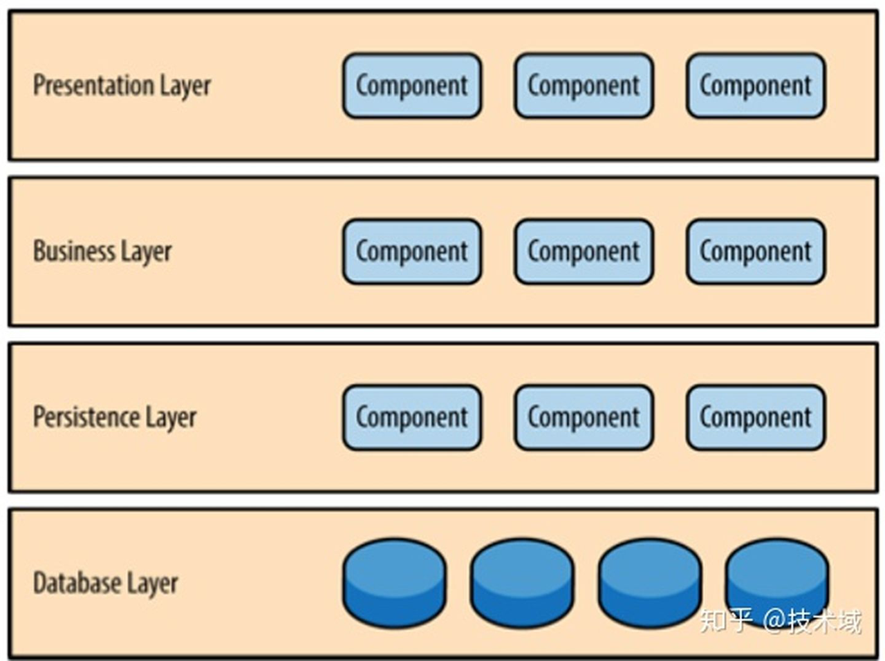
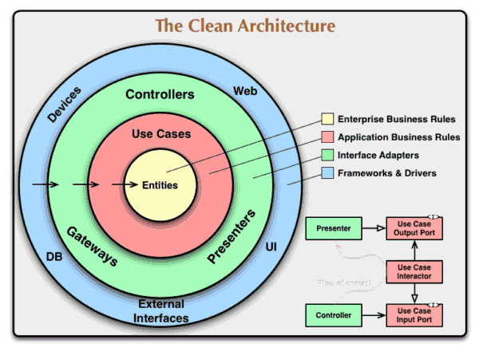
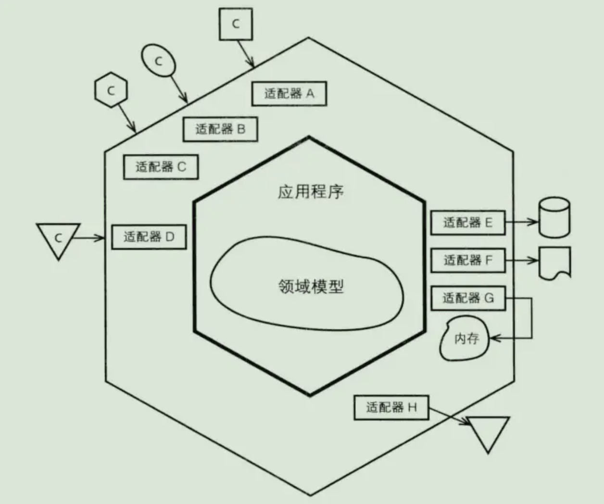
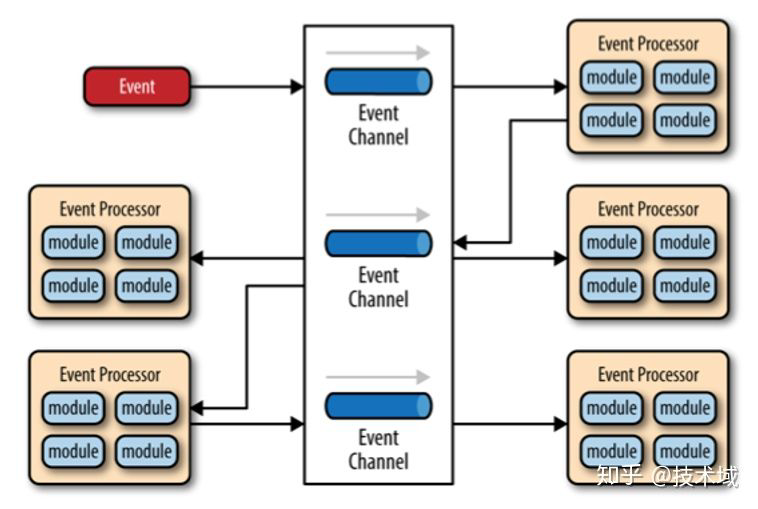
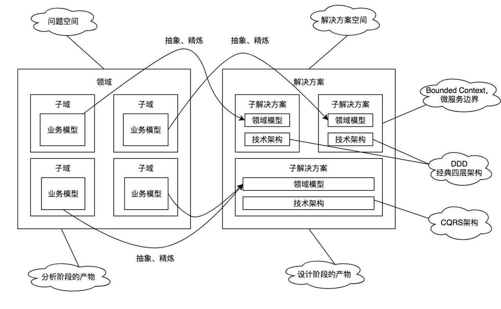
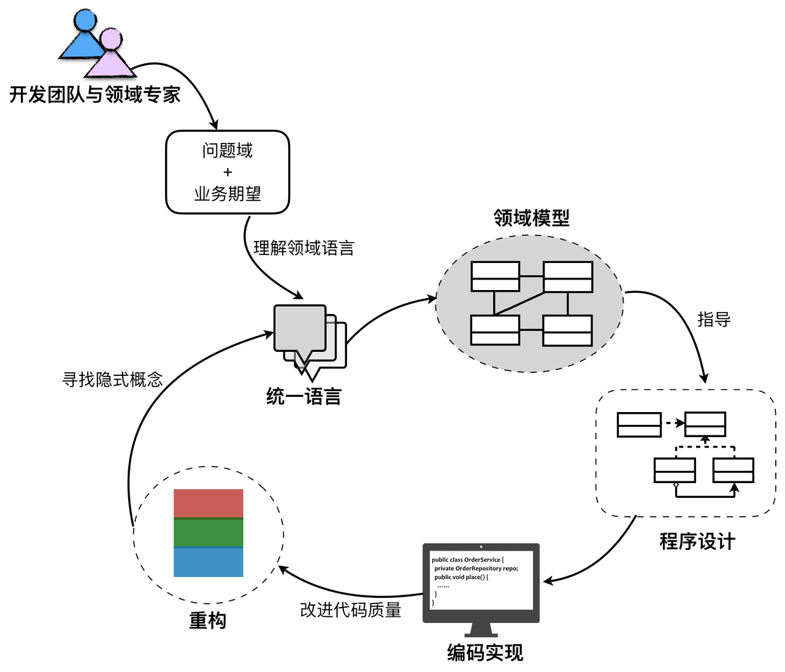
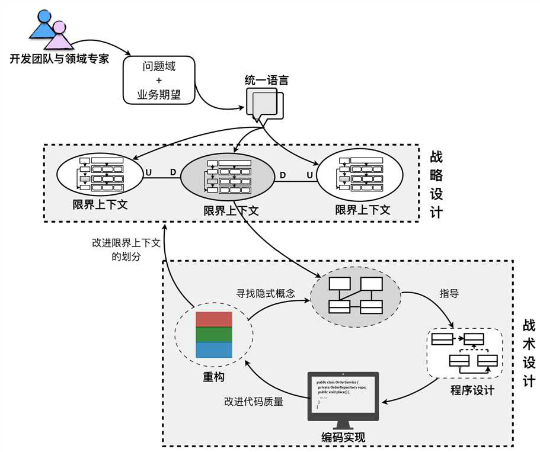
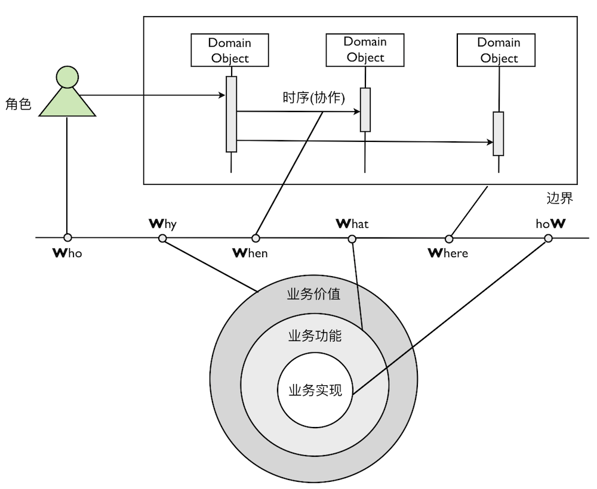

## 什么是架构设计

架构设计是基于架构原则和目标给出问题解决方案的过程。
架构和设计遵循相同的原则和方法，只是解决问题的规模和层次不同，而这规模和层次没有明显界限。

#### 问题：

1. 架构设计最基础的个人素质是什么？
2. 架构设计最基础的技术能力是什么？

### 原则、目标与方法

#### 原则：

动静分离，高内聚，低耦合

#### 目标：

1. 可控性：拆分，分而治之，拆分粒度取决于业务、人、制度多方因素
2. 复用性：抽象，在阶段都要做好抽象复用，开发->设计->架构->领域->组织架构
3. 系统标准：高性能（高并发）、可靠性（数据一致）、稳定性、可用性、安全性、易用性、可扩展、可维护

#### 方法：4+1视图

1. 用例视图：用户怎么看，UML用例图
2. 逻辑视图：系统功能抽象，UML类图、交互图、时序图
3. 开发视图：开发人员怎么看，开发文档和设计文档
4. 进程视图：程序运行状态，线程、进程、系统交互，UML活动图
5. 物理视图：部署视图，部署、网络、可靠性、可伸缩

#### 问题：

1. 在不同开发阶段实现架构设计的方法论有哪些？
2. 影响拆分粒度的因素有哪些？
3. 实现架构目标的技术有哪些，其原理是什么？
4. 为什么数据驱动设计使用最广泛，数据库三范式体现了哪些架构原则？
5. 为什么互联网公司不招初中级开发，而软件公司会大量招？

## 架构分类

### 进程角度分类：

1. 单体架构：服务在一个进程内
2. 分布式架构：服务在多个进程内

### 单体架构分类

1. 简单模式：内部没有拆分
2. MVC模式：内部分层
3. 前后分离：前后端逻辑独立实现
4. 组件模式：子项目打包为一个整体项目，手工打包->ant->maven
5. 组件库模式：公共代码打包成组织库发布

web项目前后分离两大阶段：

1. 后端渲染阶段：servlet->jsp->struts->springmvc->模板引擎->ajax
2. 前端渲染阶段：ajax->jquery->Angular、react、vue、echart

单体架构问题：代码耦合不适合迭代更新、更新部署影响大、大型项目开发困难、项目启动慢可用性下降、扩展性不好

### 分布式架构分类

1. SOA面向服务架构：关注企业IT生态建设、企业服务总线、异构服务整合；基于RPC、MQ技术
2. DSA分布式服务架构：关注系统业务拆分，考虑系统架构和服务治理，服务使用同一分布式框架
3. MSA微服务架构：精进的DSA架构，按架构原则目标实现系统，基于微服务治理技术

- 微服务治理：服务注册与发现、服务监控、资源隔离、熔断、降级、限流
- 微服务问题：服务雪崩、幂等、超时、事务一致

### 问题

1. 我们有哪些系统是单体架构，而且必须是单体架构？
2. SOA考虑的拆分粒度是什么？
3. SOA实现服务整合和复用的方式方法是什么？
4. 分布式服务架构有哪几种常用框架，优缺点是什么？
5. 推进DSA向MSA发展的技术有哪些，分别解决了哪些问题？
6. 单体架构、SOA、DSA、MSA优缺点是什么，用什么方法技术满足了架构原则和目标?

## 常用系统架构

### 分层架构

分层架构模式里的组件被分成几个平行的层次，每一层都代表了应用的一个功能(展示逻辑或者业务逻辑)。 尽管分层架构没有规定自身要分成几层几种，大多数的结构都分成四个层次：`展示层`，`业务层`，`持久层`，和`数据库层`。如下图：

### Clean架构

外圈的层次可以依赖内层，反之不可以；内圈核心的实体代表业务，不可以依赖其所处的技术环境。

### 六边形

六边形架构又称“端口和适配器模式”，是Alistair Cockburn提出的一种具有对称性特征的架构风格。在这种架构中，系统通过适配器的方式与外部交互，将应用服务于领域服务封装在系统内部。

六边型的适配器类似于反腐层的概念。

反腐层（Anti-corruption layer，简称 ACL）介于新应用和旧应用之间，用于确保新应用的设计不受老应用的限制。是一种在不同应用间转换的机制。

### CQRS

命令查询的责任分离Command Query Responsibility Segregation
Command和Query数据源分为同构和民构两种，读写分享是这种架构的一种简单实现。

从事务的角度来看 CQRS，需要面对的问题从根本来说是个最终一致性的问题。

### 问题：

1. 同构数据源有哪几种，怎么实现的数据同步？
2. 异构数据源有哪几种，怎么实现的数据同步？
3. 数据一致性的保障方法有哪些？

### 事件驱动

异步、高度解耦

## 常用业务分析方法

1. 数据库驱动：基于数据库表设计构建上层系统
2. 用例驱动（Use Case）
3. 用户故事（User Story）
4. 测试驱动（TDD）

### DDD（Domain-Driven Design）

- 场景：MSA微服务架构在技术维度、业务维度、团队管理方面对架构方法论提出了新的挑战，需要综合性系统架构方法论支持MSA的落地实施。

- 思想：开发团队应该从业务需求中提炼出统一语言，再基于统一语言建立领域模型；通过领域模型指导程序设计与编码；通过重构和设计模式改进开发质量。

DDD为两类方法论的实践集合：

1. 领域模型分析：数据库驱动、用例驱动（Use Case）、测试驱动（TDD）、用户故事（User Story）
2. 系统架构设计：分层架构、clean架构、六边型架构、事件驱动、CQRS模式

DDD的过程：Why->What->How

1. 从问题域到解决方案域的过程
2. 从需求分析到设计的过程
3. 逐步识别限界上下文的过程

### 领域模型分析

`问题域`：核心领域、子领域、限界上下文、上下文映射

核心为限界上下文，基本与微服务可以对应上。

### 领域分析方法：6w2h

## 基本概念

### 实体(entity)

重点：具备唯一ID，是否是同一实体比较ID，能够被持久化，具有业务逻辑

### 值对象(value object)

重点：不具备唯一ID，是否是同一对象比较值是否相同

值对象的定义是：描述事物的对象；更准确的说，一个没有概念上标识符描述一个领域方面的对象。

### 聚合及聚合根(aggregate、aggregate root)

重点：大部分的聚合都只是一个实体，该实体同时也是聚合根，并不是所有的实体都是聚集根，但只有实体才能成为聚集根。

一个聚合是一组相关的被视为整体的对象。每个聚合都有一个根对象（聚合根实体），从外部访问只能通过这个对象。根实体对象有组成聚合所有对象的引用，但是外部对象只能引用根对象实体。

基于聚合的以上概念，我们可以推论出从数据库查询时的单元也是以聚合为一个单元，也就是说我们不能直接查询聚合内部的某个非根的对象；

### 服务（services）

服务这个词在服务模式中是这么定义的：服务提供的操作是它提供给使用它的客户端，并突出领域对象的关系。

所有的service只负责协调并委派业务逻辑给领域对象进行处理，其本身并真正实现业务逻辑，绝大部分的业务逻辑都由领域对象承载和实现了。

当一个领域操作被视为一个重要的领域概念，一般就应该作为领域服务。 服务应该是无状态的。

### 工厂(factories)

工厂用来封装创建一个复杂对象尤其是聚合时所需的知识，作用是将创建对象的细节隐藏起来。客户传递给工厂一些简单的参数，然后工厂可以在内部创建出一个复杂的领域对象然后返回给客户。当创建 实体和值对象复杂时建议使用工厂模式。

### 仓储（repositories）

仓储是用来管理实体的集合。

仓储里面存放的对象一定是聚合，原因是domain是以聚合的概念来划分边界的；聚合作为一个整体概念，要么一起被取出来，要么一起被删除。外部访问不会单独对某个聚合内的子对象进行单独操作。因此，我们只对聚合设计仓储。

respositories和dao：

dao是面向数据访问的，是关系型数据库和应用之间的契约。

repository：位于领域层，面向aggregation root。repository是一个独立的抽象，使用领域的通用语言，它与dao进行交互，并使用领域理解的语言提供对领域模型的数据访问服务的“业务接口”。

### 问题

1. DDD在技术层面实现的最大困难在哪里？
2. DDD在管理层面实现的最大困难在哪里?

### DSL（Domain Specific Language）

`如果我们能把设计做到极致，它就能成为一门语言，一门解决一个特定问题的语言。`

- 常规模式 JAVA：业务分析->架构设计->程序设计->编码设计->开发功能->形成产品
- 原型模式 Python: 业务分析->原型->产品输出->业务分析，用原型不断迭代优化
- DSL模式 Lisp：业务分析、DSL、原型开发、产品输出，同步开发迭代

01->Assembly->c->GPL (Generalized Programming Language)->DSL

01->Assembly->c->Lisp->DSL

常见DSL:

HTML、CSS、MAVEN、sql

我们通常所用的中间件框架实际上就是一种内部 DSL：

Spring、spring mvc、springboot、mybatis

Lisp 的本质：https://www.iteedu.com/blog/plang/lisp/lispdiary/lispbz/

Lisp之根源：https://www.iteedu.com/blog/plang/lisp/lispdiary/lispzgy/

## 组织架构&技术架构

### 开发人员组织架构分两种：

1. 水平拆分的专业技术团队：前端、原生、后端、数据、测试、产品、PM
2. 垂直拆分的跨职能团队：每个团队包含各类人员

### 管理方式：

1. 水平拆分以专业的组长为主，强技术弱业务，沟通协调成本高
2. 垂直拆分以产品或PM为主，强业务弱技术，技术风险大、工作量不平均

#### 问题：

1. 垂直拆分与水平拆分优缺点是什么，如何解决？
2. 垂直拆分与水平拆分分别适用于哪种场景？
3. 如何解决跨职能团队之间工作量不平均问题？