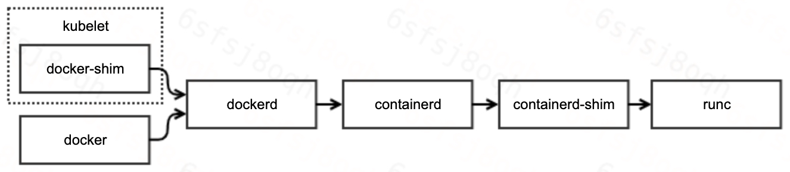
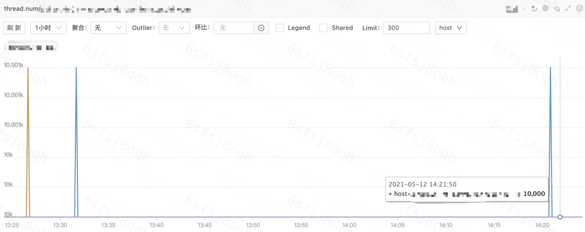
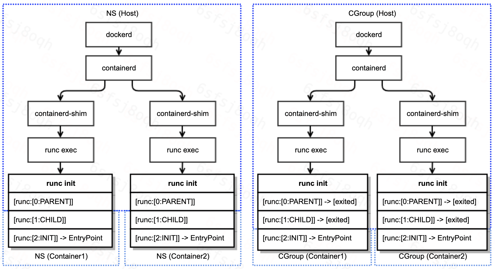

## 前言

锄禾日当午，值班好辛苦；

汗滴禾下土，一查一下午。

## 问题描述

今天，在值班排查线上问题的过程中，发现系统日志一直在刷docker异常日志：

```
May 12 09:08:40 HOSTNAME dockerd[4085]: time="2021-05-12T09:08:40.642410594+08:00" level=error msg="stream copy error: reading from a closed fifo"
May 12 09:08:40 HOSTNAME dockerd[4085]: time="2021-05-12T09:08:40.642418571+08:00" level=error msg="stream copy error: reading from a closed fifo"
May 12 09:08:40 HOSTNAME dockerd[4085]: time="2021-05-12T09:08:40.663754355+08:00" level=error msg="Error running exec 110deb1c1b2a2d2671d7368bd02bfc18a968e4712a3c771dedf0b362820e73cb in container: OCI runtime exec failed: exec failed: container_linux.go:348: starting container process caused \"read init-p: connection reset by peer\": unknown"
```

从系统风险性上来看，异常日志出现的原因需要排查清楚，并摸清是否会对业务产生影响。

下文简单介绍问题排查的流程，以及产生的原因。

## 问题排查

现在我们唯一掌握的信息，只有系统日志告知dockerd执行exec失败。

在具体的问题分析之前，我们再来回顾一下docker的工作原理与调用链路：



可见，docker的调用链路非常长，涉及组件也较多。因此，我们的排查路径主要分为如下两步：

- 确定引起失败的组件
- 确定组件失败的原因

## 定位组件

熟悉docker的用户能够一眼定位引起问题的组件。但是，我们还是按照常规的排查流程走一遍：

```go
// 1. 定位问题容器
# sudo docker ps | grep -v pause | grep -v NAMES | awk '{print $1}' | xargs -ti sudo docker exec {} sleep 1
sudo docker exec aa1e331ec24f sleep 1
OCI runtime exec failed: exec failed: container_linux.go:348: starting container process caused "read init-p: connection reset by peer": unknown


// 2. 排除docker嫌疑
# docker-containerd-ctr -a /var/run/docker/containerd/docker-containerd.sock -n moby t exec --exec-id stupig1 aa1e331ec24f621ab3152ebe94f1e533734164af86c9df0f551eab2b1967ec4e sleep 1
ctr: OCI runtime exec failed: exec failed: container_linux.go:348: starting container process caused "read init-p: connection reset by peer": unknown


// 3. 排除containerd与containerd-shim嫌疑
# docker-runc --root /var/run/docker/runtime-runc/moby/ exec aa1e331ec24f621ab3152ebe94f1e533734164af86c9df0f551eab2b1967ec4e sleep
runtime/cgo: pthread_create failed: Resource temporarily unavailable
SIGABRT: abort
PC=0x6b657e m=0 sigcode=18446744073709551610

goroutine 0 [idle]:
runtime: unknown pc 0x6b657e
stack: frame={sp:0x7ffd30f0d218, fp:0x0} stack=[0x7ffd2ab0e738,0x7ffd30f0d760)
00007ffd30f0d118:  0000000000000002  00007ffd30f7f184
00007ffd30f0d128:  000000000069c31c  00007ffd30f0d1a8
00007ffd30f0d138:  000000000045814e <runtime.callCgoMmap+62>  00007ffd30f0d140
00007ffd30f0d148:  00007ffd30f0d190  0000000000411a88 <runtime.persistentalloc1+456>
00007ffd30f0d158:  0000000000bf6dd0  0000000000000000
00007ffd30f0d168:  0000000000010000  0000000000000008
00007ffd30f0d178:  0000000000bf6dd8  0000000000bf7ca0
00007ffd30f0d188:  00007fdcbb4b7000  00007ffd30f0d1c8
00007ffd30f0d198:  0000000000451205 <runtime.persistentalloc.func1+69>  0000000000000000
00007ffd30f0d1a8:  0000000000000000  0000000000c1c080
00007ffd30f0d1b8:  00007fdcbb4b7000  00007ffd30f0d1e0
00007ffd30f0d1c8:  00007ffd30f0d210  00007ffd30f0d220
00007ffd30f0d1d8:  0000000000000000  00000000000000f1
00007ffd30f0d1e8:  0000000000000011  0000000000000000
00007ffd30f0d1f8:  000000000069c31c  0000000000c1c080
00007ffd30f0d208:  000000000045814e <runtime.callCgoMmap+62>  00007ffd30f0d210
00007ffd30f0d218: <00007ffd30f0d268  fffffffe7fffffff
00007ffd30f0d228:  ffffffffffffffff  ffffffffffffffff
00007ffd30f0d238:  ffffffffffffffff  ffffffffffffffff
00007ffd30f0d248:  ffffffffffffffff  ffffffffffffffff
00007ffd30f0d258:  ffffffffffffffff  ffffffffffffffff
00007ffd30f0d268:  ffffffffffffffff  ffffffffffffffff
00007ffd30f0d278:  ffffffffffffffff  ffffffffffffffff
00007ffd30f0d288:  ffffffffffffffff  ffffffffffffffff
00007ffd30f0d298:  ffffffffffffffff  0000000000000000
00007ffd30f0d2a8:  00000000006b68ba  0000000000000020
00007ffd30f0d2b8:  0000000000000000  0000000000000000
00007ffd30f0d2c8:  0000000000000000  0000000000000000
00007ffd30f0d2d8:  0000000000000000  0000000000000000
00007ffd30f0d2e8:  0000000000000000  0000000000000000
00007ffd30f0d2f8:  0000000000000000  0000000000000000
00007ffd30f0d308:  0000000000000000  0000000000000000
runtime: unknown pc 0x6b657e
stack: frame={sp:0x7ffd30f0d218, fp:0x0} stack=[0x7ffd2ab0e738,0x7ffd30f0d760)
00007ffd30f0d118:  0000000000000002  00007ffd30f7f184
00007ffd30f0d128:  000000000069c31c  00007ffd30f0d1a8
00007ffd30f0d138:  000000000045814e <runtime.callCgoMmap+62>  00007ffd30f0d140
00007ffd30f0d148:  00007ffd30f0d190  0000000000411a88 <runtime.persistentalloc1+456>
00007ffd30f0d158:  0000000000bf6dd0  0000000000000000
00007ffd30f0d168:  0000000000010000  0000000000000008
00007ffd30f0d178:  0000000000bf6dd8  0000000000bf7ca0
00007ffd30f0d188:  00007fdcbb4b7000  00007ffd30f0d1c8
00007ffd30f0d198:  0000000000451205 <runtime.persistentalloc.func1+69>  0000000000000000
00007ffd30f0d1a8:  0000000000000000  0000000000c1c080
00007ffd30f0d1b8:  00007fdcbb4b7000  00007ffd30f0d1e0
00007ffd30f0d1c8:  00007ffd30f0d210  00007ffd30f0d220
00007ffd30f0d1d8:  0000000000000000  00000000000000f1
00007ffd30f0d1e8:  0000000000000011  0000000000000000
00007ffd30f0d1f8:  000000000069c31c  0000000000c1c080
00007ffd30f0d208:  000000000045814e <runtime.callCgoMmap+62>  00007ffd30f0d210
00007ffd30f0d218: <00007ffd30f0d268  fffffffe7fffffff
00007ffd30f0d228:  ffffffffffffffff  ffffffffffffffff
00007ffd30f0d238:  ffffffffffffffff  ffffffffffffffff
00007ffd30f0d248:  ffffffffffffffff  ffffffffffffffff
00007ffd30f0d258:  ffffffffffffffff  ffffffffffffffff
00007ffd30f0d268:  ffffffffffffffff  ffffffffffffffff
00007ffd30f0d278:  ffffffffffffffff  ffffffffffffffff
00007ffd30f0d288:  ffffffffffffffff  ffffffffffffffff
00007ffd30f0d298:  ffffffffffffffff  0000000000000000
00007ffd30f0d2a8:  00000000006b68ba  0000000000000020
00007ffd30f0d2b8:  0000000000000000  0000000000000000
00007ffd30f0d2c8:  0000000000000000  0000000000000000
00007ffd30f0d2d8:  0000000000000000  0000000000000000
00007ffd30f0d2e8:  0000000000000000  0000000000000000
00007ffd30f0d2f8:  0000000000000000  0000000000000000
00007ffd30f0d308:  0000000000000000  0000000000000000

goroutine 1 [running]:
runtime.systemstack_switch()
	/usr/local/go/src/runtime/asm_amd64.s:363 fp=0xc4200fe788 sp=0xc4200fe780 pc=0x454120
runtime.main()
	/usr/local/go/src/runtime/proc.go:128 +0x63 fp=0xc4200fe7e0 sp=0xc4200fe788 pc=0x42bb83
runtime.goexit()
	/usr/local/go/src/runtime/asm_amd64.s:2361 +0x1 fp=0xc4200fe7e8 sp=0xc4200fe7e0 pc=0x456c91

rax    0x0
rbx    0xbe2978
rcx    0x6b657e
rdx    0x0
rdi    0x2
rsi    0x7ffd30f0d1a0
rbp    0x8347ce
rsp    0x7ffd30f0d218
r8     0x0
r9     0x6
r10    0x8
r11    0x246
r12    0x2bedc30
r13    0xf1
r14    0x11
r15    0x0
rip    0x6b657e
rflags 0x246
cs     0x33
fs     0x0
gs     0x0
exec failed: container_linux.go:348: starting container process caused "read init-p: connection reset by peer"
```

由上可知，异常是runc返回的。

## 定位原因

定位异常组件的同时，runc还给了我们一个惊喜：提供了详细的异常日志。

异常日志表明：runc exec失败的原因是因为 Resource temporarily unavailable，比较典型的资源不足问题。而常见的资源不足类型主要包含（ulimit -a）：

- 线程数达到限制
- 文件数达到限制
- 内存达到限制

因此，我们需要进一步排查业务容器的监控，以定位不足的资源类型。



上图展示了业务容器的线程数监控。所有容器的线程数都已经达到1w，而弹性云默认限制容器的线程数上限就是1w，设定该上限的原因，也是为了避免单容器线程泄漏而耗尽宿主机的线程资源。

```bash
# cat /sys/fs/cgroup/pids/kubepods/burstable/pod64a6c0e7-830c-11eb-86d6-b8cef604db88/aa1e331ec24f621ab3152ebe94f1e533734164af86c9df0f551eab2b1967ec4e/pids.max

10000
```

至此，问题的原因已定位清楚，对，就是这么简单。

## runc梳理

虽然，我们已经定位了异常日志的成因，但是，对于runc的具体工作机制，一直只有一个模糊的概念。

趁此机会，我们以runc exec为例，梳理runc的工作流程。

- runc exec首先启动子进程runc init
- runc init负责初始化容器namespace
    - runc init利用C语言的constructor特性，实现在go代码启动之前，设置容器namespace
    - C代码nsexec执行两次clone，共三个线程：父进程，子进程，孙进程，完成对容器namespace的初始化
    - 父进程与子进程完成初始化任务后退出，此时，孙进程已经在容器namespace内，孙进程开始执行go代码初始化，并等待接收runc exec发送配置
- runc exec将孙进程添加到容器cgroup
- runc exec发送配置给孙进程，配置主要包含：exec的具体命令与参数等
- 孙进程调用system.Execv执行用户命令

注意：

- 步骤2.c与步骤3是并发执行的
- runc exec与runc init通信基于socket pair对（init-p和init-c）

runc exec过程中各进程的交互流程，以及namespace与cgroup的初始化参见下图：



综合我们对runc exec执行流程的梳理，以及runc exec返回的错误信息，我们基本定位到了runc exec返回错误的代码：

```go
func (p *setnsProcess) start() (err error) {
   defer p.parentPipe.Close()
   err = p.cmd.Start()
   p.childPipe.Close()
   if err != nil {
      return newSystemErrorWithCause(err, "starting setns process")
   }
   if p.bootstrapData != nil {
      if _, err := io.Copy(p.parentPipe, p.bootstrapData); err != nil {       // clone标志位，ns配置
         return newSystemErrorWithCause(err, "copying bootstrap data to pipe")
      }
   }
   if err = p.execSetns(); err != nil {
      return newSystemErrorWithCause(err, "executing setns process")
   }
   if len(p.cgroupPaths) > 0 {
      if err := cgroups.EnterPid(p.cgroupPaths, p.pid()); err != nil {        // 这里将runc init添加到容器cgroup中
         return newSystemErrorWithCausef(err, "adding pid %d to cgroups", p.pid())
      }
   }
   if err := utils.WriteJSON(p.parentPipe, p.config); err != nil {            // 发送配置：命令、环境变量等
      return newSystemErrorWithCause(err, "writing config to pipe")
   }

   ierr := parseSync(p.parentPipe, func(sync *syncT) error {                  // 这里返回 read init-p: connection reset by peer
      switch sync.Type {
      case procReady:
         // This shouldn't happen.
         panic("unexpected procReady in setns")
      case procHooks:
         // This shouldn't happen.
         panic("unexpected procHooks in setns")
      default:
         return newSystemError(fmt.Errorf("invalid JSON payload from child"))
      }
   })
   if ierr != nil {
      p.wait()
      return ierr
   }
   return nil
}
```

现在，问题的成因与代码分析已全部完成。

## Reference

- https://www.kernel.org/doc/Documentation/cgroup-v1/pids.txt
- https://github.com/opencontainers/runc

> - 作者：plpan
> - 原文出处：https://plpan.github.io/docker-exec-%E5%A4%B1%E8%B4%A5%E9%97%AE%E9%A2%98%E6%8E%92%E6%9F%A5%E4%B9%8B%E6%97%85/