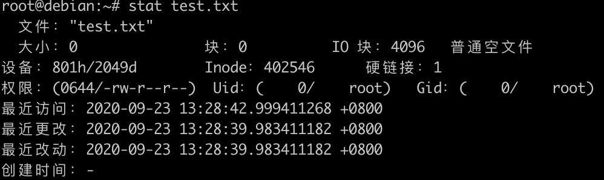
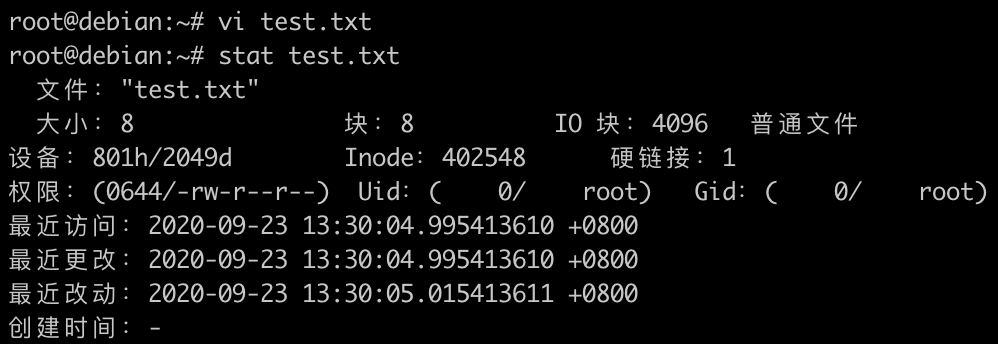
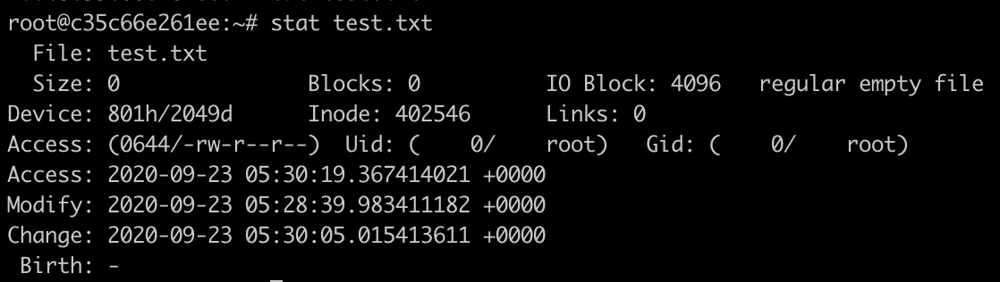

## 问题

使用 `Docker Volumes` 时，有时需要挂载一个宿主机目录或者文件，提供数据可持续或者容器内部服务配置文件。

使用命令 `docker run -it --rm -v /root/test.txt:/root/test.txt debian:10 bash` 挂载文件（test.txt 默认权限 644）时，通过 `vim` 修改宿主 `test.txt` 文件，但是容器中 `test.txt` 没有修改。这是为什么？


## 问题分析

Docker 中，mount volume 的原理是借用了 `Linux Namespace` 中的 `Mount NameSpace`，隔离系统中不同进程的挂载点视图，实际文件是没有变化。比如上面的例子，在container中，bash 实际就是一个运行在宿主机上的进程，被Docker用Linux分别隔离了 `Mount Namespace`、`UTS Namespace`、`IPC Namespace`、`PID Namespace`、`Network Namespace`和`User Namespace`，使得它看上去好像运行在了一个`独立的`、`相对隔离的`系统上，但实际它的一切资源都是宿主机在不同Namespace中的一个投影，文件也不例外。

为什么宿主机上修改 `test.txt` 文件，而容器中 `test.txt` 文件没有变化？

Linux中，`证明文件是否相同的根本途径是`，判断其 `inode`，如果两个文件的inode相同，两个文件必定为同一文件，从而两个文件的内容也必然相同。

## 验证问题

1、在宿主机上创建一个 `/root/test.txt` 文件，使用命令 `stat` 查看 `inode` 值，如下图：



2、使用命令 `docker run -it --rm -v /root/test.txt:/root/test.txt debian:10 bash` 临时启动一个容器，把宿主机文件 `/root/test.txt` 挂载到容器中。

3、另开一个终端，使用 `vi` 命令修改 /root/test.txt 文件，编辑完后保存，再次使用 stat 命令查看 /root/test.txt 文件 inode 值。从下图已经发现，inode 值已经改变。



4、登陆容器查看 `/root/test.txt` 文件  inode 值。如下图，inode 值还是 vi 修改前的值。而不是修改后的值。这也就解释为什么宿主机上修改了文件而容器中文件没有更新的原因。因为容器与宿主机使用的不是同一个文件。



## 简述 vi 或者 vim 修改文件过程

Linux 默认情况下，vim为了防止在你修改文件的过程中，由于磁盘或者系统出现问题而导致当前被修改的文件的损坏，它做了类似如下逻辑：

- 1、复制出一个需要修改文件的副本，命名为在原来文件的基础上增加 `".swp"` 后缀以及 `"."` 前缀。
- 2、修改内容保存到有 `.swp` 后缀的文件，并 `flush` 到磁盘
- 3、执行 `:wq` 就会交换原文件和 `swp` 文件的名称
- 4、删除临时 `swp` 文件

从上面可以看出，原来的文件已经被删除，但是容器还是会一直记录以前的文件，只有当 `restart` 容器时，容器才会重新读取新的文件。宿主机上修改的内容才会更新。

## 解决方法

### 方法一

使用 `echo` 修改文件，而不是使用 `vim` 或者 `vi`。

### 方法二

修改 vim 配置。执行 vim 命令，输入 `:scriptnames` 查看 vim 配置文件路径，这边配置文件路径是 `/etc/vimrc` ，在配置文件最后添加如下两行。

```bash
set backup
set backupcopy=yes
```

这样可以解决问题，不过也有一个很大的副作用，那就是每次用vim编辑文件保存之后，vim会生成一个类似该被修改文件，但末尾增加了一个"~"后缀，用以保存修改之前的文件内容。`此方法不推荐`。

### 方法三

修改文件权限，文件默认权限是 `644`，把权限修改为 `666`。修改完权限后，再次通过 vim 修改并保存后，原文件的 inode 不会发生变化。(`推荐此方法`)

```bsh
$ chmod 666 /root/test.txt
```

### 方法四

挂载`目录`，不要挂载`文件`。挂载目录不会出现宿主机文件更新，而容器中文件没有更新。(`推荐此方法`)

## 参考链接

- https://forums.docker.com/t/modify-a-file-which-mount-as-a-data-volume-but-it-didnt-change-in-container/2813/13
- https://www.cnblogs.com/lylex/p/12781007.html