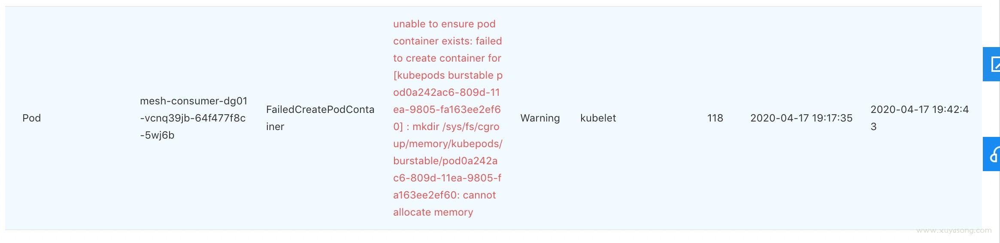
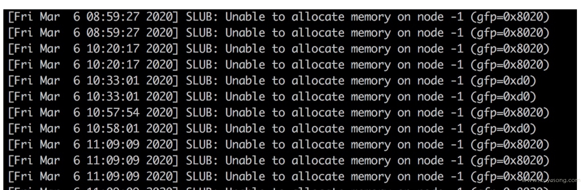

## 前言

这篇文章的全称应该叫：[在某些内核版本上，cgroup 的 kmem account 特性有内存泄露问题]，如果你遇到过 pod 的 `cannot allocated memory` 报错，node 内核日志的 `SLUB: Unable to allocate memory on node -1` 报错，那么恭喜你中招了。

这个问题在 [pingcap 文章](https://pingcap.com/blog/try-to-fix-two-linux-kernel-bugs-while-testing-tidb-operator-in-k8s/) 和腾讯云的[官方修复](https://tencentcloudcontainerteam.github.io/2018/12/29/cgroup-leaking/)都发过，原因也讲的很清楚，不过因为版本差异，文章里的方法有所变动，这里做下总结。

## 现象

我们的环境：
- K8S 版本： 1.11、1.13、1.16
- docker 版本：18.09
- 机器操作系统：centos7、centos6
- 机器内核版本：3.10

可能会出现以下几种现象：

1、pod 状态异常，describe pod 显示原因为: `no allocated memory`



2、节点上执行 dmesg 有日志显示：slub无法分配内存：`SLUB: Unable to allocate memory on node -1`



3、节点 OOM 开始按优先级杀进程，有可能会导致有些正常 pod 被杀掉

4、机器free 查看可用内存还有很多，却无法分配，怀疑是内存泄露。

## 原因

一句话总结：

- cgroup 的 kmem account 特性在 3.x 内核上有内存泄露问题，如果开启了 kmem account 特性 会导致可分配内存越来越少，直到无法创建新 pod 或节点异常。

几点解释：

- 1、kmem account 是cgroup 的一个扩展，全称CONFIG_MEMCG_KMEM，属于机器默认配置，本身没啥问题，只是该特性在 3.10 的内核上存在漏洞有内存泄露问题，4.x的内核修复了这个问题。
- 2、因为 kmem account 是 cgroup 的扩展能力，因此runc、docker、k8s 层面也进行了该功能的支持，即默认都打开了kmem 属性。
- 3、因为3.10 的内核已经明确提示 kmem 是实验性质，我们仍然使用该特性，所以这其实不算内核的问题，是 k8s 兼容问题。

其他细节原因下面会解释

## 解决方案

`推荐方案三`

### 方案一

既然是 3.x 的问题，直接升级内核到 4.x 及以上即可，内核问题解释：

- https://github.com/torvalds/linux/commit/d6e0b7fa11862433773d986b5f995ffdf47ce672
- https://support.mesosphere.com/s/article/Critical-Issue-KMEM-MSPH-2018-0006

这种方式的缺点是：
- 1、要升级所有节点，节点重启的话已有 pod 肯定要漂移，如果节点规模很大，这个升级操作会很繁琐，业务部门也会有意见，要事先沟通。
- 2、这个问题归根结底是软件兼容问题，3.x 自己都说了不成熟，不建议你使用该特性，k8s、docker却 还要开启这个属性，那就不是内核的责任，因为我们是云上机器，想替换4.x 内核需要虚机团队做足够的测试和评审，因此这是个长期方案，不能立刻解决问题。
- 3、已有业务在 3.x 运行正常，不代表可以在 4.x 也运行正常，即全量升级内核之前需要做足够的测试，尤其是有些业务需求对os做过定制。

因为 2 和 3 的原因，我们没有选择升级内核，决定使用其他方案。

### 方案二

修改虚机启动的引导项 grub 中的cgroup.memory=nokmem，让机器启动时直接禁用 cgroup的 kmem 属性

```bash
# 修改/etc/default/grub 为：

GRUB_CMDLINE_LINUX="crashkernel=auto net.ifnames=0 biosdevname=0 intel_pstate=disable cgroup.memory=nokmem"

# 生成配置：
/usr/sbin/grub2-mkconfig -o /boot/grub2/grub.cfg

# 重启机器：
reboot 

# 验证：
cat /sys/fs/cgroup/memory/kubepods/burstable/pod*/*/memory.kmem.slabinfo 无输出即可。
```

这个方式对一些机器生效，但有些机器替换后没生效，且这个操作也需要机器重启，暂时不采纳。

### 方案三

在 k8s 维度禁用该属性。issue 中一般建议修改 kubelet代码并重新编译。

对于v1.13及其之前版本的kubelet，需要手动替换以下两个函数。

```
vendor/github.com/opencontainers/runc/libcontainer/cgroups/fs/memory.go

func EnableKernelMemoryAccounting(path string) error {
    return nil
}


func setKernelMemory(path string, kernelMemoryLimit int64) error {
    return nil
}
```

重新编译并替换 kubelet

```
make WHAT=cmd/kubelet GOFLAGS=-v GOGCFLAGS="-N -l"
```

对于v1.14及其之后版本的kubelet 通过添加BUILDTAGS来禁止 kmem accounting.

```
make BUILDTAGS="nokmem" WHAT=cmd/kubelet GOFLAGS=-v GOGCFLAGS="-N -l"
```

我们遇到1.16 版本的BUILDTAGS=”nokmem“编译出来的 let 还是有问题，还是通过修改代码的方式使其生效：

```
修改文件：
vendor/github.com/opencontainers/runc/libcontainer/cgroups/fs/kmem.go

为：

// +build linux,!nokmem

package fs

import (
    "errors"
)

func EnableKernelMemoryAccounting(path string) error {
    return nil
}

func setKernelMemory(path string, kernelMemoryLimit int64) error {
    return errors.New("kernel memory accounting disabled in this runc build")
}
```

编译前，可以编辑下文件 hack/lib/version.sh，将 KUBE_GIT_TREE_STATE="dirty" 改为 KUBE_GIT_TREE_STATE="clean"，确保版本号干净。

这里面提下两篇文章：

- pingcap：https://pingcap.com/blog/try-to-fix-two-linux-kernel-bugs-while-testing-tidb-operator-in-k8s/
- 腾讯云：https://tencentcloudcontainerteam.github.io/2018/12/29/cgroup-leaking/

都修改了 kubelet，pingcap 的文章有提到，docker18.09 默认关闭了 kmem，我们用的就是 18.09，但其实 docker 是打开了的，包括现在最新版的 docker-ce，直接 docker run 出来的容器也有 kmem

因此只修改 kubelet 在某些情况下是有问题的，判断依据是：

- /sys/fs/cgroup/memory/memory.kmem.slabinfo
- /sys/fs/cgroup/memory/kubepods/memory.kmem.slabinfo
- /sys/fs/cgroup/memory/kubepods/burstabel/pod123456/xxx/memory.kmem.slabinfo

上边的三个文件，前两个是由 let 生成，对应 pod 维度的，修复 kubelet 后cat 该文件发现没有开启 kmem符合预期，但第三个是开启了的，猜测是 docker 层runc 生成容器时又打开了

因此，最简单的方式是和腾讯一样，直接修改下层的runc，在 runc层面将kmem直接写死为 nokmem

runc 文档：https://github.com/opencontainers/runc/blob/a15d2c3ca006968d795f7c9636bdfab7a3ac7cbb/README.md

方式：用最新版的 runc, make BUILDTAGS="seccomp nokmem" 然后 替换 /usr/bin/runc

验证：替换了 runc 后，不重启 docker，直接 kubectl run 或者 docker run, 新容器都会禁用 kmem，当然如果 kill 老 pod，新产生的 pod也禁用了kmem，证明没有问题

## 验证方式

找到一个设置了 request、limit的 pod，然后获取其 cgroup 中的 memory.kmem.slabinfo文件，如果报错或为 0，就证明没开 kmem，就没问题。

```
cat /sys/fs/cgroup/memory/kubepods/burstable/pod*/*/memory.kmem.slabinfo 
```

你也可以直接新建一个：

```
kubectl run nginx-1 --image=hub.baidubce.com/cce/nginx-alpine-go:latest --port=80 --restart=Never --requests='cpu=100m,memory=100Mi' --limits="cpu=200m,memory=200Mi"
```

然后 docker ps | grep nginx-1 得到容器 id

```
find /sys/fs/cgroup/memory -name "memory.kmem.slabinfo" | grep 容器 id，得到slabinfo的路径，直接 cat看结果
```

这个验证方式也是上边的复现方式。

## 影响范围

k8s在 1.9版本开启了对 kmem 的支持，因此 1.9 以后的所有版本都有该问题，但必须搭配 3.x内核的机器才会出问题。

一旦出现会导致新 pod 无法创建，已有 pod不受影响，但pod 漂移到有问题的节点就会失败，直接影响业务稳定性。因为是内存泄露，直接重启机器可以暂时解决，但还会再次出现。

## 原理解释

### kmem 是什么

kmem 是cgroup 的一个扩展，全称CONFIG_MEMCG_KMEM，属于机器默认配置。

内核内存与用户内存：

内核内存：专用于Linux内核系统服务使用，是不可swap的，因而这部分内存非常宝贵的。但现实中存在很多针对内核内存资源的攻击，如不断地fork新进程从而耗尽系统资源，即所谓的“fork bomb”。

为了防止这种攻击，社区中提议通过linux内核限制 cgroup中的kmem 容量，从而限制恶意进程的行为，即kernel memory accounting机制。

使用如下命令查看KMEM是否打开：

```
# cat /boot/config-`uname -r`|grep CONFIG_MEMCG
CONFIG_MEMCG=y
CONFIG_MEMCG_SWAP=y
CONFIG_MEMCG_SWAP_ENABLED=y
CONFIG_MEMCG_KMEM=y
```

### cgroup 与 kmem 机制

使用 cgroup 限制内存时，我们不但需要限制对用户内存的使用，也需要限制对内核内存的使用。kernel memory accounting 机制为 cgroup 的内存限制增加了 stack pages（例如新进程创建）、slab pages(SLAB/SLUB分配器使用的内存)、sockets memory pressure、tcp memory pressure等，以保证 kernel memory 不被滥用。

当你开启了kmem 机制，具体体现在 memory.kmem.limit_in_bytes 这个文件上：

```
/sys/fs/cgroup/memory/kubepods/pod632f736f-5ef2-11ea-ad9e-fa163e35f5d4/memory.kmem.limit_in_bytes
```

实际使用中，我们一般将 memory.kmem.limit_in_bytes 设置成大于 memory.limit_in_bytes，从而只限制应用的总内存使用。

kmem 的 limit 与普通 mem 的搭配，参考这篇文章：https://lwn.net/Articles/516529/

cgroup 文档: https://www.kernel.org/doc/Documentation/cgroup-v1/memory.txt

### kmem 属性的漏洞

在4.0以下版本的 Linux 内核对 kernel memory accounting 的支持并不完善，在3.x 的内核版本上，会出现 kernel memory 无法回收，bug 解释：

- https://bugzilla.redhat.com/show_bug.cgi?id=1507149
- https://github.com/kubernetes/kubernetes/issues/61937
- https://support.d2iq.com/s/article/Critical-Issue-KMEM-MSPH-2018-0006

### docker 与 k8s 使用 kmem

以上描述都是cgroup层面即机器层面，但是 runc 和 docker 发现有这个属性之后，在后来的版本中也支持了 kmem ，k8s 发现 docker支持，也在 1.9 版本开始支持。

1.9版本及之后，kubelet 才开启 kmem 属性

kubelet 的这部分代码位于：

```
https://github.com/kubernetes/kubernetes/blob/release-1.12/vendor/github.com/opencontainers/runc/libcontainer/cgroups/fs/memory.go#L70-L106
```

对于k8s、docker 而言，kmem 属性属于正常迭代和优化，至于 3.x 的内核上存在 bug 不能兼容，不是k8s 关心的问题。

但 issue 中不断有人反馈，因此在 k8s 1.14 版本的 kubelet 中，增加了一个编译选项 make BUILDTAGS="nokmem"，就可以编译 kubelet 时就禁用 kmem，避免掉这个问题。而1.8 到1.14 中间的版本，只能选择更改 kubelet 的代码。


### slub 分配机制

因为节点 dmesg 的报错是：`SLUB: Unable to allocate memory on node -1`

cgroup 限制下，当用户空间使用 malloc 等系统调用申请内存时，内核会检查线性地址对应的物理地址，如果没有找到会触发一个缺页异常，进而调用 brk 或 do_map 申请物理内存(brk申请的内存通常小于128k)。而对于内核空间来说，它有2种申请内存的方式，slub和vmalloc：

- slab用于管理内存块比较小的数据，可以在/proc/slabinfo下查看当前slab的使用情况，
- vmalloc操作的内存空间为 VMALLOC_START～4GB，适用于申请内存比较大且效率要求不高的场景。可以在/proc/vmallocinfo中查看vmalloc的内存分布情况。
- 可以在/proc/buddyinfo中查看当前空闲的内存分布情况。

### 其他的表现

- 除了最上面提到的无法分配内存问题，kmem 还会导致其他现象，如pod资源占用过高问题
- 复现该问题还有一种方式，就是疯狂创建 cgroup 文件，直到 65535 耗尽，参考：https://github.com/kubernetes/kubernetes/issues/61937

> - 作者：徐亚松
> - 原文链接：http://www.xuyasong.com/?p=2049