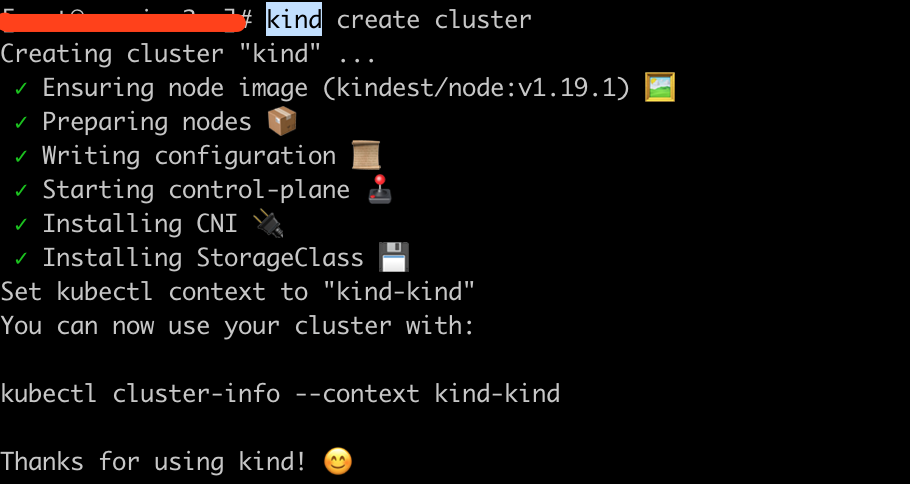
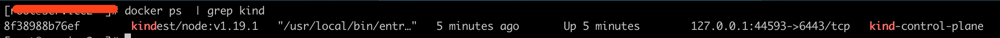
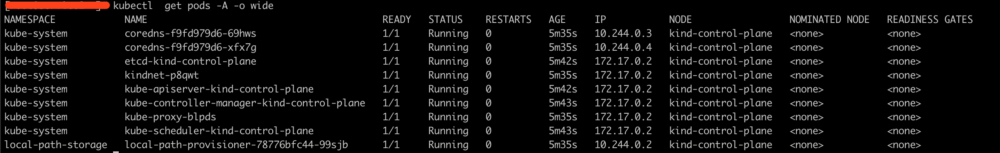
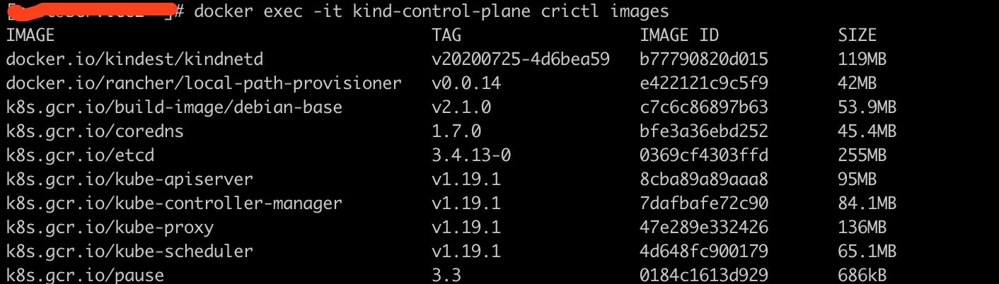

## 什么是 Kind

`kind`：是一种使用Docker容器`节点`运行本地Kubernetes集群的工具。该类型主要用于测试Kubernetes，但可用于本地开发或CI。

> 注意：kind仍在开发中

## 部署

### Mac & Linux

```bash
$ curl -Lo ./kind "https://kind.sigs.k8s.io/dl/v0.9.0/kind-$(uname)-amd64"
$ chmod +x ./kind
$ mv ./kind /some-dir-in-your-PATH/kind
```

### Mac 上使用 brew 安装

```bash
$ brew install kind
```

### Windows

```bash
$ curl.exe -Lo kind-windows-amd64.exe https://kind.sigs.k8s.io/dl/v0.9.0/kind-windows-amd64
Move-Item .\kind-windows-amd64.exe c:\some-dir-in-your-PATH\kind.exe

# OR via Chocolatey (https://chocolatey.org/packages/kind)
$ choco install kind
```

## K8S集群创建与删除

```bash
# 创建集群，默认集群名称为 kind
$ kind create cluster
```



一个 Docker 容器创建的 K8S 集群



列出K8S集群pods



```bash
# 定义集群名称
$ kind create cluster --name kind-2

# 查询集群
$ kind get clusters

# 删除集群
$ kind delete cluster
```

## 其它操作

```bash
# 列出集群镜像
$ docker exec -it my-node-name crictl images
```



## 参考链接

> - https://github.com/kubernetes-sigs/kind
> - https://kind.sigs.k8s.io/docs/user/quick-start/#installation