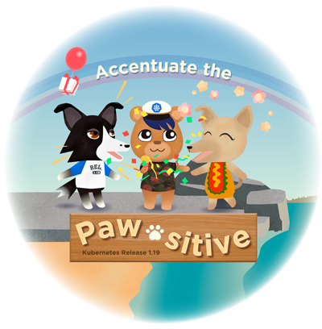

## 前言

终于，我们推出了Kubernetes 1.19，这是2020年的第二个发行版，并且迄今为止最长的发行周期持续了20周。它由33项增强功能组成。12个增强功能进入`稳定版`，18个增强功能进入`测试版`，13个增强功能进入`alpha版`。

由于 COVID-19、George Floyd 抗议以及我们作为发布团队经历的其他一些全球性事件，因此1.19版本与常规版本完全不同。由于这些事件，我们决定调整我们的时间表，并让 SIG、工作组和贡献者有更多的时间来完成任务。额外的时间也让大家有时间关注 Kubernetes 项目之外的生活，并确保他们的精神状态更加良好。

贡献者是 Kubernetes 的核心，《 Kubernetes行为准则》要求人们彼此优秀，尽管我们的世界动荡不安，但我们从社区中看到的只是伟大和谦卑。

## Kubernetes 1.19 Logo

所有人都启发了这个 Kubernetes 1.19版本 Logo！这个版本有点像是一场马拉松比赛，也证明了当世界是一个荒野之地时，我们可以聚集在一起，做不可思议的事情。

之所以选择“强调爪子-本地化”作为发布主题，是因为它捕捉了发布团队尽管世界状况良好的积极前景。1.19徽标中显示的字符代表了我们发行团队中每个人的个性，从emo到peppy，甚至更多！

关于设计师：汉娜贝丝·拉格洛夫（Hannabeth Lagerlof）是位于加利福尼亚州洛杉矶的视觉设计师，她在环境和图形设计领域拥有广泛的背景。汉娜贝斯（Hannabeth）创造艺术和用户体验来激发联系。您可以在Twitter上以@emanate_design的身份找到Hannabeth。

## 主要主题

### 将Kubernetes的支持期限增加到一年

长期支持（LTS）工作组于2019年初进行的一项调查表明在当前的9个月支持期内，很大一部分Kubernetes最终用户未能升级。该调查以及调查的其他回应表明，如果将补丁程序的支持期限延长至12-14个月，则30％的用户将能够在支持的版本上保留其部署。无论用户是使用自建版还是商业发行版，情况都是如此。因此，延长支持期将导致超过 80% 的用户使用受支持的版本，而不是现在的 50-60%。一年一度的支持期可为用户提供所需的缓冲期，并且更符合熟悉的年度规划周期。从 Kubernetes 1.19 版本开始，支持窗口将延长到一年。

### 储存容量追踪

传统上，Kubernetes调度程序基于这样的假设，即集群中任何地方都可以使用附加的持久性存储，并具有无限的容量。拓扑约束解决了第一点，但是到目前为止，仍然进行了pod调度，而没有考虑剩余的存储容量可能不足以启动新的pod。`存储容量跟踪`是一项新的Alpha功能，它通过为CSI驱动程序添加API来报告存储容量来解决该问题，并在为Pod选择节点时在Kubernetes调度程序中使用该信息。该功能可作为支持本地卷和其他容量限制较大的卷类型的动态预配置的基础。

### 通用临时存储

Kubernetes 提供了卷插件，其生命周期与 Pod 绑定，可用作临时空间（例如内置的 `emptydir` 卷类型），也可以将一些数据加载到 Pod 中（例如内置的`configmap` 和 `secret` 卷类型，或 “CSI内联卷”）。新的通用临时卷alpha功能允许将任何支持动态预配置的现有存储驱动程序用作临时卷，并将该卷的生命周期绑定到Pod。它可用于提供与根磁盘不同的临时存储，例如永久性内存或该节点上的单独本地磁盘。支持所有用于卷配置的StorageClass参数。支持`PersistentVolumeClaims` 支持的所有功能，如存储容量跟踪、快照和还原以及卷的大小调整。

### CSI Volume 健康监测

CSI 健康状况监控的 Alpha 版本随 Kubernetes 1.19一起发布。此功能使CSI驱动程序可以与Kubernetes共享来自底层存储系统的异常卷状况，以便可以将它们报告为PVC或Pod上的事件。此功能是 Kubernetes 进行程序检测和解决单个卷健康问题的基础。

### Ingress 升级为 GA

就将 Ingress API 推向 GA 而言，API 本身在 Beta 版中已经存在了很长时间，以至于通过使用和采用（包括用户和负载均衡器/Ingress 控制器提供商），它已经达到了事实上的 GA 状态。在没有全面替代的情况下放弃它不是一个可行的方法。它显然是一个有用的 API，并且捕获了一组不平凡的用例。在这一点上，似乎更谨慎的做法是将当前的 API 声明为社区将支持的 V1 版本，同时开发 V2 Ingress API 或具有超集功能的完全不同的 API。

### 结构化日志

在v1.19之前，登录Kubernetes控制平面无法保证日志消息和这些日志中对Kubernetes对象的引用具有任何统一的结构。这使得解析，处理，存储，查询和分析日志变得困难，并迫使管理员和开发人员在大多数情况下基于某些正则表达式依赖于即席解决方案。由于这些问题，基于这些日志的任何分析解决方案都难以实现和维护。

### 新的 klog 方法

该Kubernetes版本向klog库引入了新方法，该方法提供了用于格式化日志消息的更结构化的接口。现在，每个现有的格式化日志方法（`Infof`，`Errorf`）都通过结构化方法（`InfoS`，`ErrorS`）进行匹配。新的日志记录方法将日志消息作为第一个参数，将键值对列表作为可变参数的第二个参数。这种方法允许逐步采用结构化日志记录，而无需一次将所有 Kubernetes转换为新的API。

### Kubelet的客户端TLS证书轮换

kubelet使用私钥和证书向kube-apiserver认证kubelet。证书在首次启动时通过集群外机制提供给kubelet。自Kubernetes v1.8起，群集已包含（beta）过程，用于获取初始证书/密钥对并在证书到期时对其进行轮换。在Kubernetes v1.19中，它可以稳定下来。

在 kubelet 启动过程中，将对文件系统进行扫描，以查找由证书管理器管理的现有证书/密钥对。如果有可用的证书/密钥，则将加载它。如果没有，则 kubelet 会检查配置文件中的编码证书值或 kubeconfig 中的文件引用。如果证书是一个 bootstrap 证书，则它将用于生成密钥，创建证书签名请求并向 API服务器请求签名的证书。

当到期临近时，证书管理器负责提供正确的证书，生成新的私钥并请求新的证书。随着kubelet请求证书的签名是其启动顺序的一部分，并且不断地对来自kubelet的证书签名请求进行自动批准，以使群集管理变得可管理。

## 其他更新

### 毕业至稳定

- Seccomp (https://github.com/kubernetes/enhancements/issues/135)
- Kubelet 客户端 TLS 证书轮转 (https://github.com/kubernetes/enhancements/issues/266)
- 限制节点对 API 的访问 (https://github.com/kubernetes/enhancements/issues/279)
- 重新设计事件 API (https://github.com/kubernetes/enhancements/issues/383)
- Ingress 升级到 V1 版本 (https://github.com/kubernetes/enhancements/issues/1453)
- CertificateSigningRequest API (https://github.com/kubernetes/enhancements/issues/1513)
- 在没有Docker的情况下构建Kubelet (https://github.com/kubernetes/enhancements/issues/1547)

### 主要变化

- 节点拓扑管理器 (https://github.com/kubernetes/enhancements/issues/693)
- 新的端点 API (https://github.com/kubernetes/enhancements/issues/752)
- 将 Kubernetes 支持窗口增加到一年 (https://github.com/kubernetes/enhancements/issues/1498)

### 其他显着特性

- 运行多个调度配置文件 (https://github.com/kubernetes/enhancements/issues/1451)
- CertificateSigningRequest API (https://github.com/kubernetes/enhancements/issues/1513)
- 不变的 Secrets 和 ConfigMap (https://github.com/kubernetes/enhancements/issues/1412)

## 发行说明

在我们的发行说明(https://github.com/kubernetes/kubernetes/blob/master/CHANGELOG/CHANGELOG-1.19.md)中查看 Kubernetes 1.19 发行版的完整详细信息。

## 可用性

Kubernetes 1.19可以在GitHub(https://github.com/kubernetes/kubernetes/releases/tag/v1.19.0)上下载。要开始使用 Kubernetes，请查看这些交互式教程(https://kubernetes.io/docs/tutorials/)或使用带有 KinD（Docker中的Kubernetes）的 Docker 容器“节点”运行本地 Kubernetes 集群。您还可以使用 `kubeadm` 轻松安装1.19 。

## 发布团队

在数百名贡献了技术和非技术内容的个人的努力下，此版本才得以实现。特别感谢HashiCorp的高级开发人员倡导者Taylor Dolezal领导的发布团队。34位发布团队成员协调了发布的各个方面，从文档到测试，验证和功能完整性。

随着Kubernetes社区的发展，我们的发布过程很好地展示了开源软件开发中的协作。Kubernetes继续快速获得新用户。这种增长创造了一个积极的反馈周期，更多的贡献者提交了代码，从而创建了一个更加活跃的生态系统。到目前为止，Kubernetes已有49,000多位个人贡献者，活跃社区有3,000多人。

## 从长远来看

该版本与增强方面也有所不同。传统上，我们在增强功能调用和增强功能冻结之间需要3-4周的时间，到此阶段，贡献者可以确认某个特定功能是否会成为周期的一部分。这个发行周期是独一无二的，我们有五个星期才达到相同的里程碑。延长的时间使贡献者有更多的时间来计划和决定他们各自功能的毕业。

贡献者实现这些功能的里程碑从通常的5周延长到7周。为贡献者提供了40％以上的时间来处理其功能，从而减少了疲劳，并为实现工作提供了更多的思考机会。我们还注意到最后一刻的摆弄大大减少了。这个周期的异常请求数量也减少了6个，而上一个发布周期是14个。

## 生态系统更新

- CNCF刚刚结束了它的第一个Virtual KubeCon。所有注册的人都可以按需进行所有对话，还不算太晚！
- 该认证Kubernetes安全专家（CKS）十一月来了！CKS致力于集群和系统强化，最大程度地减少微服务漏洞和供应链的安全性。
- CNCF发布了第二份《云原生开发状态》，展示了使用容器和无服务器技术的大量云原生开发人员。
- Kubernetes.dev，一个以Kubernetes贡献者为中心的网站已经启动。它将贡献者的文档，资源和项目事件信息带到一个中央位置。

## 项目速度

Kubernetes DevStats 仪表盘(https://k8s.devstats.cncf.io/d/12/dashboards?orgId=1)说明了公司主要贡献者的贡献明细，以及一套令人印象深刻的预配置报告，从个人贡献者到拉动请求生命周期时间。如果你想从 Kubernetes 和 CNCF 社区收集数字、事实和数据，它是最好的开始。

在4月到8月的这个发布周期中，有382家不同的公司和超过2464名个人为Kubernetes 做出了贡献。查看 DevStats(https://k8s.devstats.cncf.io/d/11/companies-contributing-in-repository-groups?orgId=1&var-period=m&var-repogroup_name=All&from=1585692000000&to=1598392799000)，可以了解更多关于 Kubernetes 项目和社区的整体速度。

## 即将发布的在线讲座

2020年9月25日，加入 Kubernetes 1.19发布团队成员，了解本次发布的主要功能，包括存储容量跟踪、结构化日志、Ingress V1 GA 等。请在此注册：https://www.cncf.io/webinars/kubernetes-1-19/。

> - 原文链接：https://kubernetes.io/blog/2020/08/26/kubernetes-release-1.19-accentuate-the-paw-sitive/