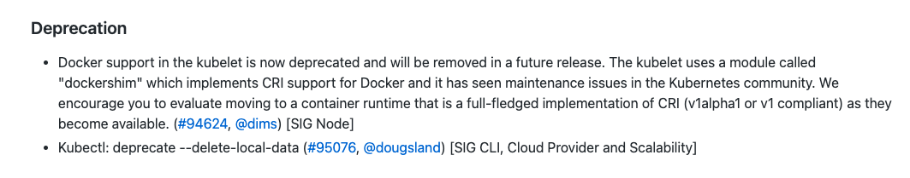
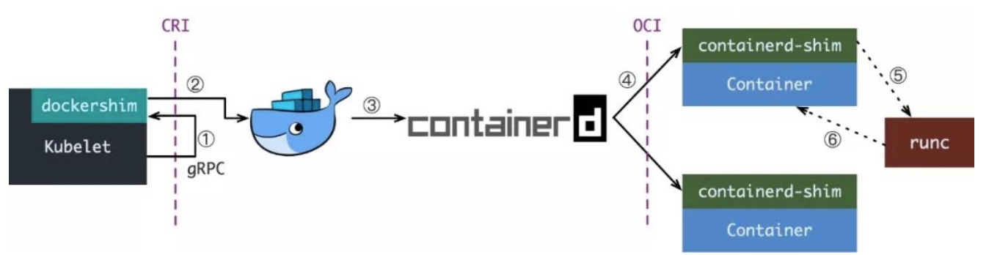

## 前言

- Kubelet 中对 Docker 支持被弃用，并将在以后的版本中删除。Kubelet 使用一个名为 `dockershim` 的模块，该模块实现了对Docker的 `CRI` 支持，在此PR后续版本将删除`dockershim`。
- Kubectl 弃用 `--delete-local-data` 参数。

## 名词解释

上面中提到两个名词，分别为 `CRI` 和 `dockershim`。下面分别解释一下：

### CRI

大家在看到 `CRI` 时就会想起 `OCI`，这两个名词概念容易混淆。

`CRI`：容器运行时接口 `container runtime interface`，CRI 中定义了容器和镜像两个接口，实现了这两个接口目前主流的是：CRI-O、Containerd。（目前 PCI 产品使用的即为 Containerd）。

其主要的作用：

- 1、针对容器操作的接口，包括容器的创建、启动和停止等
- 2、针对镜像的操作，拉去、删除镜像等
- 3、针对 podsandbox（容器沙箱环境）
- 4、以上全是接口

`OCI`：开放容器标准 `open container initiative`，OCI 中定义了两个标准：`容器运行时标准` 和 `容器镜像标准`，实现了这一标准的主流是：runc（也即我们日常说的 Docker）、Kata-Container。

主要作用，制作容器：

- 1、容器镜像制作内容，即 `ImageSpec`
- 2、容器需要接收哪些指令，即 `runtimeSpec`

### Dockershim

`Dockershim 作用`：把外部收到的请求转化成 `Docker Daemon` 能听懂的请求，让 Docker Daemon 执行创建、删除等容器操作。

## Kubelete 创建容器步骤 [1]

- 1、Kubelet 通过 CRI 接口（gRPC）调用 dockershim，请求创建一个容器。CRI 即容器运行时接口，这一步中，Kubelet 可以视作一个简单的 CRI Client，而 dockershim 就是接收请求的 Server。目前 dockershim 的代码其实是内嵌在 Kubelet 中的，所以接收调用就是 Kubelet 进程。
- 2、dockershim 收到请求后，转化成 Docker Daemon 能听懂的请求，发到 Docker Daemon 上请求创建一个容器。
- 3、Docker Daemon 早在 1.12 版本中就已经将针对容器的操作移到另一个守护进程 containerd 中，因此 Docker Daemon 仍然不能帮我们创建容器，而是要请求 containerd 创建一个容器。
- 4、containerd 收到请求后，并不会自己直接去操作容器，而是创建一个叫做 containerd-shim 的进程，让 containerd-shim 去操作容器。是因为容器进程需要一个父进程来做诸如收集状态，维持 stdin 等 fd 打开等工作。而假如这个父进程就是 containerd，那每次 containerd 挂掉或升级，整个宿主机上所有的容器都得退出了。而引入了 containerd-shim 就规避了这个问题（containerd 和 shim 并不是父子进程关系）。
- 5、我们知道创建容器需要做一些设置 namespaces 和 cgroups，挂载 root filesystem 等等操作，而这些事该怎么做已经有了公开的规范，那就是 OCI。它的一个参考实现叫做 runC。于是，containerd-shim 在这一步需要调用 runC 这个命令行工具，来启动容器。
- 6、runC 启动完容器后本身会直接退出，containerd-shim 则会成为容器进程的父进程，负责收集容器进程的状态，上报给 containerd，并在容器中 pid 为 1 的进程退出后接管容器中的子进程进行清理，确保不会出现僵尸进程。

通过上面来看，`Docker Daemon` 和 `dockershim` 看上去就是两个不干活的东西，Kubelet 为啥不直接调用 `containerd` 呢？其实和容器历程有关，这里不在阐述。

尽管现在已经有 `CRI-O`，`containerd-plugin` 这样更精简轻量的 `Runtime` 架构，但 `dockershim` 这一套作为经受了最多生产环境考验的方案，迄今为止仍是 Kubernetes 默认的 Runtime 实现。不过 `Containerd` 逐渐被人们所知晓。

## 展望

虽然未来 Kubelet 删除 dockershim 支持，但并不说明 Docker 马上就不能在 Kubernetes 中使用，目前容器市场 Docker 还是占用很大的比例。这中间会有一个过渡期，大家可以关注 `Containerd` 或者 `Podman`。Centos8 开始，仓库源默认容器已经从 `Docker` 切换为 `Podman`。

## 参考链接

- [1] https://www.cnblogs.com/charlieroro/articles/10998203.html
- https://github.com/kubernetes/kubernetes/blob/master/CHANGELOG/CHANGELOG-1.20.md
- https://blog.51cto.com/12182612/2436484
- https://mp.weixin.qq.com/s/_NJA71eWT0-mGEMy1DEqLw