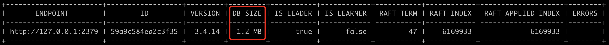
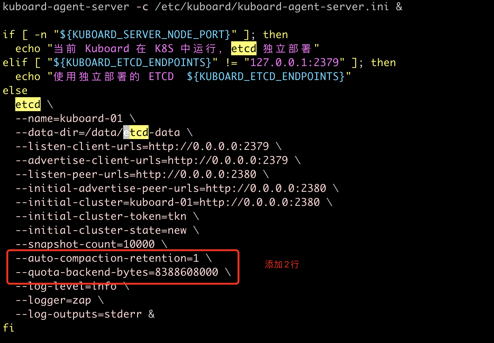
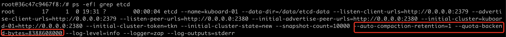

## 一、前言

当运行 `ETCD` 日志报 `Erro: mvcc database space exceeded` 时，说明ETCD存储不足了（默认ETCD存储是2G），配额会触发告警，然后 Etcd 系统将进入操作受限的维护模式。

通过下面命令可以查看ETCD存储使用情况：

```bash
$ ETCDCTL_API=3 etcdctl --endpoints="http://127.0.0.1:2379" --write-out=table endpoint status
```



## 二、临时解决方案

> PS: 压缩前做好快照备份，命令 `etcdctl snapshot save backup.db`

通过 ETCD `数据压缩`来临时解决问题，具体如下操作

```bash
# 获取当前版本
$ rev=$(ETCDCTL_API=3 etcdctl --endpoints=http://127.0.0.1:2379 endpoint status --write-out="json" | egrep -o '"revision":[0-9]*' | egrep -o '[0-9].*')

# 压缩所有旧版本
$ ETCDCTL_API=3 etcdctl --endpoints=http://127.0.0.1:2379 compact $rev

# 整理多余的空间
$ ETCDCTL_API=3 etcdctl --endpoints=http://127.0.0.1:2379 defrag

# 取消告警信息
$ ETCDCTL_API=3 etcdctl --endpoints=http://127.0.0.1:2379 alarm disarm

# 测试是否能成功写入
$ ETCDCTL_API=3 etcdctl --endpoints=http://127.0.0.1:2379 put testkey 123

OK

# 再次查看ETCD存储使用情况
$ ETCDCTL_API=3 etcdctl --endpoints="http://127.0.0.1:2379" --write-out=table endpoint status
```

## 三、最终解决方案

在 ETCD 启动命令中添加下面两个参数：

```bash
# 表示每隔一个小时自动压缩一次
--auto-compaction-retention=1
# 磁盘空间调整为 8G，官方建议最大 8G（单位是字节）
--quota-backend-bytes=8388608000
```

## 四、最佳实践

大家有没有使用过 `Kuboard`（Kubernetes 多集群管理界面，官网地址：https://kuboard.cn），如果有使用过的同学可能会遇到ETCD存储不足的问题，因为官网提供的docker镜像中，ETCD启动参数并没有添加 `--auto-compaction-retention` 和 `--quota-backend-bytes` 参数。

修改官网 `Kuboard` docker镜像 `/entrypoint.sh` 启动脚本



生成 Dockerfile 文件：

```bash
# 编辑 Dockerfile
$ vim Dockerfile

FROM eipwork/kuboard:v3.5.0.3

COPY ./entrypoint.sh /entrypoint.sh

# 构建镜像
$ docker build -t eipwork/kuboard-modify:v3.5.0.3 . -f Dockerfile
```

启动 Kuboard，并查看进程如下：




## 五、参考文档

- https://etcd.io/docs/v3.4/op-guide/maintenance/