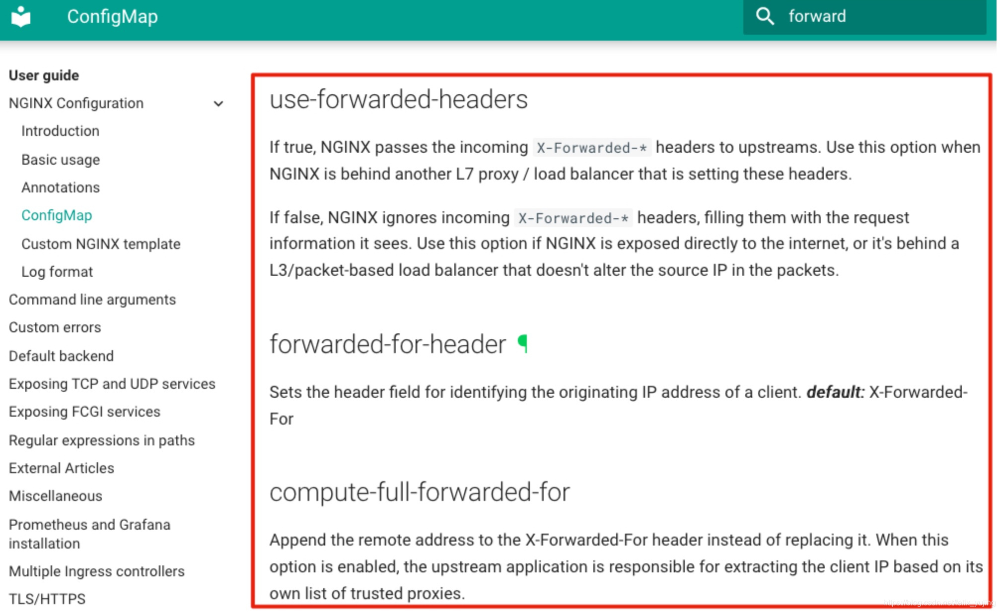
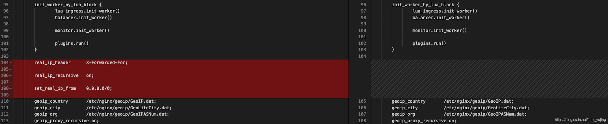
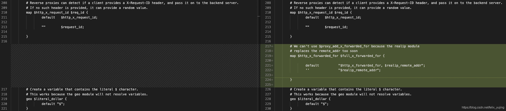
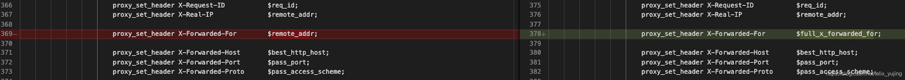

背景
--

业务应用经常有需要用到用户真实ip的场景，比如：异地登录的风险预警、访问用户分布统计等功能等。当有这种需求的时候，在业务上容器过程中，如果用到ingress就要注意配置了。通常，用户ip的传递依靠的是`X-Forwarded-*`参数。但是默认情况下，ingress是没有开启的。

ingress的文档 https://kubernetes.github.io/ingress-nginx/user-guide/nginx-configuration 还比较详细，这里介绍一下用到的3个参数：  

> 注：在文档顶栏的搜索框搜索forward字样就可以找到这3个参数

1\. use-forwarded-headers
-------------------------

*   如果Nginx在其他7层代理或负载均衡后面，当期望Nginx将`X-Forwarded-*`的头信息传递给后端服务时，则需要将此参数设为true
*   如果设为false（默认为false），Nginx会忽略掉`X-Forwarded-*`的头信息。false设置适用于Nginx直接对外或前面只有3层负载均衡的场景

由于ingress的主配置是从configmap中获取的，更新参数则需要修改名为nginx-configuration的configmap的配置：在data配置块下添加`use-forwarded-headers: "true"`

修改后，ingress nginx会自动加载更新nginx.conf主配置文件。下图为更新前后配置文件变化对比：

> 注：左边为开启use-forwarded-headers后ingress nginx主配置文件，右边为开启前

2\. forwarded-for-header
------------------------

用来设置识别客户端来源真实ip的字段，默认是`X-Forwarded-For`。如果想修改为自定义的字段名，则可以在configmap的data配置块下添加：`forwarded-for-header: "THE_NAME_YOU_WANT"`。通常情况下，我们使用默认的字段名就满足需求，所以不用对这个字段进行额外配置。

3\. compute-full-forwarded-for
------------------------------

如果只是开启了`use-forwarded-headers: "true"`的话，会发现还是没能获取到客户端来源的真实ip，原因是当前X-Forwarded-For变量是从remote\_addr获取的值，每次取到的都是最近一层代理的ip。为了解决这个问题，就要配置compute-full-forwarded-for字段了，即在configmap的data配置块添加：`compute-full-forwarded-for: "true"`。其作用就是，将客户端用户访问所经过的代理ip按逗号连接的列表形式记录下来。

待ingress nginx加载configmap并更新主配置文件后，对比更新前后变化如下：

> 注：左边是未开启compute-full-forwarded-for配置的ingress nginx主配置文件，右边是开启了的

举例说明
----

如果从客户端ip0发起一个HTTP请求到达服务器之前，经过了三个代理proxy1、proxy2、proxy3，对应的ip分别为ip1、ip2、ip3，那么服务端最后得到的X-Forwarded-For值为：ip0,ip1,ip2。列表中并没有ip3，ip3可以在服务端通过remote_addr来获得。这样应用程序通过获取X-Forwarded-For字段的第一个ip，就可以得到客户端用户真实ip了。

注意项
---

值得注意的是，并不是所有的场景都能通过X-Forwarded-For来获取用户正式ip。  
比如，当服务器前端使用了CDN的时候，X-Forwarded-For方式获取到的可能就是CDN的来源ip了，  
这种情况，可以根CDN厂商约定一个字段名来记录用户真实ip，然后代理将这个字段逐层传递，最后到服务端。