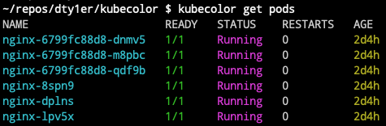
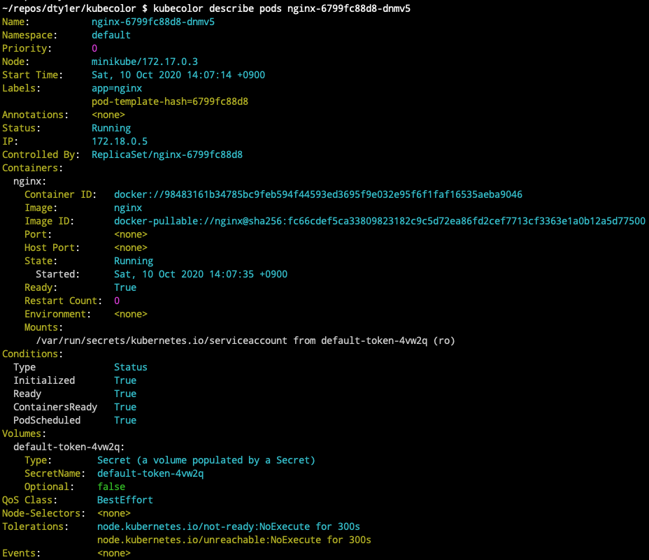
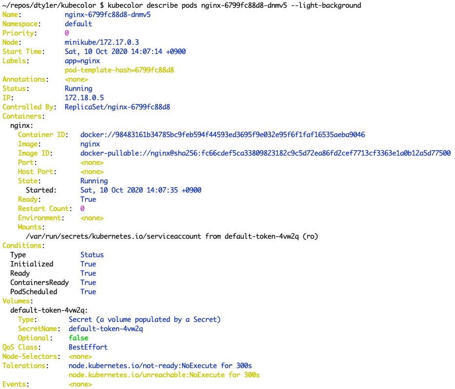

## kubecolor 带有色彩输出

- 获取 kubernetes node 节点信息



- 显示 kubernetes pods 详细信息



- 更换背影颜色主题



从上面来看，带有色彩输出比没有带色彩输出看的更舒服些。

## Kubecolor 如何运行？

kubecolor 为 kubectl 命令输出着色，不执行任何其他操作。kubecolor 在内部调用 `kubectl command` 并尝试对输出进行着色。

## Kubecolor 安装

- 二进制文件安装

打开 `https://github.com/dty1er/kubecolor/releases` 页面，下载相应的二进制文件，下载文件后，把文件放到 `/usr/local/bin` 目录下，并把文件添加执行权限。

- Mac 安装

```bash
$ brew install dty1er/tap/kubecolor
```

## Kubecolor 用法

如果习惯使用 kubectl，可以把 kubecolor 命令做一个 kubectl 别名。具体在 .bash_profile 文件中配置，下面是具体配置。kubecolor 使用和 kubectl 命令方法一样。

```bash
alias kubectl="kubecolor"
```

当 kubecolor 输出 tty 不是标准输出时，它会自动禁用着色。例如，如果您正在运行 `kubecolor get pods > result.txt` 或 `kubecolor get pods | grep xxx`，则输出将传递到文件或其它命令，因此不会着色。在这种情况下，您可以通过传递 `--force-colors` 标志来强制 kubecolor 进行着色。

> 项目地址：https://github.com/dty1er/kubecolor

## 参考链接

- https://github.com/dty1er/kubecolor