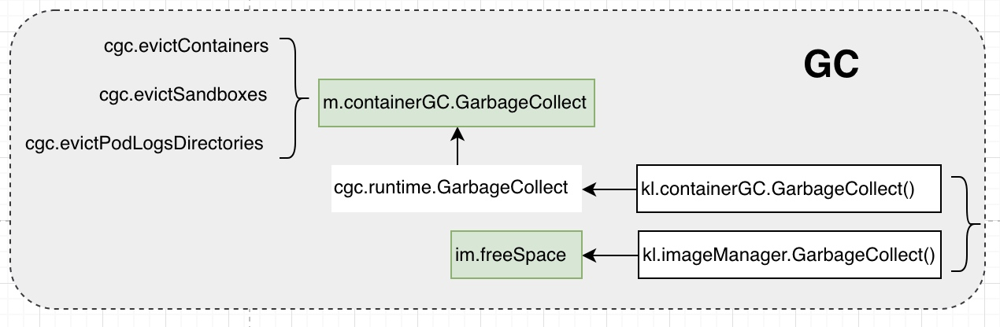
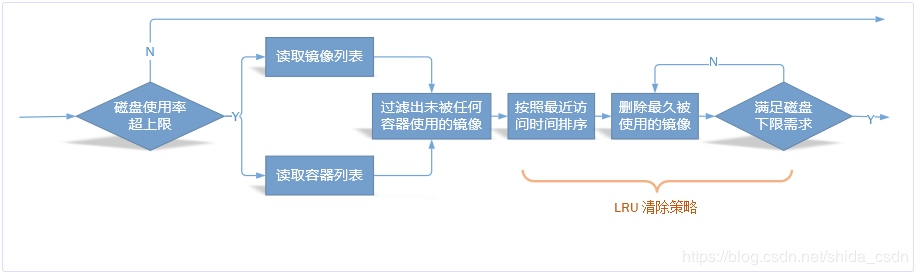

## 概述

在k8s中节点会通过docker pull机制获取外部的镜像，那么什么时候清除镜像呢？k8s运行的容器又是什么时候清除呢?

- `api-server`: 运行在master，无状态组件，go自动内存垃圾回收
- `controller-manager`: 运行在master,无状态组件，go自动内存垃圾回收，owner机制提供resource垃圾回收
- `scheduler`: 运行在master，无状态组件，go自动内存垃圾回收
- `kube-proxy`: 运行在node，无状态组件，无垃圾收集需要
- `kubelet`：运行在node,无状态组件,需要管理宿主机的image和container

`Kubelet`：会定期进行垃圾回收（Garbage Collection），以清理节点上的无用镜像和容器。

- 每隔 1 分钟进行一次容器清理
- 每隔 5 分钟进行一次镜像清理

截止到 `v1.15` 版本，垃圾回收间隔时间还都是在源码中固化的，不可自定义配置，如果节点上已经运行了 Kubelet，不建议再额外运行其它的垃圾回收工具，因为这些工具可能错误地清理掉 Kubelet 认为本应保留的镜像或容器，从而可能造成不可预知的问题。

## 容器的回收

docker容器的本质是宿主机上的一个进程，为了将容器做差异化的封装，docker借助于类似AUFS之类的文件系统做了很多事情。容器停止执行后，这些文件系统并不会自动清除，通过docker ps -a也能够看到这些资源（这是为了下次可以快速启动）。kubelet有一套container gc的方案，专门用于清理宿主机上的非所需容器。

另外，容器镜像较耗存储资源，但是每一台k8s node的存储空间都是有限的，kubelet上运行的pod生命周期可能很短，但是每个pod可能都使用不同的镜像，这就会导致宿主机上会留下很多不再需要的容器镜像，为了将有限的空间腾出来高效利用，kubelet设计了一套image gc的方案。

GC机制即将被eviction替代，在kubelet参数中已经有对应的提示信息。

容器GC的业务逻辑主要在(m *kubeGenericRuntimeManager)GarbageCollect中，主要是三个参数：

- `MinAge`: 容器可以被垃圾回收的最小年龄,默认0分钟,命令行参数为 minimum-container-ttl-duration
- `MaxPerPodContainer`: 每个pod中保留的最大的停止容器数量,默认为1,命令行参数为 maximum-dead-containers-per-container
- `MaxContainers`: 整个节点保留的最大的停止容器数量,默认为-1,标示没有限制,命令行参数为 maximum-dead-containers

容器回收过程如下:

- 1、顶层函数会每分钟被调用，触发container gc操作；
- 2、该操作会以container的结束时间是否超过gcPolicy.MinAge为依据，查询出那些满足条件的容器，并组织成为按照pod为key，container列表为值的字典；这一步并没有做实际删除，但是其操作结果为后两部奠定了数据依据；
- 3、对字典中的每个pod的container做处理，找出该pod超过gcPolicy.MaxPerPodContainer的容器，然后对它们`按照结束时间排序`，执行删除，保障每个pod下已结束的container数满足配置参数；
- 4、经过上一部的删除后，针对node来讲，如果节点上待删除的容器数依然大于gcPolicy.MaxContainers, 就执行反向的运算。把node允许保留的最大容器数平分给每个pod，再按照该标准对每个pod执行一轮删除；
- 5、如果依然还不满足要求的数量，就不再按照pod做key，直接将所有的container拍扁平，`按照时间顺序先删除最旧的容器`，直到满足总数小于gcPolicy.MaxContainers。

## 镜像的回收

镜像回收主要参数：

- `minimum-image-ttl-duration`：最少这么久镜像都未被使用，才允许清理；比如:’300ms’, ‘10s’ or ‘2h45m’.”
- `image-gc-high-threshold`：imageFS磁盘使用率的上限，当达到该值时触发镜像清理。默认值为 90%
- `image-gc-low-threshold`： imageFS磁盘使用率的下限，每次清理直到使用率低于这个值或者没有可以清理的镜像了才会停止。默认值为 80%

具体流程比较简单：

1、与容器GC比较起来，镜像GC顶层函数被触发的周期更长，为5分钟触发一次。

2、通过cadvisor获取到节点上imageFS的详情，得到capacity、avaiable，据此推算磁盘使用率等信息；

3、当磁盘使用率大于image-gc-high-threshold参数中指定的值时，触发镜像的GC操作；

4、找出当前未被使用的镜像列表并按时间排序，过滤掉那些小于minimum-image-ttl-duration的镜像；

5、正式从节点上删除镜像；每次都比较是否删除的镜像数以满足所需释放的bytesToFree，若满足就停止删除。

- 那些`用户手动 run 起来的容器`，对于 Kubelet 垃圾回收来说就是不可见的，也就不能阻止对相关镜像的垃圾回收
- 当镜像存放目录磁盘使用率(df -h) 大于 HighThresholdPercent后，开始删除节点中未使用的docker镜像
- 当磁盘使用率降低至LowThresholdPercent时，停止镜像的垃圾回收。
- 在节点中存在一定的image是必要的，因为可以减少docker拉取镜像的速度减少带宽压力，加速容器启动。

## 参考

- https://kubernetes.io/zh/docs/concepts/cluster-administration/kubelet-garbage-collection/
- http://ljchen.net/2018/10/28/kubelet%E9%85%8D%E7%BD%AE%E6%BA%90%E5%92%8C%E5%9E%83%E5%9C%BE%E5%9B%9E%E6%94%B6%E6%B5%81%E7%A8%8B/
- https://tangxusc.github.io/blog/2019/05/kubelet%E5%9E%83%E5%9C%BE%E5%9B%9E%E6%94%B6%E6%9C%BA%E5%88%B6/

> - 作者：徐亚松
> - 原文链接：http://www.xuyasong.com/?p=1911