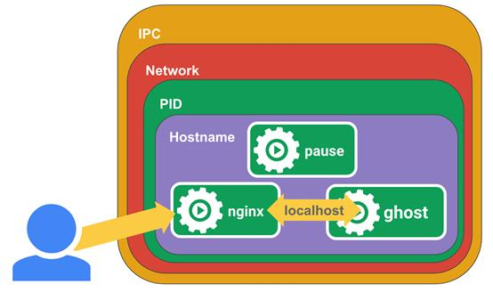

## 前言

【译】The Almighty Pause Container

当我们检查 kubernetes 集群的 node 节点时，我们使用 `docker ps` 查看时会发现一些名为 `pause` 的容器在节点上运行。

```bash
$ docker ps
CONTAINER ID IMAGE COMMAND ...
...
3b45e983c859 gcr.io/google_containers/pause-amd64:3.0 "/pause" ...
...
dbfc35b00062 gcr.io/google_containers/pause-amd64:3.0 "/pause" ...
...
c4e998ec4d5d gcr.io/google_containers/pause-amd64:3.0 "/pause" ...
...
508102acf1e7 gcr.io/google_containers/pause-amd64:3.0 "/pause" ...
```

- 这些 `pause` 容器是什么？
- 为什么会有这么多 `pause` 容器？
- 这是怎么回事呢？

为了回答这些问题，我们需要去回顾一下这些pods是如何在kubernetes下被创建的，特别是在docker/containerd运行环境。

Docker支持以containers的方式部署软件，container也非常适合用来部署单个软件。但是，当我们想一起运行一个软件的多个模块的时候，这种方式又会变得非常的笨重。我们会常常遇到这种情况，当开发人员创建了多个docker镜像后，还需要使用监控模块去启动和管理多个进程。在生产环境下，会发现如果把这些应用部署为一组容器，并将这些容器组彼此分隔，每个容器组共享一个环境，这种方式会更有效。

Kubernetes为应对这种case，提出了pod的抽象概念。Pod的概念，隐藏了docker中复杂的标志位以及管理docker容器、共享卷及其他docker资源的复杂性。同时也隐藏了不同容器运行环境的差异。

原则上，任何人只需要创建一个父容器就可以配置docker来管理容器组之间的共享问题。这个父容器需要能够准确的知道如何去创建共享运行环境的容器，还能管理这些容器的生命周期。为了实现这个父容器的构想，kubernetes中，用pause容器来作为一个pod中所有容器的父容器。这个pause容器有两个核心的功能，第一，它提供整个pod的Linux命名空间的基础。第二，启用PID命名空间，它在每个pod中都作为PID为1进程，并回收僵尸进程。

## 什么是共享命名空间？

在Linux中，当我们运行一个新的进程时，这个进程会继承父进程的命名空间。而运行一个进程在一个新的命名空间，是通过 `unsharing` 父进程的命名空间从而创建一个新的命名空间。这里举个例子，使用unshare工具来运行一个具有新PID，UTS，IPC以及mount命名空间的shell。

```bash
$ sudo unshare --pid --uts --ipc --mount -f chroot rootfs /bin/sh
```

一旦这个进程运行，我们就可以添加其他进程到这个进程的命名空间，从而组成一个pod。我们就可以使用setns来添加新的进程到一个已存在的命名空间中。同一个Pod中的容器共享命名空间，下面举个例子，一起来看我们如何利用pause容器和共享空间来创建一个pod。

首先我们创建一个pause容器。

```bash
$ docker run -d --name pause -p 8080:80 gcr.io/google_containers/pause-amd64:3.0
```

然后我们可以运行其他容器来组成我们的pod。先运行nginx，为localhost:2368创建一个代理。

注意，我们也将本机的8080端口代理到pause容器的80端口，而不是代理到nginx容器，这是因为pause容器初始化了网络命名空间，nginx容器将会加入这个命名空间。

```bash
$ cat <<EOF >> nginx.conf
> error_log stderr;
> events { worker_connections 1024; }
> http {
> access_log /dev/stdout combined;
> server {
> listen 80 default_server;
> server_name example.com www.example.com;
> location / {
> proxy_pass http://127.0.0.1:2368;
> }
> }
> }
> EOF

$ docker run -d --name nginx -v `pwd`/nginx.conf:/etc/nginx/nginx.conf --net=container:pause --ipc=container:pause --pid=container:pause nginx
```

进而我们再创建ghost 容器，这是一个博客程序，作为我们的服务端。

```bash
$ docker run -d --name ghost --net=container:pause --ipc=container:pause --pid=container:pause ghost
```

通过以上的方法，我们就可以通过访问 `http://localhost:8080/` 来查看我们的博客了。

上面的例子中，我们用pause容器为其他容器提供了共享的命名空间。



不难想到，这其中的过程是非常复杂的。而且我们还没有深入探讨如何去监控和管理这些容器的生命周期。但是不用担心，我们不需要这么复杂的去管理我们的容器，因为kubernetes已经都为我们做好了。

## 如何回收僵尸进程？

在Linux中，存在父进程的进程在同一个PID命名空间中会组成一个树形结构。在这个熟悉结构中，位于根节点的进程没有父进程，这个进程就是PID为1的init进程。

进程可以通过fork和exec系统调用来创建其他进程，而这个使用fork系统调用的进程就成为新建进程的父进程。Fork用来创建当前进程的另一个拷贝，exec用来运行新的进程以代替当前进程，此时新进程的PID和被替代进程的PID是一样的（为了运行一个完全独立的应用，你需要执行fork以及exec系统调用，使用fork来为当前进程创建一个拥有新PID的子进程，然后当子进程检测他自己是否是子进程时，执行exec从而用你想要运行的进程来替代本身，大多是语言都提供了函数以实现这一方法）。每个进程在系统进程表里有存在一条记录。它记录了关于进程状态和退出码的相关信息。当子进程已经结束运行时，它在进程表中的记录仍然存在，只有当父进程通过使用wait系统调用取回了它的退出码。这个过程就叫做回收僵尸进程。


僵尸进程意为那些已经停止运行但因为父进程没有释放导致他们在进程表中的记录仍然存在的一类进程。父进程没有被释放主要是因为没有通过调用wait系统调用。严格的来说，每个进程在结束时，都会在一小段时间内成为“僵尸”，但这些僵尸进程则会存活的更久。

当父进程在子进程完成后不调用wait的syscall时，就会出现生存时间较长的僵死进程。一种情况是，父进程编写得很差，并且简单地忽略了wait调用，或者父进程在子进程之前死亡，而新的父进程没有调用wait。当进程的父进程在子进程之前死亡时，操作系统将子进程分配给“init”进程或PID 1。例如，init进程“采用”子进程并成为它的父进程。这意味着，现在当子进程退出时，新的父进程(init)必须调用wait获取它的退出代码，否则它的进程表项将永远保持不变，变成僵尸。

在容器中，每个PID命名空间必须有一个进程作为init进程。Docker中每个容器通常有自己的PID命名空间，入口点进程是init进程。但是，在kubernetes pod中，我们可以使容器在另一个容器的命名空间中运行。在这种情况下，一个容器必须承担init进程的角色，而其他容器则作为init进程的子元素添加到命名空间中。

下面的例子是，我将在nginx容器的PID命名空间中添加ghost容器。

```bash
$ docker run -d --name nginx -v `pwd`/nginx.conf:/etc/nginx/nginx.conf -p 8080:80 nginx

$ docker run -d --name ghost --net=container:nginx --ipc=container:nginx --pid=container:nginx ghost
```

在本例中，nginx扮演PID 1的角色，并添加ghost作为nginx的子进程。这基本上是可以的，但从技术上讲，nginx现在需要负责管理每一个子进程。例如，如果ghost fork了子进程或使用exec运行子进程，但ghost又在子进程完成之前崩溃，那么nginx将采用这些ghost的子进程作为自己的子进程。然而，nginx的设计初衷并不是为了能够以init进程的形式运行并获取僵尸。针对这一现象，在Kubernetes pods中，容器的运行方式与上面基本相同，但是为每个pod创建了一个特殊的暂停容器。这个pause容器运行一个非常简单的进程，它不执行任何函数，但本质上是永久休眠的(请参阅下面的pause()调用)。它是如此简单，我可以包括完整的源代码，在这里写:

```c
#include <signal.h>
#include <stdio.h>
#include <stdlib.h>
#include <sys/types.h>
#include <sys/wait.h>
#include <unistd.h>
 
static void sigdown(int signo) {
 psignal(signo, "Shutting down, got signal");
 exit(0);
}
 
static void sigreap(int signo) {
 while (waitpid(-1, NULL, WNOHANG) > 0);
}
 
int main() {
 if (getpid() != 1)
 /* Not an error because pause sees use outside of infra containers. */
 fprintf(stderr, "Warning: pause should be the first process\n");
 
 if (sigaction(SIGINT, &(struct sigaction){.sa_handler = sigdown}, NULL) < 0)
 return 1;
 if (sigaction(SIGTERM, &(struct sigaction){.sa_handler = sigdown}, NULL) < 0)
 return 2;
 if (sigaction(SIGCHLD, &(struct sigaction){.sa_handler = sigreap, .sa_flags = SA_NOCLDSTOP},NULL) < 0)
 return 3;
 
 for (;;)
 pause();
 fprintf(stderr, "Error: infinite loop terminated\n");
 return 42;
}
```

如上所见，它不仅仅是休眠。它的一个重要功能是作为pod中PID 1的角色，当僵尸被父进程孤立时，通过调用wait 来捕获僵尸进程(参见sigreap)。这样我们就不会让僵尸在Kubernetes pod的PID命名空间中堆积。

## 一些关于PID命名空间共享的思考

值得注意的是，kubernetes在PID命名空间共享方面已经经历了多次反复修改。如果启用了PID命名空间共享，那么pause容器就可以帮你回收丧尸进程，这一配置目前只在Kubernetes 1.7+中可用。在Docker 1.13.1+及Kubernetes 1.7运行环境下，这一选项是默认开启的。你也可以使用kubelet标志禁用它(--docker-disable-share-pid=true)。但是这一配置又在Kubernetes 1.8中被修改，现在它在默认情况下是禁用的，除非使用kubelet标志(--docker-disable-share-pid=false)启用它。请参阅关于在这个GitHub问题中添加对PID命名空间共享的讨论。

> https://github.com/kubernetes/kubernetes/issues/1615

如果没有启用PID命名空间共享，那么Kubernetes pod中的每个容器都有自己的PID 1，并且每个容器都需要自己捕获僵尸进程。很多时候这不是一个问题，因为应用程序不会生成其他进程，但是僵尸进程占用内存是一个经常被忽略的问题。因此，由于PID命名空间共享使我们能够在相同pod中的容器之间发送信号，本人非常希望PID命名空间共享成为Kubernetes中的默认值。

> - 原文出处：https://zhuanlan.zhihu.com/p/81666226