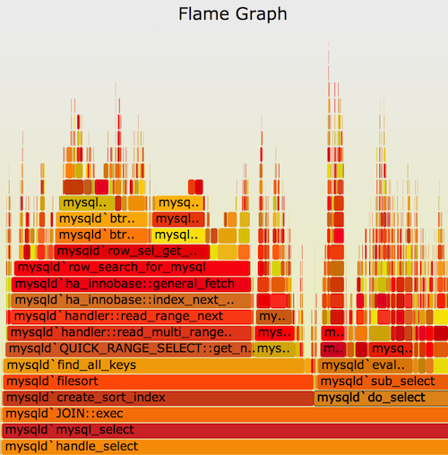

## 什么是性能分析？

`性能分析`是分析应用程序性能以改善代码段性能的行为。可视化配置文件并快速识别性能问题的最流行方法之一是生成 `“火焰图”`。例如下图



y轴是堆栈深度，x轴跨越样本总体。 每个矩形都是一个函数，其中的宽度表示它在配置文件中出现的频率。 从左到右的顺序并不重要(堆栈按字母顺序排序)。

## 在Kubernetes上如何分析应用性能？

应用性能分析是一项艰巨的任务。 大多数探查器有两个主要问题：

- 需要修改应用程序。 通常，可以通过将标志添加到执行命令或将一些性能分析库导入代码中来实现。
- 由于在性能分析过程中会严重影响性能，因此通常避免在产品中进行性能分析。

在Kubernetes集群中运行的应用程序上执行分析时，甚至更加困难。 需要部署一个包含配置文件修改的新容器映像，而不是当前正在运行的容器。 此外，当应用程序重新启动时，某些性能问题可能会消失，这使调试变得困难。
 
## 在Kubernetes应用性能分析解决方案？

Kubernetes 中可以使用 `Kubectl Flame` 分析 Pod 应用性能。`Kubectl Flame` 是一个kubectl插件，可以使在Kubernetes中运行的分析应用程序获得流畅的体验，而无需进行任何应用程序修改或停机。 另外，kubectl flame的目标是通过最大程度地降低性能损失来实现生产友好。

> 源码地址：https://github.com/VerizonMedia/kubectl-flame

## 运行原理

`kubectl flame` 在与目标容器相同的节点上启动 Kubernetes Job。在后台kubectl-flame使用`async-profiler`来为Java应用程序生成火焰图。通过共享`/tmp`文件夹与目标JVM进行交互。Golang支持基于`ebpf`分析。Python支持基于`py-spy`。

## 使用要求

- 支持的语言：Go，Java（任何基于JVM的语言）和 Python
- 使用Docker作为容器运行时的Kubernetes集群（已在GKE，EKS和AKS上测试）

## 安装

```bash
$ kubectl krew install flame
```

## 使用

### 分析 Kubernetes Pod

分析 Java 应用 mypod 1分钟，并在将火焰图保存到 /tmp/flamegraph.svg

```bash
$ kubectl flame mypod -t 1m --lang java -f /tmp/flamegraph.svg
```

### 分析基于 alpine 操作系统的容器

在基于 alpine 的容器中分析 Java 应用程序需要使用 `--alpine` 标志

```bash
$ kubectl flame mypod -t 1m -f /tmp/flamegraph.svg --lang Java --alpine
```

> 注意：仅 Java 应用程序需要此 `--alpine` 标志，而 `Go` 分析则不需要该标志。

### 分析 sidecar 容器

包含多个容器的 Pod 需要将目标容器指定为参数

```bash
$ kubectl flame mypod -t 1m --lang go -f /tmp/flamegraph.svg mycontainer
```

### 分析 Golang 多进程容器

在包含多个进程的Pod中对Go应用程序进行性能分析需要通过 `--pgrep` 标志指定目标进程名称：

```bash
$ kubectl flame mypod -t 1m --lang go -f /tmp/flamegraph.svg --pgrep go-app
```

> Java分析假定进程名称为java。`--pgrep` 如果您的进程名称不同，请使用标志。

 ## 参考链接

- https://github.com/VerizonMedia/kubectl-flame
- https://blog.csdn.net/weixin_26746861/article/details/108935182