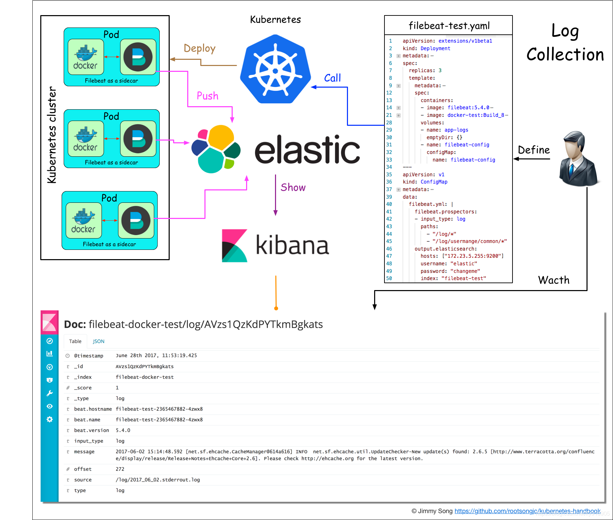
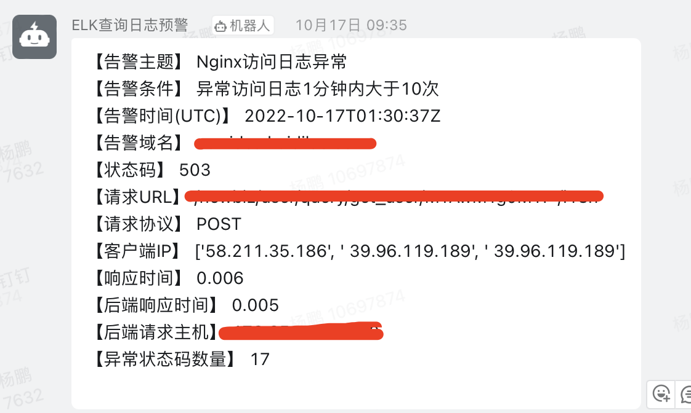
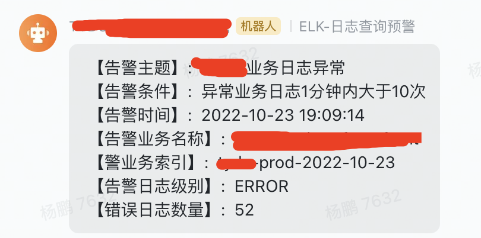

## 一、前言

随着 Kubernetes 使用越来越广泛，日志集中收集、展示、告警等都需要考虑的事情。Kubernetes 日志收集方案一般有下面几种：

- 1、日志收集组件以 `Daemonset` 形式运行在 Kubernetes Node 中，业务容器日志目录统一挂载到Node节点指定的目录，日志收集组件读取对应的目录。
- 2、日志收集组件以 `Daemonset` 形式运行在 Kubernetes Node 中，收集业务容器标准输出`stdout`和`stderr`日志。
- 3、日志收集组件以 `Sidecar` 形式和业务容器运行在一个pod中，把业务日志目录挂载出来，让同一个Pod中日志收集容器能读取到。

> 日志收集到集中日志平台，但是另一个问题来了，应该如何对业务日志告警？

下面是一个 Kubernetes 日志收集架构图，比较开源的解决方案。



## 二、日志格式

下面例举两个日志例子，一个是 Nginx 访问日志，另一个是 Java 业务日志格式

- 1、nginx 访问日志格式

```
{
  "@timestamp": "2022-10-20T11:47:05+08:00",
  "servername": "www.example.com",
  "remote_addr": "172.20.199.10",
  "referer": "-",
  "request_method": "GET",
  "request_uri": "/",
  "server_protocol": "HTTP/1.1",
  "request_time": "0.000",
  "status": 200,
  "bytes": 577,
  "useragent": "Mozilla/5.0 (Windows NT 6.1; WOW64) AppleWebKit/537.36 (KHTML, like Gecko) Chrome/65.0.3325.162 Safari/537.36",
  "x_forwarded": "172.18.25.11, 100.122.43.140",
  "upstr_addr": "172.20.199.20:8080",
  "upstr_host": "-",
  "ups_resp_time": "0.01"
}
```

- 2、java 业务日志格式
```
{
  "@timestamp": "2022-10-20T19:14:26.875+08:00",
  "level": "INFO",
  "appName": "test-service",
  "requestId": "",
  "remoteIp": "",
  "traceId": "",
  "spanId": "",
  "parent": "",
  "thread": "XNIO-1 task-14",
  "class": "c.c.common.security.util.SecurityUtil",
  "line": "118",
  "message": "没有登录",
  "stack_trace": "java.lang.ClassCastException: null\n"
}
```

## 三、告警要求

- 1、Nginx 访问日志，1分钟内，需要把 Http 状态码是 `404、429、499、5xx` 大于10条就告警
- 2、java 业务日志格式，1分钟内，日志级别(level)是 `ERROR` 并且总数大于10条就告警
- 3、通过 `钉钉机器人` 或者 `飞书机器人` 告警


## 四、如何根据日志告警？

> 本文日志存储在 `Elasticsearch` 中

本文使用 `ElastAlert` 服务来实现告警，简单介绍下 ElastAlert 是什么？

`ElastAlert` 是一个简单的框架，用于从检索Elasticsearch中的数据异常，尖峰等来实现告警。

它通过将Elasticsearch与两种类型的组件（规则类型和警报）结合使用。定期查询Elasticsearch，并将数据传递到规则类型，该规则类型确定找到任何匹配项。发生匹配时，它会发出一个或多个警报，这些警报根据不同的类型采取相应的措施。

ElastAlert由一组规则配置，每个规则定义一个查询，一个规则类型和一组警报。

### ElastAlert 特性

- 架构简单，定制灵活
- 支持多种匹配规则（频率、阈值、数据变化、黑白名单、变化率等）
- 支持多种警报类型（邮件、HTTP POST、自定义脚本等，`默认不支持 钉钉机器人、飞书机器人等`）
- 匹配项汇总报警，重复警报抑制，报警失败重试和过期
- 可用性强，状态信息保存到Elasticsearch的索引中
- 过程的调试和审计等

### ElastAlert 可用性

- ElastAlert 将其状态保存到 Elasticsearch，启动后，将恢复之前停止的状态
- 如果 Elasticsearch 没有响应，ElastAlert 将等到恢复后才继续
- 抛出错误的警报可能会在一段时间内自动重试

### ElastAlert 部署

> 项目地址：https://github.com/bitsensor/elastalert.git，官方提供 docker 镜像，但并不是很好用，这里作者重新构建一个docker镜像。

### ElastAlert 告警监控展示

- 1、钉钉机器人告警展示



- 2、飞书机器人告警展示



### 构建 elastalert 镜像

```bash
# 下载 ElastAlert 代码
$ git clone https://github.com/bitsensor/elastalert.git
$ cd elastalert

# 创建 Dockerfile，ElastAlert 默认不支持 钉钉机器人、飞书机器人，这里需要扩展下
$ vim Dockerfile

FROM python:3.6-alpine as pyea

ENV ELASTALERT_VERSION=v0.2.4
ENV ELASTALERT_URL=https://github.com/Yelp/elastalert/archive/$ELASTALERT_VERSION.zip
ENV ELASTALERT_HOME /opt/elastalert

WORKDIR /opt

RUN sed -i 's/dl-cdn.alpinelinux.org/mirrors.aliyun.com/g' /etc/apk/repositories && \
    apk add --update --no-cache ca-certificates openssl-dev openssl libffi-dev gcc musl-dev wget && \
    apk add --update --no-cache curl tzdata make libmagic nodejs npm && \
    apk add --update --no-cache tzdata && \
    cp /usr/share/zoneinfo/Asia/Shanghai /etc/localtime && \
    echo "Asia/Shanghai" > /etc/timezone && \
    wget -O elastalert.zip "${ELASTALERT_URL}" && \
    unzip elastalert.zip && \
    rm elastalert.zip && \
    mv e* "${ELASTALERT_HOME}"

ENV TZ Asia/Shanghai

WORKDIR "${ELASTALERT_HOME}"

RUN mkdir ~/.pip && \
    echo '[global]' >> ~/.pip/pip.conf && \
    echo 'index-url = https://pypi.tuna.tsinghua.edu.cn/simple' >> ~/.pip/pip.conf && \
    /usr/local/bin/python3 -m pip install --upgrade pip && \
    pip3 install cryptography==3.3.2 && \
    sed -i 's/jira>=1.0.10,<1.0.15/jira>=2.0.0/g' setup.py && \
    python3 setup.py install && \
    pip3 install "setuptools==46.1.3" && \
    pip3 install pyOpenSSL==16.2.0 && \
    sed -i 's/jira>=1.0.10,<1.0.15/jira>=2.0.0/g' requirements.txt && \
    pip3 install -r requirements.txt

RUN cd /opt && \
    wget https://github.com/xuyaoqiang/elastalert-dingtalk-plugin/archive/master.zip && \
    unzip master.zip && \
    rm -f master.zip && \
    cd elastalert-dingtalk-plugin-master && \
    cp -r elastalert_modules /opt/elastalert/ 

COPY . /opt/elastalert-server

WORKDIR /opt/elastalert-server

RUN sed -i '1i process.env.TZ = "Asia/Shanghai";' index.js && \
    npm --registry https://registry.npm.taobao.org install --production --quiet

COPY config/elastalert.yaml /opt/elastalert/config.yaml
COPY config/elastalert-test.yaml /opt/elastalert/config-test.yaml
COPY config/config.json config/config.json
COPY rule_templates/ /opt/elastalert/rule_templates
COPY elastalert_modules/ /opt/elastalert/elastalert_modules

RUN mkdir -p /opt/elastalert/rules/ /opt/elastalert/server_data/tests/ && \
    cd /opt/elastalert/elastalert_modules && \
    wget https://raw.githubusercontent.com/gpYang/elastalert-feishu-plugin/main/elastalert_modules/feishu_alert.py

EXPOSE 3030
ENTRYPOINT ["npm", "start"]

# 构建 ElastAlert 镜像
$ docker build -t yangpeng2468/elastalert:v0.2.4 . -f Dockerfile
```

上传到 dockerhub 个人仓库中，提供给大家下载
```bash
$ docker push yangpeng2468/elastalert:v0.2.4
```

### 配置 ElastAlert 并启动

- 1、首先创建 config.json 配置文件

```bash
# 创建配置文件目录
$ mkdir -p /data/elastalert/config /data/elastalert/rules /data/elastalert/rule_templates

$ vim config/config.json

{
  "appName": "elastalert-server",
  "port": 3030,
  "wsport": 3333,
  "elastalertPath": "/opt/elastalert",
  "verbose": false,
  "es_debug": false,
  "debug": false,
  "rulesPath": {
    "relative": true,
    "path": "/rules"
  },
  "templatesPath": {
    "relative": true,
    "path": "/rule_templates"
  },
  "es_host": "xx.xx.xx.xx", # es 地址
  "es_port": 9200,
  "writeback_index": "elastalert_status"
}
```

- 2、创建 elastalert.yaml 配置文件

```bash
$ vim config/elastalert.yaml

# The elasticsearch hostname for metadata writeback
# Note that every rule can have its own elasticsearch host
es_host: xx.xx.xx.xx # es 地址

# The elasticsearch port
es_port: 9200

# ElastAlert从中加载规则配置文件的位置 
rules_folder: rules

# ElastAlert多久查询一次Elasticsearch的时间 
run_every:
  minutes: 10

# 用来设置请求里时间字段的范围，默认是15分钟 
buffer_time:
  minutes: 10

# Option basic-auth username and password for elasticsearch
es_username: elastic 
es_password: xxx # es 密码

# 是ElastAlert将在其中存储数据的索引的名称 
writeback_index: elastalert_status

# 别名
writeback_alias: elastalert_alerts

# 失败警报的重试窗口 
alert_time_limit:
  days: 2
```

- 3、创建 nginx 访问日志报警文件

```bash
$ vim rules/nginx.yaml

#rule name 必须是独一的，不然会报错，这个定义完成之后，会成为报警的标题
name: nginx-access-alert

#配置的是frequency，需要两个条件满足，在相同 query_key条件下，timeframe 范围内有num_events个被过滤出来的异常
type: frequency

#指定index，支持正则匹配同时如果嫌麻烦直接* 也可
index: nginx-*-prod-%Y-%m-%d  
use_strftime_index: true

#时间触发的次数
num_events: 10

#和num_events参数关联，也就是说1分钟内出现10次会报警
timeframe:
  minutes: 1

#同一规则的两次警报之间的最短时间。在此时间内发生的任何警报都将被丢弃。默认值为一分钟。
realert:
  minutes: 3

#防止同一条规则在一段时间内发出两次警报
#realert:
#  days: 1

# query_key 用来防止基于某个字段的重复项
realert:
  minutes: 10
query_key: servername

#用来拼配告警规则，elasticsearch 的query语句，支持 AND&OR等
filter:
- query:
    query_string: 
      query: "status: [500 TO 599] OR status: 429 OR status: 404"

#只需要的字段 https://elastalert.readthedocs.io/en/latest/ruletypes.html#include
include: ["servername", "request_method", "request_uri", "remote_addr", "@timestamp", "status", "request_time", "ups_resp_time", "x_forwarded", "upstr_addr"]

#告警方式，钉钉 和 飞书 告警，可以只选择一种就行
alert:
- "elastalert_modules.dingtalk_alert.DingTalkAlerter"
- "elastalert_modules.feishu_alert.FeishuAlert"

# 钉钉机器人接口地址
dingtalk_webhook: "https://oapi.dingtalk.com/robot/send?access_token=xxx"
dingtalk_msgtype: "text"
alert_subject: "Nginx访问日志异常"
alert_text_type: alert_text_only
alert_text: |
 【告警主题】 Nginx访问日志异常
 【告警条件】 异常访问日志1分钟内大于10次
 【告警时间(UTC)】 {}
 【告警域名】 {}
 【状态码】 {}
 【请求URL】 {}
 【请求协议】 {}
 【客户端IP】 {}
 【响应时间】 {}
 【后端响应时间】 {}
 【后端请求主机】 {}
 【异常状态码数量】 {}
alert_text_args:
 - "@timestamp"
 - servername
 - status
 - request_uri
 - request_method
 - x_forwarded
 - request_time
 - ups_resp_time
 - upstr_addr
 - num_hits

# 飞书机器人接口地址
feishualert_url: "https://open.feishu.cn/open-apis/bot/v2/hook/"

# 飞书机器人id
feishualert_botid:
  "xxx"

# 告警标题
feishualert_title:
  "Nginx访问日志异常"

# 这个时间段内的匹配将不告警，适用于某些时间段请求低谷避免误报警
feishualert_skip:
  start: "00:00:00"
  end: "00:01:00"

# 告警内容
# 使用{}可匹配matches
feishualert_body:
  "
  【告警主题】:  {feishualert_title}\n
  【告警条件】:  异常访问日志1分钟内大于10次\n
  【告警时间】:  {feishualert_time}\n
  【告警域名】:  {servername}\n
  【状态码】:  {status}\n
  【请求URL】:  {request_uri}\n
  【请求协议】:  {request_method}\n
  【客户端IP】:  {x_forwarded}\n
  【响应时间】:  {request_time}\n
  【后端响应时间】:  {ups_resp_time}\n
  【后端请求主机】:  {upstr_addr}\n
  【异常状态码数量】:  {num_hits}
  "
```

- 4、创建 java 业务日志报警文件

```bash
$ vim rules/java.yaml

#rule name 必须是独一的，不然会报错，这个定义完成之后，会成为报警的标题
name: java-prod-alert

#配置的是frequency，需要两个条件满足，在相同 query_key条件下，timeframe 范围内有num_events个被过滤出来的异常
type: frequency

#指定index，支持正则匹配同时如果嫌麻烦直接* 也可
index: java-*-prod-%Y-%m-%d
use_strftime_index: true

#时间触发的次数
num_events: 10

#和num_events参数关联，也就是说1分钟内出现10次会报警
timeframe:
  minutes: 1

#同一规则的两次警报之间的最短时间。在此时间内发生的任何警报都将被丢弃。默认值为一分钟。
realert:
  minutes: 3

#防止同一条规则在一段时间内发出两次警报
#realert:
#  days: 1

# query_key 用来防止基于某个字段的重复项
realert:
  minutes: 15
query_key: applicationName

#用来拼配告警规则，elasticsearch 的query语句，支持 AND&OR等
filter:
- query:
    query_string: 
      query: "level: ERROR"

#只需要的字段 https://elastalert.readthedocs.io/en/latest/ruletypes.html#include
include: ["applicationName", "level", "@timestamp", "_index"]

#告警方式，钉钉 和 飞书 告警，可以只选择一种就行
alert:
- "elastalert_modules.dingtalk_alert.DingTalkAlerter"
- "elastalert_modules.feishu_alert.FeishuAlert"

# 钉钉机器人接口地址
dingtalk_webhook: "https://oapi.dingtalk.com/robot/send?access_token=xxx"
dingtalk_msgtype: "text"
alert_subject: "java业务日志异常"
alert_text_type: alert_text_only
alert_text: |
 【告警主题】 java业务日志异常
 【告警条件】 异常业务日志1分钟内大于10次
 【告警时间(UTC)】 {}
 【告警业务名称】 {}
 【告警业务索引】 {}
 【告警日志级别】 {}
 【错误日志数量】 {}
alert_text_args:
 - "@timestamp"
 - applicationName
 - _index
 - level
 - num_hits


# 飞书机器人接口地址
feishualert_url: "https://open.feishu.cn/open-apis/bot/v2/hook/"

# 飞书机器人id
feishualert_botid:
  "xxx"

# 告警标题
feishualert_title:
  "toB业务日志异常"

# 这个时间段内的匹配将不告警，适用于某些时间段请求低谷避免误报警
feishualert_skip:
  start: "00:00:00"
  end: "00:01:00"

# 告警内容
# 使用{}可匹配matches
feishualert_body:
  "
  【告警主题】:  {feishualert_title}\n
  【告警条件】:  异常业务日志1分钟内大于10次\n
  【告警时间】:  {feishualert_time}\n
  【告警业务名称】:  {applicationName}\n
  【警业务索引】:  {_index}\n
  【告警日志级别】:  {level}\n
  【错误日志数量】:  {num_hits}
  "
```

- 5、创建 ElastAlert 镜像启动脚本

```bash
$ cd /data/elastalert
$ vim run.sh

docker run -d --restart always -p 3030:3030 -p 3333:3333 \
    --name elastalert \
    --hostname elastalert \
    -v /data/elastalert/config/elastalert.yaml:/opt/elastalert/config.yaml \
    -v /data/elastalert/config/elastalert-test.yaml:/opt/elastalert/config-test.yaml \
    -v /data/elastalert/config/config.json:/opt/elastalert-server/config/config.json \
    -v /data/elastalert/rules:/opt/elastalert/rules \
    -v /data/elastalert/rule_templates:/opt/elastalert/rule_templates \
    yangpeng2468/elastalert:v0.2.4

# 启动
$ sh run.sh
```

## 五、参考文档

- https://github.com/bitsensor/elastalert
- https://zhuanlan.zhihu.com/p/386722918