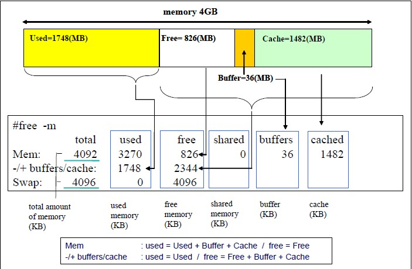
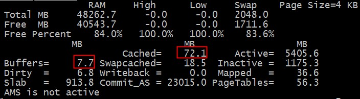
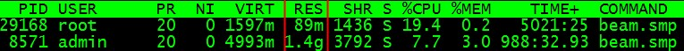
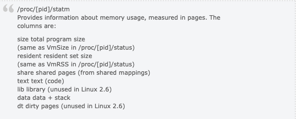
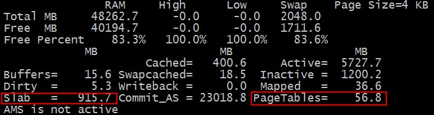
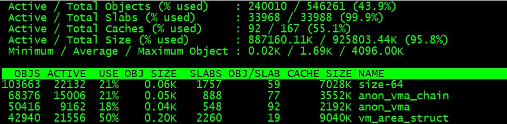

### 前言

前几天 纯上 同学问了一个问题：

> 我 `ps aux` 看到的RSS内存只有不到30M，但是free看到内存却已经使用了7,8G了，已经开始swap了，请问ps aux的实际物理内存统计是不是漏了哪些内存没算？我有什么办法确定free中used的内存都去哪儿了呢？

这个问题不止一个同学遇到过了，之前子嘉同学也遇到这个问题，内存的计算总是一个迷糊账。 我们今天来把它算个清楚下!

### 解答

通常我们是这样看内存的剩余情况的：

```bash
$free -m

             total       used       free     shared    buffers     cached
Mem:         48262       7913      40349          0         14        267
-/+ buffers/cache:       7631      40631
Swap:         2047        336       1711
```

那么这个信息是如何解读的呢，以下这个图解释的挺清楚的！


上面的情况下我们总的内存有48262M，用掉了`7913M`。 其中 `buffer+cache` 总共 `14+267=281M`, 由于这种类型的内存是可以回收的，虽然我们用掉了 `7913M`，但是实际上我们如果实在需要的话，这部分`buffer/cache`内存是可以放出来的。

我们来演示下：

```bash
$ sudo sysctl vm.drop_caches=3

vm.drop_caches = 3

$ free -m

             total       used       free     shared    buffers     cached
Mem:         48262       7676      40586          0          3         41
-/+ buffers/cache:       7631      40631
Swap:         2047        336       1711
```

我们把 `buffer/cache` 大部分都清除干净了，只用了44M，所以我们这次 `used` 的空间是7676M。

到现在我们比较清楚几个概念：
- 1、总的内存多少
- 2、buffer/cache内存可以释放的。
- 3、used的内存的概率。

即使是这样我们还是要继续追查下used的空间（7637M)到底用到哪里去了？

这里首先我们来介绍下 `nmon` 这个工具，它对内存的使用显示比较直观。


使用的内存的去向我们很自然的就想到操作系统系统上的各种进程需要消耗各种内存，我们透过top工具来看下：


通常我们会看进程的`RES`这一项，这项到底是什么意思呢？这个数字从哪里出来的呢？ 通过`strace`对`top`和`nmon`的追踪和结合源码，我们确定这个值是从`/proc/PID/statm`的第二个字段读取出来的.

那这个字段什么意思呢？

man proc 或者 http://www.kernel.org/doc/man-pages/online/pages/man5/proc.5.html 会详细的解释/proc/下的文件的具体意思，我们摘抄下：


`resident set size` 也就是每个进程用了具体的多少页的内存。由于linux系统采用的是虚拟内存，进程的代码，库，堆和栈使用的内存都会消耗内存，但是申请出来的内存，只要没真正touch过，是不算的，因为没有真正为之分配物理页面。

我们实际进程使用的物理页面应该用 `resident set size` 来算的，遍历所有的进程，就可以知道所有的所有的进程使用的内存。

我们来实验下RSS的使用情况：

```bash
$ cat RSS.sh

#/bin/bash                                                                                                              
for PROC in `ls  /proc/|grep "^[0-9]"`
do
  if [ -f /proc/$PROC/statm ]; then
      TEP=`cat /proc/$PROC/statm | awk '{print ($2)}'`
      RSS=`expr $RSS + $TEP`
  fi
done
RSS=`expr $RSS \* 4`
echo $RSS"KB"

$ ./RSS.sh 

7024692KB
```

从数字来看，我们的进程使用了大概7024M内存，距离7637M还有几百M内存哪里去了？ 哪里去了？ 猫吃掉了？

我们再回头来仔细看下 `nmon` 的内存统计表。


那个该死的slab是什么呢？ 那个PageTables又是什么呢？

简单的说内核为了高性能每个需要重复使用的对象都会有个池，这个slab池会cache大量常用的对象，所以会消耗大量的内存。运行命令：

```bash
$ slabtop
```

我们可以看到：



从图我们可以看出各种对象的大小和数目，遗憾的是没有告诉我们`slab`消耗了多少内存。
我们自己来算下好了：

```bash
$ echo `cat /proc/slabinfo |awk 'BEGIN{sum=0;}{sum=sum+$3*$4;}END{print sum/1024/1024}'` MB

904.256 MB
```

好吧，把每个对象的数目*大小，再累加，我们就得到了总的内存消耗量: 904M

那么`PageTables`呢？ 我们万能的内核组的同学现身了：

> - 伯瑜: 你还没有计算page tables的大小，还有struct page也有一定的大小（每个页一个,64bytes），如果是2.6.32的话，每个页还有一个page_cgroup(32bytes)，也就是说内存大小的2.3%(96/4096)会被内核固定使用的
> - 含黛: struct page是系统boot的时候就会根据内存大小算出来分配出去的，18内核是1.56%左右，32内核由于cgroup的原因会在2.3%

好吧，知道是干嘛的啦，管理这些物理页面的硬开销，那么具体是多少呢？

```bash
$ echo `grep PageTables /proc/meminfo | awk '{print $2}'` KB

58052 KB
```

好吧，小结下！内存的去向主要有3个：
- 1、进程消耗。
- 2、slab消耗
- 3、pagetable消耗。

我把三种消耗汇总下和free出的结果比对下,这个脚本的各种计算项仲同学帮忙搞定的:

```bash
$ cat cm.sh

#/bin/bash
for PROC in `ls /proc/|grep "^[0-9]"`
do
  if [ -f /proc/$PROC/statm ]; then
      TEP=`cat /proc/$PROC/statm | awk '{print ($2)}'`
      RSS=`expr $RSS + $TEP`
  fi
done
RSS=`expr $RSS \* 4`
PageTable=`grep PageTables /proc/meminfo | awk '{print $2}'`
SlabInfo=`cat /proc/slabinfo |awk 'BEGIN{sum=0;}{sum=sum+$3*$4;}END{print sum/1024/1024}'`
 
echo $RSS"KB", $PageTable"KB", $SlabInfo"MB"
printf "rss+pagetable+slabinfo=%sMB\n" `echo $RSS/1024 + $PageTable/1024 + $SlabInfo|bc`
free -m
 
$ ./cm.sh

7003756KB, 59272KB, 904.334MB
rss+pagetable+slabinfo=7800.334MB
             total       used       free     shared    buffers     cached
Mem:         48262       8050      40211          0         17        404
-/+ buffers/cache:       7629      40633
Swap:         2047        336       1711
```

free 报告说 `7629M`， 我们的cm脚本报告说 `7800.3M`， 我们的CM多报了 `171M`。

damn,这又怎么回事呢？

我们重新校对下我们的计算。 我们和nmon来比对下，slab和pagetable的值是吻合的。 那最大的问题可能在进程的消耗计算上。

resident resident set size 包括我们使用的各种库和so等共享的模块，在前面的计算中我们重复计算了。

```bash
$ pmap `pgrep bash`

...
22923:   -bash
0000000000400000    848K r-x--  /bin/bash
00000000006d3000     40K rw---  /bin/bash
00000000006dd000     20K rw---    [ anon ]
00000000008dc000     36K rw---  /bin/bash
00000000013c8000    592K rw---    [ anon ]
000000335c400000    116K r-x--  /lib64/libtinfo.so.5.7
...
0000003ec5220000      4K rw---  /lib64/ld-2.12.so
0000003ec5221000      4K rw---    [ anon ]
0000003ec5800000   1628K r-x--  /lib64/libc-2.12.so
...
0000003ec5b9c000     20K rw---    [ anon ]
00007f331b910000  96836K r----  /usr/lib/locale/locale-archive
00007f33217a1000     48K r-x--  /lib64/libnss_files-2.12.so
...
00007f33219af000     12K rw---    [ anon ]
00007f33219bf000      8K rw---    [ anon ]
00007f33219c1000     28K r--s-  /usr/lib64/gconv/gconv-modules.cache
00007f33219c8000      4K rw---    [ anon ]
00007fff5e553000     84K rw---    [ stack ]
00007fff5e5e4000      4K r-x--    [ anon ]
ffffffffff600000      4K r-x--    [ anon ]
 total           108720K
```

多出的171M正是共享库重复计算的部分。

但是由于每个进程共享的东西都不一样，我们也没法知道每个进程是如何共享的，没法做到准确的区分。

所以只能留点小遗憾，欢迎大家来探讨。

### 总结：

内存方面的概念很多，需要深入挖掘！

祝玩的开心！

> - 作者：Yu Feng
> - 原文：http://blog.yufeng.info/archives/2456