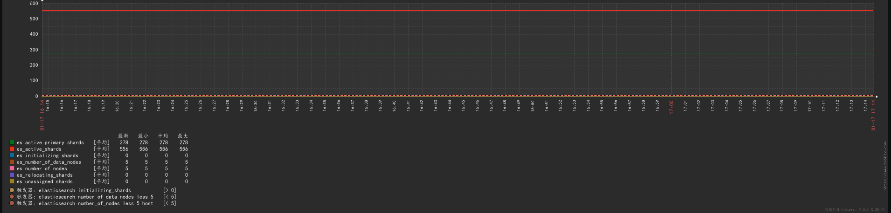
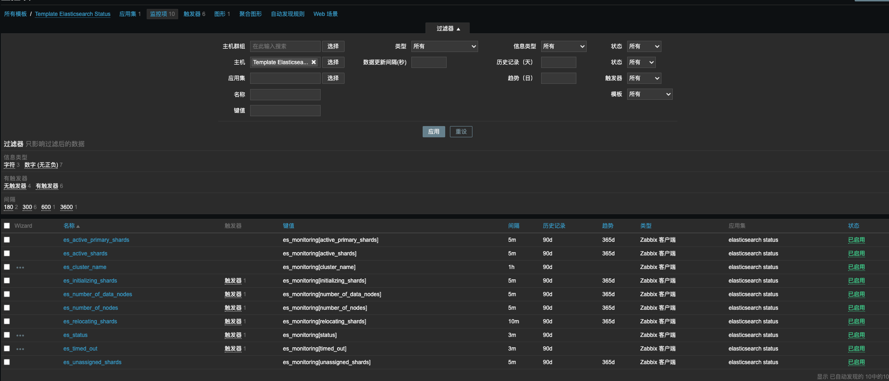

## 监控图展示



## 创建监控 ELK 脚本

```bash
# zabbix agent 创建 scripts 目录并安装jq命令
$ mkdir /etc/zabbix/scripts
$ yum install -y jq

# 创建elk监控脚本
$ touch es_monitoring.sh && chmod +x es_monitoring.sh
$ vim es_monitoring.sh

case $1 in
    active_primary_shards)
        result=`curl --user elastic:password -s -XGET 192.168.0.1:9200/_cluster/health | jq .$1`
        echo $result
        ;;
    active_shards)
        result=`curl --user elastic:password -s -XGET 192.168.0.1:9200/_cluster/health | jq .$1`
        echo $result
        ;;
    cluster_name)
        result=`curl --user elastic:password -s -XGET 192.168.0.1:9200/_cluster/health | jq .$1`
        echo $result
        ;;
    number_of_data_nodes)
        result=`curl --user elastic:password -s -XGET 192.168.0.1:9200/_cluster/health | jq .$1`
        echo $result
        ;;
    initializing_shards)
        result=`curl --user elastic:password -s -XGET 192.168.0.1:9200/_cluster/health | jq .$1`
        echo $result
        ;;
    number_of_nodes)
        result=`curl --user elastic:password -s -XGET 192.168.0.1:9200/_cluster/health | jq .$1`
        echo $result
        ;;
    relocating_shards)
        result=`curl --user elastic:password -s -XGET 192.168.0.1:9200/_cluster/health | jq .$1`
        echo $result
        ;;
    status)
        result=`curl --user elastic:password -s -XGET 192.168.0.1:9200/_cluster/health | jq .$1`
        echo $result
        ;;
    timed_out)
        result=`curl --user elastic:password -s -XGET 192.168.0.1:9200/_cluster/health | jq .$1`
        echo $result
        ;;
    unassigned_shards)
        result=`curl --user elastic:password -s -XGET 192.168.0.1:9200/_cluster/health | jq .$1`
        echo $result
        ;;
    *)
        echo "Usage:$0(active_primary_shards|active_shards|cluster_name|number_of_data_nodes|initializing_shards|number_of_nodes|relocating_shards|status|timed_out|unassigned_shards)"
        ;;
esac
```

## 创建 zabbix-agent es 监控配置

```bash
# 创建es监控配置
$ vim /etc/zabbix/zabbix_agentd.d/es_monitoring.conf 

UserParameter=es_monitoring[*],/etc/zabbix/scripts/es_monitoring.sh $1

# 重启 zabbix-agent 服务
$ systemctl restart zabbix-agent
```

## zabbix-server 添加监控 es 模板



上面是 Zabbix 监控 ES 模板，具体模板配置公众号后台回复 `zabbix-es` 获取。