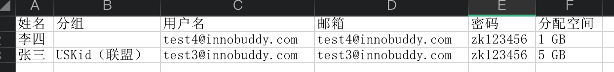

## Nextcloud 优点

- 完全开源
- 支持web界面、手机ios系统、手机安卓系统
- 容器化部署

## 准备环境

- 部署 docker、docker-compose (本文不讲docker、docker-compose部署)

## 部署 Nextcloud

```bash
# 创建 nextcloud 目录
$ mkdir -p /data/nextcloud
$ cd /data/nextcloud

# 创建数据存储目录
$ mkdir db nextcloud-data nginx-config redis-data
```

```bash
# 创建 nextcloud nginx 配置
$ vim nginx-config/default.conf

upstream php-handler {
	server nextcloud:9000;
}

server {
	listen 80;

    charset utf-8;

	# Add headers to serve security related headers
	# Before enabling Strict-Transport-Security headers please read into this
	# topic first.
	# add_header Strict-Transport-Security "max-age=15768000;
	# includeSubDomains; preload;";
	#
	# WARNING: Only add the preload option once you read about
	# the consequences in https://hstspreload.org/. This option
	# will add the domain to a hardcoded list that is shipped
	# in all major browsers and getting removed from this list
	# could take several months.
	add_header X-Content-Type-Options nosniff;
	add_header X-XSS-Protection "1; mode=block";
	add_header X-Robots-Tag none;
	add_header X-Download-Options noopen;
	add_header X-Permitted-Cross-Domain-Policies none;
	add_header Referrer-Policy no-referrer;

	root /var/www/html;

	location = /robots.txt {
		allow all;
		log_not_found off;
		access_log off;
	}

	# The following 2 rules are only needed for the user_webfinger app.
	# Uncomment it if you're planning to use this app.
	#rewrite ^/.well-known/host-meta /public.php?service=host-meta last;
	#rewrite ^/.well-known/host-meta.json /public.php?service=host-meta-json
	# last;

	location = /.well-known/carddav {
		return 301 $scheme://$host:$server_port/remote.php/dav;
	}
	location = /.well-known/caldav {
		return 301 $scheme://$host:$server_port/remote.php/dav;
	}

	# set max upload size
	client_max_body_size 10G;
	fastcgi_buffers 64 4K;

	# Enable gzip but do not remove ETag headers
	gzip on;
	gzip_vary on;
	gzip_comp_level 4;
	gzip_min_length 256;
	gzip_proxied expired no-cache no-store private no_last_modified no_etag auth;
	gzip_types application/atom+xml application/javascript application/json application/ld+json application/manifest+json application/rss+xml application/vnd.geo+json application/vnd.ms-fontobject application/x-font-ttf application/x-web-app-manifest+json application/xhtml+xml application/xml font/opentype image/bmp image/svg+xml image/x-icon text/cache-manifest text/css text/plain text/vcard text/vnd.rim.location.xloc text/vtt text/x-component text/x-cross-domain-policy;

	# Uncomment if your server is build with the ngx_pagespeed module
	# This module is currently not supported.
	#pagespeed off;

	location / {
		rewrite ^ /index.php$request_uri;
	}

	location ~ ^/(?:build|tests|config|lib|3rdparty|templates|data)/ {
		deny all;
	}
	location ~ ^/(?:\.|autotest|occ|issue|indie|db_|console) {
		deny all;
	}

	location ~ ^/(?:index|remote|public|cron|core/ajax/update|status|ocs/v[12]|updater/.+|ocs-provider/.+)\.php(?:$|/) {
		fastcgi_split_path_info ^(.+\.php)(/.*)$;
		include fastcgi_params;
		fastcgi_param SCRIPT_FILENAME $document_root$fastcgi_script_name;
		fastcgi_param PATH_INFO $fastcgi_path_info;
		# fastcgi_param HTTPS on;
		#Avoid sending the security headers twice
		fastcgi_param modHeadersAvailable true;
		fastcgi_param front_controller_active true;
		fastcgi_pass php-handler;
		fastcgi_intercept_errors on;
		fastcgi_request_buffering off;
	}

	location ~ ^/(?:updater|ocs-provider)(?:$|/) {
		try_files $uri/ =404;
		index index.php;
	}

	# Adding the cache control header for js and css files
	# Make sure it is BELOW the PHP block
	location ~ \.(?:css|js|woff2?|svg|gif)$ {
		try_files $uri /index.php$request_uri;
		add_header Cache-Control "public, max-age=15778463";
		# Add headers to serve security related headers (It is intended to
		# have those duplicated to the ones above)
		# Before enabling Strict-Transport-Security headers please read into
		# this topic first.
		# add_header Strict-Transport-Security "max-age=15768000;
		#  includeSubDomains; preload;";
		#
		# WARNING: Only add the preload option once you read about
		# the consequences in https://hstspreload.org/. This option
		# will add the domain to a hardcoded list that is shipped
		# in all major browsers and getting removed from this list
		# could take several months.
		add_header X-Content-Type-Options nosniff;
		add_header X-XSS-Protection "1; mode=block";
		add_header X-Robots-Tag none;
		add_header X-Download-Options noopen;
		add_header X-Permitted-Cross-Domain-Policies none;
		add_header Referrer-Policy no-referrer;

		# Optional: Don't log access to assets
		access_log off;
	}

	location ~ \.(?:png|html|ttf|ico|jpg|jpeg)$ {
		try_files $uri /index.php$request_uri;
		# Optional: Don't log access to other assets
		access_log off;
	}
}
```

```bash
# 创建 nextcloud docker-compose 配置
$ vim docker-compose.yml
```

```yaml
version: '3.6'
 
services:
  db:
    image: mariadb:10.5.5
    restart: always
    ports:
      - 3306:3306
    volumes:
      - /data/nextcloud/db:/var/lib/mysql
      - /etc/localtime:/etc/localtime:ro
    environment:
      - MYSQL_ROOT_PASSWORD=******
      - MYSQL_DATABASE=******
      - MYSQL_USER=nextcloud
      - MYSQL_PASSWORD=******
 
  redis:
    image: redis:6.0.8
    restart: always
    # 设置 redis 密码为 redis123
    command: redis-server --requirepass redis123
    ports:
      - 6379:6379
    volumes:
      - /data/nextcloud/redis-data:/data
      - /etc/localtime:/etc/localtime:ro
 
  nextcloud:
    image: nextcloud:19.0.3-fpm-alpine
    restart: always
    volumes:
      - /data/nextcloud/nextcloud-data:/data/html
      - /etc/localtime:/etc/localtime:ro
    environment:
      - MYSQL_HOST=db
      - MYSQL_DATABASE=nextcloud
      - MYSQL_USER=nextcloud
      - MYSQL_PASSWORD=******
      - REDIS_HOST=redis
      - REDIS_HOST_PORT=6379
      - REDIS_HOST_PASSWORD=******
      - NEXTCLOUD_ADMIN_USER=admin
      - NEXTCLOUD_ADMIN_PASSWORD=******
      - NEXTCLOUD_TRUSTED_DOMAINS="nextcloud.example.com"
      - OVERWRITEPROTOCOL=https
      - SMTP_HOST=******
      - SMTP_SECURE=ssl
      - SMTP_PORT=465
      - SMTP_AUTHTYPE=LOGIN
      - SMTP_NAME=******
      - SMTP_PASSWORD=******
      - MAIL_FROM_ADDRESS=******
      - MAIL_DOMAIN=******
    depends_on:
      - db
      - redis
 
  nginx:
    image: nginx:1.19.2
    restart: always
    ports:
      - 8088:80
    volumes:
      - /data/nextcloud/nginx-config:/etc/nginx/conf.d
      - /data/nextcloud/nextcloud-data:/data/html:ro
      - /etc/localtime:/etc/localtime:ro
 
  nextcloud_cron:
    image: nextcloud:19.0.3-fpm-alpine
    restart: always
    volumes:
      - /data/nextcloud/nextcloud-data:/data/html
      - /etc/localtime:/etc/localtime:ro
    entrypoint: /cron.sh
    depends_on:
      - db
      - redis
```

```bash
# 创建 collabora 服务，用于 word 在线编辑
$ vim docker-collabora-compose.yml
```

```yaml
version: '3.6'
 
services:
  collabora:
    image: collabora/code:6.4.0.3
    restart: always
    ports:
      - 9980:9980
    cap_add:
     - MKNOD
    environment:
      - username=admin
      - password=Collabora!@#D
      # Domain the service should be accessed from:
      - domain=nextcloud-internal\\.example\\.com\|nextcloud\\.example\\.com
    volumes:
      - /etc/localtime:/etc/localtime:ro
```

```bash
# 启动 nextcloud 和 collabora 服务
$ docker-compose -f docker-compose.yml -f docker-collabora-compose.yml up -d
```

## 配置入口 nginx 服务

> 用途：反向代理 nextcloud 和 collabora 服务

```bash
# 配置 nextcloud 反向代理nginx服务
$ vim /etc/nginx/conf.d/nextcloud.config

upstream nextcloud_nginx {
  server localhost:8088;
}
 
server {
   listen 80;
   server_name nextcloud.example.com;
   return 307 https://$host$request_uri;
}
 
server {
    listen 443 ssl http2;
    server_name cloud.innobuddy.com;
 
    client_max_body_size 10G;
    add_header Strict-Transport-Security "max-age=31536000";
    add_header X-Frame-Options SAMEORIGIN;
 
    location / {
      proxy_set_header X-Real-IP $remote_addr;
      proxy_set_header X-Forwarded-For $proxy_add_x_forwarded_for;
      proxy_set_header Host $http_host;
      proxy_set_header X-Nginx-Proxy true;
      proxy_set_header X-Forwarded-Proto $scheme;
      proxy_pass_header Set-Cookie;
      proxy_pass_header X-CSRF-TOKEN;
 
      proxy_pass http://nextcloud_nginx;
    }
}
```

```bash
# 配置 collabora 反向代理nginx服务
$ vim /etc/nginx/conf.d/collabora.config

upstream collabora {
  server localhost:9980;
}

server {
   listen 80;
   server_name collabora.example.com;
   return 307 https://$host$request_uri;
}
 
server {
    listen 443 ssl http2;
 
    server_name collabora.example.com;
 
    client_max_body_size 200m;
 
    # static files
    location ^~ /loleaflet {
        proxy_pass https://collabora;
        proxy_set_header Host $http_host;
    }
 
    # WOPI discovery URL
    location ^~ /hosting/discovery {
        proxy_pass https://collabora;
        proxy_set_header Host $http_host;
    }
 
   # main websocket
   location ~ ^/lool/(.*)/ws$ {
       proxy_pass https://collabora;
       proxy_redirect off;
       proxy_http_version 1.1;
       proxy_set_header Upgrade $http_upgrade;
       proxy_set_header Connection "upgrade";
       proxy_set_header Host $http_host;
       proxy_read_timeout 36000s;
   }
 
   # download, presentation and image upload
   location ~ ^/lool {
       proxy_pass https://collabora;
       proxy_set_header Host $http_host;
   }
 
   # Admin Console websocket
   location ^~ /lool/adminws {
       proxy_pass https://collabora;
       proxy_redirect off;
       proxy_http_version 1.1;
       proxy_set_header Upgrade $http_upgrade;
       proxy_set_header Connection "upgrade";
       proxy_set_header Host $http_host;
       proxy_read_timeout 36000s;
   }
 
   location / {
       proxy_pass https://collabora;
       proxy_set_header Host $http_host;
   }
}
```

## 访问 nextcloud

- 访问 https://nextcloud.example.com 后，输入 docker-compose 中声明的管理员账号密码，根据提示操作，nextcloud 搭建完成。
- nextcloud 支持 word 在线编辑，这个在 nextcloud 设置中有 collabora 选项参数，填入 https://collabora.example.com 地址就行。（如果没有安装 collabora 组件，在插件中心安装一下，具体可以网上搜索相关文章。）

## 批量创建用户

### `users.csv` 表格格式

> 分配空间如果不写，默认 `5GB`



### 批量创建用户程序

```
$ vim batch_user_creation.py
```

```python
#!/usr/bin/env python3
# -*- coding=utf8 -*-
 
from nextcloud import NextCloud
 
 
def readUser():
    cnt = 0
    userList = []
 
    with open("./users.csv", "r", encoding='UTF-8') as f:
        for line in f.readlines():
            line = line.strip('\n')  # 去掉列表中每一个元素的换行符
            cnt += 1
            # 去掉表格中第一行目录名称
            if cnt == 1:
                continue
            userList.append(line.split(","))
    return userList
 
 
def main():
    NEXTCLOUD_URL = 'https://nextcloud.example.com'
    NEXTCLOUD_USERNAME = 'admin'
    NEXTCLOUD_PASSWORD = '******'
    to_js = True
    nxc = NextCloud(endpoint=NEXTCLOUD_URL,
                    user=NEXTCLOUD_USERNAME,
                    password=NEXTCLOUD_PASSWORD,
                    json_output=to_js)
 
    for userInformation in readUser():
        userid = userInformation[2]
        password = userInformation[4]
        groupName = userInformation[1]
        displayName = userInformation[0]
        email = userInformation[3]
        quota = userInformation[5]
        if not quota:
            quota = "5 GB"
 
        # 新增用户并设置密码
        nxc.add_user(userid, password)
 
        # 把新增用户添加到分组中
        nxc.add_to_group(userid, groupName)
        new_user_values = {
            "email": email,
            "quota": quota,
            "displayname": displayName
        }
 
        # 修改新增用户信息
        for key, value in new_user_values.items():
            nxc.edit_user(userid, key, value)
 
 
if __name__ == "__main__":
    main()
```