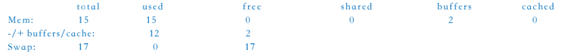
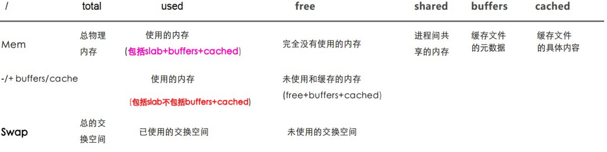

## 案例一

### 问题
最近一台 `CentOS` 服务器，发现内存无端`损失`了许多，`free` 和 `ps` 统计的结果`相差十几个G`，非常奇怪，后来Google了许久才搞明白。

### 分析

1、linux系统内存消耗主要有三个地方：
- 进程
- slab
- pagecacge

用 `free` 命令查看到的是系统整体的内容使用情况，而使用 `ps` 和 `top` 看到的内存使用情况都是以进程维度来看的，因此看不到 `slabcache` `和pagecache` 的内存占用信息。

2、判断应用程序是否有内存泄露问题，只根据进程的内存使用或机器的内存变化来判定都不太准确，如果单凭进程的内存变化可能会疏忽一些小对象的内存泄露问题。

同时对于机器的内存的使用也要做是否合理的判断。对于不同语言的应用都有相应的神器可以辅助定位内存泄露问题，同时结合linux内存的监控工具进行分析，
除了 `top`，`free`还有 `pmap`，`/proc/meminfo` 和 `/slabinfo`，`slaptop`等。

3、通过这个问题，有一点比较重要的是，在使用监控工具进行监控和分析时，对其值的具体含义还是要了解的很清楚，否则会造成误判，使问题变得更加复杂。

4、此外 `page cache`，`dentries`和`inodes cache`，系统是会自动回收的。

可以通过以下几种方式加速其回收，不过实际并不需要这么做。

手工清除内存 缓存

- `echo 1 > /proc/sys/vm/drop_caches` 清除page cache
- `echo 2 > /proc/sys/vm/drop_caches` 清除denries和inodes
- `echo 3 > /proc/sys/vm/drop_caches` 清除page cache ，dentries及inodes
- 调整 `vm.vfs_cache_pressure` 值大小，默认是100。值越大，dentries和inodes cache的回收速度会越快
- 调整 `vm.min_free_kbytes` 值大小，该值为系统开始内存回收的阀值，越大表示系统会越早开始回收(一般情况下此值不建议调整)。

### 问题描述和初步调查

```bash
$ free -g
```


这台服务器有 `16G内存`，但是结果显示除了2G左右的文件Buffer缓存外，其余十几G都被确确实实的用光了。(free按1024进制计算，总内存可能比实际偏小)

这里大概介绍下 `free` 结果的含义:



然后 `top` 看了下，没有特别吃内存的程序。用 `ps` 大概统计下所有程序占用的总内存:

```bash
$ echo `ps aux |awk '{mem += $6} END {print mem/1024/1024}'` GB

0.595089
```

结果显示所有进程占用的内存还不到 `1G`，实际上，因为`free`, `ps`的统计方式的差别和 `Copy-on-write` 和 `Shared libraries`等内存优化机制的存在，这两者的统计结果通常是不一样的。但是一般情况下绝对不会相差十几个G，肯定是有什么隐藏的问题，Google了许久后发现，free没有专门统计另一项缓存: `Slab`。

### Slab 简介和进一步调查

`Slab Allocation` 是Kernel 2.2之后引入的一个内存管理机制，专门用于缓存内核的数据对象，可以理解为一个内核专用的对象池，可以提高系统性能并减少内存碎片。 (Kernel 2.6.23之后，SLUB成为了默认的allocator)

#### 查看Slab缓存

```bash
$ cat /proc/meminfo

# 其中，Slab相关的数据为
Slab: 154212 kB
SReclaimable: 87980 kB
SUnreclaim: 66232 kB
```

SReclaimable(Linux 2.6.19+) 都是 clean 的缓存，随时可以释放。回到之前的内存问题，

#### 查看服务器上Slab占用的内存：

方法1：

```bash
$ cat /proc/meminfo|grep Slab

Slab: 12777668 kB
```

方法2：

```bash
echo `cat /proc/meminfo|grep Slab|awk '{mem += $2} END {print mem/1024/1024}'` GB

12G
```

`12G `的Slab缓存，有意思的是free把Slab缓存统计到了 `usedmemory` 中，这就是之前那个问题的症结所在了。另外，还可以查看 `/proc/slabinfo` (或使用 `slabtop` 命令)来查看Slab缓存的具体使用情况。

结果发现，`ext3_inode_cache` 和 `dentry_cache` 占用了绝大部分内存。考虑到这台服务器会频繁地用 `rsync` 同步大量的文件，这个结果也并不意外。

### 解决问题

先说明一下，如果问题仅仅是Slab占用了太多的内存(SReclaimable)，那么通常不需要太操心，因为这根本不是个问题(如果是SUnreclaim太多且不断增长，那么很有可能是内核有bug)。但是，如果是因为Slab占用内存太多而引起了其他的问题，建议继续往下阅读。

#### 清除Slab可回收缓存

通过 `/proc/sys/vm/drop_caches` 这个配置项，可以手动清除指定的可回收缓存(SReclaimable)

`echo 2 > /proc/sys/vm/drop_caches` 或者 `sysctl vm.drop_caches=2`

上面的命令会主动释放 `Slab` 中 `clean的缓存`(包括inode和dentry的缓存)，然后再 `free -g` 一下，空闲的内存陡增了十几个G

`注意的是`，手动清除缓存可能会在一段时间内降低系统性能。原则上不推荐这么做，因为如果有需要，系统会自动释放出内存供其他程序使用。
另外，手动清除Slab缓存是一个治标不治本的办法。因为问题不在Slab，实际操作的时候发现，清除缓存一段时间后，`Slab缓存`很快又会反弹回去。

如果需要治本，要么搞定问题进程，要么修改系统配置，要么增加物理内存。

### 调整系统 vm 配置

> `风险预警`: 调整以下系统配置可能会对系统性能造成负面影响，请仔细测试并谨慎操作。

`/etc/sysctl.conf` 里有以下几个对内存管理影响比较大的内核参数配置：

`vm.vfs_cache_pressure` 

系统在进行内存回收时，会先回收page cache, inode cache, dentry cache和swap cache。vfs_cache_pressure 越大，每次回收时，inode cache和dentry cache所占比例越大。

`vfs_cache_pressure` 

默认是100，该值越大inode cache和dentry cache的回收速度会越快，越小则回收越慢，为0的时候完全不回收，内存溢出(OOM!)。

`vm.min_free_kbytes` 

系统的"保留内存"的大小，"保留内存"用于低内存状态下的"atomic memory allocation requests"(eg. kmalloc + GFP_ATOMIC)，该参数也被用于计算开始内存回收的阀值，默认在开机的时候根据当前的内存计算所得，越大则表示系统会越早开始内存回收。`vm.min_free_kbytes 过大可能会导致 OOM`，太小可能会导致系统出现死锁等问题。查看默认设置：`cat /proc/sys/vm/min_free_kbytes`

`vm.swappiness` 

该配置用于控制系统将内存 `swap out` 到交换空间的积极性，取值范围是[0, 100]。`vm.swappiness` 越大，系统的交换积极性越高，默认是60， 如果为0则不会进行交换。

```bash
$ vim /etc/sysctl.conf

vm.swappiness = 1
```
查看默认设置：`cat /proc/sys/vm/swappiness`

`drop_caches`

默认值为0，将此值设置为1，2或3，使内核删除页面缓存和slab缓存的各种组合。

- 1 系统使所有的页面缓冲存储器失效并释放。
- 2 系统释放所有未使用的slab缓存内存。
- 3 系统释放所有的页面缓存和slab缓存内存。

查看默认设置： `cat /proc/sys/vm/drop_caches`

> 注：以上参数设置是非破坏性的操作，由于脏数据不能被释放，建议设置以上参数的值之前运行sync把内存数据写入硬盘。在生产环境中不建议使用drop_caches释放内存。

## 案例二 （物理内存的外碎片回收）

### 问题

执行 `docker ps` 命令挂住

### 问题分析

查找 `/var/log/messages`，发现有错误信息：`XFS: possible memory allocation deadlock in kmem_alloc (mode:0x250)`

在linux中使用`buddy算法`解决`物理内存`的`碎片问题`，其把所有空闲的内存，以2的幂次方的形式，分成11个块链表，分别对应为1、2、4、8、16、32、64、128、256、512、1024个页块。

Linux支持`NUMA技术`，对于NUMA设备，NUMA系统的结点通常是由一组CPU和本地内存组成，每一个节点都有相应的本地内存，因此buddyinfo 中的Node0表示节点ID；而每一个节点下的内存设备，又可以划分为多个内存区域(zone)，因此下面的显示中，对于Node0的内存，又划分类`DMA`、`Normal`、`HighMem`区域。而后面则是表示空闲的区域。

此处以 `Normal` 区域进行分析，第二列值为100，表示当前系统中normal区域，可用的连续两页的内存大小为100*2*PAGE_SIZE；第三列值为52，

表示当前系统中normal区域，可用的连续四页的内存大小为 `52*2^2* PAGE_SIZE`

```bash
$ cat /proc/buddyinfo

Node 0, zone DMA 23 15 4 5 2 3 3 2 3 1 0
Node 0, zone Normal 149 100 52 33 23 5 32 8 12 2 59
Node 0, zone HighMem 11 21 23 49 29 15 8 16 12 2 142
```

可以看到从第5列开始，只剩下 `44*16*PAGE_SIZE` 的页块，后面剩下的分别是`1 * 32 *PAGE_SIZE`, `1 * 64 *PAGE_SIZE`, `2 *128 * PAGE_SIZE`，剩下256,512的页块都没有了因此推测，导致这个问题出现的时候，该机器的内存碎片很多，当某个应用执行时，在xfs的申请内存中有这种连续的大块的内存申请的操作的请求。

比如：6000: map = kmem_alloc(subnex * sizeof(*map), KM_MAYFAIL | KM_NOFS); 就会导致内存一直分配不到。

例如：执行 `docker ps`，`docker exec`这些命令时，会一直阻塞在 `kmem_alloc` 的循环中，反复申请内存，由于内存碎片没有被组合，因此就一直申请不到，执行这些命令也会卡住，这也就验证了执行某些命令如`ls`、`ssh`都不会失败(因为需要内存的 `PAGE` 不是那么大)。

### 临时解决方法：

`echo 1 > /proc/sys/vm/drop_caches`

上述命令操作会把碎片化的 `PAGE` 重新分配，之后在申请大块的PAGE内存就可以申请到，不阻塞了。

### 永久解决方法：

优化内核参数：
```bash
# 保留1G空闲内存，达到该值，触发内存回收
$ cat >> /etc/sysctl.conf <<EOF
vm.min_free_kbytes = 1048576
EOF

#立即生效
$ sysctl -p
```
### 什么是 overcommit or oom 问题

Linux对大部分申请内存的请求都回复"yes"，以便能跑更多更大的程序，因为申请内存后，并不会马上使用内存，这种技术叫做 `Overcommit`。

当linux发现内存不足时，会发生OOM killer(OOM=out-of-memory)，它会选择杀死一些进程(用户态进程，不是内核线程)，以便释放内存。

当 oom-killer 发生时，linux会选择杀死哪些进程？选择进程的函数是oom_badness函数(在mm/oom_kill.c中)，该函数会计算每个进程的点数(0~1000)，点数越高，这个进程越有可能被杀死。

每个进程的点数跟 `oom_score_adj` 有关，而且 `oom_score_adj` 可以被设置(-1000最低，1000最高)。

### 内核参数 overcommit_memory, 它是内存分配策略

`可选值`：0、1、2。

- `0`：表示内核将检查是否有足够的可用内存供应用进程使用；如果有足够的可用内存，内存申请允许；否则，内存申请失败，并把错误返回给应用进程。
- `1`：表示内核允许分配所有的物理内存，而不管当前的内存状态如何。
- `2`：表示内核允许分配超过所有物理内存和交换空间总和的内存。

## 参考链接

- https://www.mawenbao.com/research/linux-ate-my-memory.html
- https://access.redhat.com/documentation/en-us/red_hat_enterprise_linux/6/html/performance_tuning_guide/s-memory-tunables
- http://blog.51yip.com/nosql/1776.html
- http://linuxperf.com/?p=102

> - 案例一原文出处：http://blog.atime.me/research/linux-ate-my-memory.html
> - 案例二原文出处：https://www.cnblogs.com/beilong/p/8192676.html