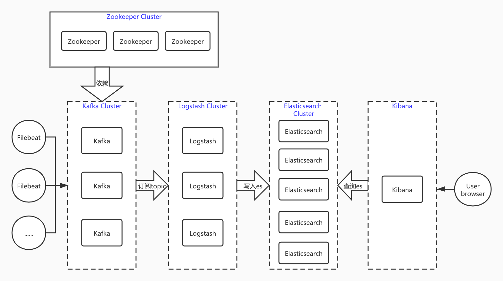

## 一、elk架构简介



- 首先 `logstash` 具有日志采集、过滤、筛选等功能，功能完善但同时体量也会比较大，消耗系统资源自然也多。`filebeat`作为一个轻量级日志采集工具，虽然没有过滤筛选功能，但是仅仅部署在应用服务器作为我们采集日志的工具可以是说最好的选择。但我们有些时候可能又需要logstash的过滤筛选功能，所以我们在采集日志时用filebeat，然后交给logstash过滤筛选。
- 其次，logstash的吞吐量是有限的，一旦短时间内filebeat传过来的日志过多会产生堆积和堵塞，对日志的采集也会受到影响，所以在filebeat与logstash中间又加了一层`kafka`消息队列来缓存或者说解耦，当然redis也是可以的。这样当众多filebeat节点采集大量日志直接放到kafka中，logstash慢慢的进行消费，两边互不干扰。
- 至于`zookeeper`，分布式服务管理神器，监控管理kafka的节点注册，`topic`管理等，同时弥补了kafka集群节点对外界无法感知的问题，kafka实际已经自带了zookeeper，这里将会使用独立的zookeeper进行管理，方便后期zookeeper集群的扩展。

## 二、环境

- 阿里云ECS：5台部署ES节点，3台分别部署logstash、kafka、zookeeper和kibana等服务。
- 阿里云ECS配置：5台 4核16G 2TB SSD磁盘。3台 4核16G 200G SSD磁盘。都是 Centos7.8系统
- 安装 docker 和 docker-compose
- ELK版本7.10.1；zookeeper版本3.6.2；kafka版本2.13-2.6.0；

IP地址 | 主机名称 | 用途
---|---|---
172.20.166.25 | es-master1 | es master 和 es 数据节点
172.20.166.24 | es-master2 | es master 和 es 数据节点
172.20.166.22 | es-master3 | es master 和 es 数据节点
172.20.166.23 | es-data1 | es数据节点
172.20.166.26 | es-data2 | es数据节点
172.20.166.27 | logstash1 | logstash、kafka、zookeeper
172.20.166.28 | logstash2 | logstash、kafka、zookeeper
172.20.166.29 | logstash3 | logstash、kafka、kafa-manager、zookeeper、kibana、curator

## 三、系统参数优化

```bash
# 最大用户打开进程数
$ vim /etc/security/limits.d/20-nproc.conf 

*           soft   nproc       65535
*           hard   nproc       65535

# 优化内核，用于 docker 支持
$ modprobe br_netfilter
$ cat <<EOF >  /etc/sysctl.d/k8s.conf
net.bridge.bridge-nf-call-ip6tables = 1
net.bridge.bridge-nf-call-iptables = 1
net.ipv4.ip_forward = 1
EOF
$ sysctl -p /etc/sysctl.d/k8s.conf

# 优化内核，对 es 支持
$ echo 'vm.max_map_count=262144' >> /etc/sysctl.conf

# 生效配置
$ sysctl -p
```

## 四、部署 docker 和 docker-compose

### 部署 docker

```bash
# 安装必要的一些系统工具
$ yum install -y yum-utils device-mapper-persistent-data lvm2

# 添加软件源信息
$ yum-config-manager --add-repo http://mirrors.aliyun.com/docker-ce/linux/centos/docker-ce.repo

# 更新并安装 Docker-CE
$ yum makecache fast
$ yum -y install docker-ce

# 配置docker
$ systemctl enable docker
$ systemctl start docker
$ vim /etc/docker/daemon.json
{"data-root": "/var/lib/docker", "bip": "10.50.0.1/16", "default-address-pools": [{"base": "10.51.0.1/16", "size": 24}], "registry-mirrors": ["https://4xr1qpsp.mirror.aliyuncs.com"], "log-opts": {"max-size":"500m", "max-file":"3"}}
$ sed  -i '/ExecStart=/i ExecStartPost=\/sbin\/iptables -P FORWARD ACCEPT' /usr/lib/systemd/system/docker.service
$ systemctl enable docker.service
$ systemctl daemon-reload
$ systemctl restart docker
```

### 部署 docker-compose

```bash
# 安装 docker-compose
$ sudo curl -L "https://github.com/docker/compose/releases/download/1.27.4/docker-compose-$(uname -s)-$(uname -m)" -o /usr/local/bin/docker-compose
$ chmod +x /usr/local/bin/docker-compose
```

## 五、部署 ES

### es-master1 操作

```bash
# 创建 es 目录
$ mkdir /data/ELKStack
$ mkdir elasticsearch elasticsearch-data elasticsearch-plugins

# 容器es用户 uid 和 gid 都是 1000
$ chown 1000.1000 elasticsearch-data elasticsearch-plugins

# 临时启动一个es
$ docker run --name es-test -it --rm docker.elastic.co/elasticsearch/elasticsearch:7.10.1 bash

# 生成证书，证书有效期10年，证书输入的密码这里为空
$ bin/elasticsearch-certutil ca --days 3660
$ bin/elasticsearch-certutil cert --ca elastic-stack-ca.p12 --days 3660

# 打开新的窗口，拷贝生成的证书
$ cd /data/ELKStack/elasticsearch
$ mkdir es-p12
$ docker cp es-test:/usr/share/elasticsearch/elastic-certificates.p12 ./es-p12
$ docker cp es-test:/usr/share/elasticsearch/elastic-stack-ca.p12 ./es-p12
$ chown -R 1000.1000 ./es-p12

# 创建 docker-compose.yml 
$ vim docker-compose.yml

version: '2.2'
services:
  elasticsearch:
    image: docker.elastic.co/elasticsearch/elasticsearch:7.10.1
    container_name: es01
    environment:
      - cluster.name=es-docker-cluster
      - cluster.initial_master_nodes=es01,es02,es03
      - bootstrap.memory_lock=true
      - "ES_JAVA_OPTS=-Xms10000m -Xmx10000m"
    ulimits:
      memlock:
        soft: -1
        hard: -1
      nofile:
        soft: 65536
        hard: 65536
    mem_limit: 13000m
    cap_add:
      - IPC_LOCK
    restart: always
    # 设置 docker host 网络模式
    network_mode: "host"
    volumes:
       - /data/ELKStack/elasticsearch-data:/usr/share/elasticsearch/data
       - /data/ELKStack/elasticsearch-plugins:/usr/share/elasticsearch/plugins
       - /data/ELKStack/elasticsearch/elasticsearch.yml:/usr/share/elasticsearch/config/elasticsearch.yml
       - /data/ELKStack/elasticsearch/es-p12:/usr/share/elasticsearch/config/es-p12

# 创建 elasticsearch.yml 配置文件
$ vim elasticsearch.yml

cluster.name: "es-docker-cluster"
node.name: "es01"
network.host: 0.0.0.0

node.master: true
node.data: true

discovery.zen.minimum_master_nodes: 2
http.port: 9200
transport.tcp.port: 9300

# 如果是多节点es，通过ping来健康检查
discovery.zen.ping.unicast.hosts: ["172.20.166.25:9300", "172.20.166.24:9300", "172.20.166.22:9300", "172.20.166.23:9300", "172.20.166.26:9300"]
discovery.zen.fd.ping_timeout: 120s
discovery.zen.fd.ping_retries: 6
discovery.zen.fd.ping_interval: 10s

cluster.info.update.interval: 1m
indices.fielddata.cache.size:  20%
indices.breaker.fielddata.limit: 40%
indices.breaker.request.limit: 40%
indices.breaker.total.limit: 70%
indices.memory.index_buffer_size: 20%
script.painless.regex.enabled: true

# 磁盘分片分配
cluster.routing.allocation.disk.watermark.low: 100gb
cluster.routing.allocation.disk.watermark.high: 50gb
cluster.routing.allocation.disk.watermark.flood_stage: 30gb

# 本地数据分片恢复配置
gateway.recover_after_nodes: 3
gateway.recover_after_time: 5m
gateway.expected_nodes: 3
cluster.routing.allocation.node_initial_primaries_recoveries: 8
cluster.routing.allocation.node_concurrent_recoveries: 2

# 允许跨域请求
http.cors.enabled: true
http.cors.allow-origin: "*"
http.cors.allow-headers: Authorization,X-Requested-With,Content-Length,Content-Type

# 开启xpack
xpack.security.enabled: true
xpack.monitoring.collection.enabled: true

# 开启集群中https传输
xpack.security.transport.ssl.enabled: true
xpack.security.transport.ssl.verification_mode: certificate
xpack.security.transport.ssl.keystore.path: es-p12/elastic-certificates.p12
xpack.security.transport.ssl.truststore.path: es-p12/elastic-certificates.p12

# 把 es 配置使用 rsync 同步到其它 es 节点
$ rsync -avp -e ssh /data/ELKStack 172.20.166.24:/data/
$ rsync -avp -e ssh /data/ELKStack 172.20.166.22:/data/
$ rsync -avp -e ssh /data/ELKStack 172.20.166.23:/data/
$ rsync -avp -e ssh /data/ELKStack 172.20.166.26:/data/

# 启动 es
$ docker-compose up -d

# 查看 es
$ docker-compose ps
```

### es-master2 操作

```bash
$ cd /data/ELKStack/elasticsearch

# 修改 docker-compose.yml elasticsearch.yml 两个配置
$ sed -i 's/es01/es02/g' docker-compose.yml elasticsearch.yml

# 启动 es
$ docker-compose up -d
```

### es-master3 操作

```bash
$ cd /data/ELKStack/elasticsearch

# 修改 docker-compose.yml elasticsearch.yml 两个配置
$ sed -i 's/es01/es03/g' docker-compose.yml elasticsearch.yml

# 启动 es
$ docker-compose up -d
```

### es-data1 操作

```bash
$ cd /data/ELKStack/elasticsearch

# 修改 docker-compose.yml elasticsearch.yml 两个配置
$ sed -i 's/es01/es04/g' docker-compose.yml elasticsearch.yml

# 不做为 es master 节点，只做数据节点
$ sed -i 's/node.master: true/node.master: false/g' elasticsearch.yml

# 启动 es
$ docker-compose up -d
```

### es-data2 操作

```bash
$ cd /data/ELKStack/elasticsearch

# 修改 docker-compose.yml elasticsearch.yml 两个配置
$ sed -i 's/es01/es05/g' docker-compose.yml elasticsearch.yml

# 不做为 es master 节点，只做数据节点
$ sed -i 's/node.master: true/node.master: false/g' elasticsearch.yml

# 启动 es
$ docker-compose up -d
```

### 设置 es 访问账号

```bash
# es-master1 操作
$ docker exec -it es01 bash

# 设置 elastic，apm_system，kibana，kibana_system，logstash_system，beats_system，remote_monitoring_user 等密码
# 密码都设置为 elastic123，这里只是举例，具体根据需求设置
$ ./bin/elasticsearch-setup-passwords interactive
```

## 六、部署 Kibana

### logstash3 操作

```bash
$ mkdir -p /data/ELKStack/kibana
$ cd /data/ELKStack/kibana

# 创建 kibana 相关目录，用于容器挂载
$ mkdir config data plugins
$ chown 1000.1000 config data plugins

# 创建 docker-compose.yml
$ vim docker-compose.yml

version: '2'
services:
  kibana:
    image: docker.elastic.co/kibana/kibana:7.10.1
    container_name: kibana
    restart: always
    network_mode: "bridge"
    mem_limit: 2000m
    environment:
      SERVER_NAME: kibana.example.com
    ports:
      - "5601:5601"
    volumes:
       - /data/ELKStack/kibana/config:/usr/share/kibana/config
       - /data/ELKStack/kibana/data:/usr/share/kibana/data
       - /data/ELKStack/kibana/plugins:/usr/share/kibana/plugins

# 创建 kibana.yml
$ vim config/kibana.yml

server.name: kibana
server.host: "0"
elasticsearch.hosts: ["http://172.20.166.25:9200","http://172.20.166.24:9200","http://172.20.166.22:9200"]
elasticsearch.username: "kibana"
elasticsearch.password: "elastic123"
monitoring.ui.container.elasticsearch.enabled: true
xpack.security.enabled: true
xpack.encryptedSavedObjects.encryptionKey: encryptedSavedObjects12345678909876543210
xpack.security.encryptionKey: encryptionKeysecurity12345678909876543210
xpack.reporting.encryptionKey: encryptionKeyreporting12345678909876543210
i18n.locale: "zh-CN"

# 启动 kibana
$ docker-compose up -d
```

## 七、部署 Zookeeper

### logstash1 操作

```bash
# 创建 zookeeper 目录
$ mkdir /data/ELKStack/zookeeper
$ cd /data/ELKStack/zookeeper
$ mkdir data datalog
$ chown 1000.1000 data datalog

# 创建 docker-compose.yml
$ vim docker-compose.yml

version: '2'
services:
  zoo1:
    image: zookeeper:3.6.2
    restart: always
    hostname: zoo1
    container_name: zoo1
    network_mode: "bridge"
    mem_limit: 2000m
    ports:
      - 2181:2181
      - 3888:3888
      - 2888:2888
    volumes:
      - /data/ELKStack/zookeeper/data:/data
      - /data/ELKStack/zookeeper/datalog:/datalog
      - /data/ELKStack/zookeeper/zoo.cfg:/conf/zoo.cfg
    environment:
      ZOO_MY_ID: 1  # 表示 ZK服务的 id, 它是1-255 之间的整数, 必须在集群中唯一
      ZOO_SERVERS: server.1=0.0.0.0:2888:3888;2181 server.2=172.20.166.28:2888:3888;2181 server.3=172.20.166.29:2888:3888;2181
      # ZOOKEEPER_CLIENT_PORT: 2181

# 创建 zoo.cfg 配置
$ vim zoo.cfg

tickTime=2000
initLimit=10
syncLimit=5
dataDir=/data
dataLogDir=/datalog
autopurge.snapRetainCount=3
autopurge.purgeInterval=1
maxClientCnxns=60
server.1= 0.0.0.0:2888:3888;2181
server.2= 172.20.166.28:2888:3888;2181
server.3= 172.20.166.29:2888:3888;2181

# 拷贝配置到 logstash2 logstash3 机器上
$ rsync -avp -e ssh /data/ELKStack/zookeeper 172.20.166.28:/data/ELKStack/
$ rsync -avp -e ssh /data/ELKStack/zookeeper 172.20.166.29:/data/ELKStack/

# 启动 zookeeper
$ docker-compose up -d
```

### logstash2 操作

```bash
$ cd /data/ELKStack/zookeeper

# 修改 docker-compose.yml 文件
$ vim docker-compose.yml

version: '2'
services:
  zoo2:
    image: zookeeper:3.6.2
    restart: always
    hostname: zoo2
    container_name: zoo2
    network_mode: "bridge"
    mem_limit: 2000m
    ports:
      - 2181:2181
      - 3888:3888
      - 2888:2888
    volumes:
      - /data/ELKStack/zookeeper/data:/data
      - /data/ELKStack/zookeeper/datalog:/datalog
      - /data/ELKStack/zookeeper/zoo.cfg:/conf/zoo.cfg
    environment:
      ZOO_MY_ID: 2  # 表示 ZK服务的 id, 它是1-255 之间的整数, 必须在集群中唯一
      ZOO_SERVERS: server.1=172.20.166.27:2888:3888;2181 server.2=0.0.0.0:2888:3888;2181 server.3=172.20.166.29:2888:3888;2181
      # ZOOKEEPER_CLIENT_PORT: 2181

# 修改 zoo.cfg
$ vim zoo.cfg

tickTime=2000
initLimit=10
syncLimit=5
dataDir=/data
dataLogDir=/datalog
autopurge.snapRetainCount=3
autopurge.purgeInterval=1
maxClientCnxns=60
server.1= 172.20.166.27:2888:3888;2181
server.2= 0.0.0.0:2888:3888;2181
server.3= 172.20.166.29:2888:3888;2181

# 启动 zookeeper
$ docker-compose up -d
```

### logstash3 操作

```bash
$ cd /data/ELKStack/zookeeper

# 修改 docker-compose.yml 文件
$ vim docker-compose.yml

version: '2'
services:
  zoo3:
    image: zookeeper:3.6.2
    restart: always
    hostname: zoo3
    container_name: zoo3
    network_mode: "bridge"
    mem_limit: 2000m
    ports:
      - 2181:2181
      - 3888:3888
      - 2888:2888
    volumes:
      - /data/ELKStack/zookeeper/data:/data
      - /data/ELKStack/zookeeper/datalog:/datalog
      - /data/ELKStack/zookeeper/zoo.cfg:/conf/zoo.cfg
    environment:
      ZOO_MY_ID: 3  # 表示 ZK服务的 id, 它是1-255 之间的整数, 必须在集群中唯一
      ZOO_SERVERS: server.1=172.20.166.27:2888:3888;2181 server.2=172.20.166.28:2888:3888;2181 server.3=0.0.0.0:2888:3888;2181
      # ZOOKEEPER_CLIENT_PORT: 2181

# 修改 zoo.cfg
$ vim zoo.cfg

tickTime=2000
initLimit=10
syncLimit=5
dataDir=/data
dataLogDir=/datalog
autopurge.snapRetainCount=3
autopurge.purgeInterval=1
maxClientCnxns=60
server.1= 172.20.166.27:2888:3888;2181
server.2= 172.20.166.28:2888:3888;2181
server.3= 0.0.0.0:2888:3888;2181

# 启动 zookeeper
$ docker-compose up -d

# 操作 zookeeper
$ docker run -it zoo3 bash
$ zkCli.sh -server 172.20.166.27:2181,172.20.166.28:2181,172.20.166.29:2181
```

## 八、部署 Kafka

### logstash1 操作

```bash
# 创建 kafka 目录
$ mkdir -p /data/ELKStack/kafka
$ cd /data/ELKStack/kafka

# 创建数据目录，用于存储kafka容器数据
$ mkdir data

# 把kafka配置拷贝到宿主机上
$ docker run --name kafka-test -it --rm wurstmeister/kafka:2.13-2.6.0 bash
$ cd /opt/kafka
$ tar zcvf /tmp/config.tar.gz config

# 打开一个新的窗口
$ docker cp kafka-test:/tmp/config.tar.gz ./

# 解压配置文件
$ tar xf config.tar.gz

# 创建 docker-compose.yml
$ vim docker-compose.yml

version: '2'

services:
  kafka1:
    image: wurstmeister/kafka:2.13-2.6.0
    restart: always
    hostname: kafka1
    container_name: kafka1
    network_mode: "bridge"
    mem_limit: 5120m
    ports:
    - 9092:9092
    - 9966:9966
    environment:
      KAFKA_BROKER_ID: 1
      KAFKA_ADVERTISED_LISTENERS: PLAINTEXT://172.20.166.27:9092       # 宿主机的IP地址而非容器的IP，及暴露出来的端口
      KAFKA_ADVERTISED_HOST_NAME: 172.20.166.27                        # 外网访问地址
      KAFKA_ADVERTISED_PORT: 9092                                      # 端口
      KAFKA_ZOOKEEPER_CONNECT: 172.20.166.27:2181,172.20.166.28:2181,172.20.166.29:2181           # 连接的zookeeper服务及端口
      KAFKA_JMX_OPTS: "-Dcom.sun.management.jmxremote -Dcom.sun.management.jmxremote.authenticate=false -Dcom.sun.management.jmxremote.ssl=false -Djava.rmi.server.hostname=172.20.166.27 -Dcom.sun.management.jmxremote.rmi.port=9966"
      JMX_PORT: 9966 # kafka需要监控broker和topic的数据的时候,是需要开启jmx_port的
      KAFKA_HEAP_OPTS: "-Xmx4096M -Xms4096M"
    volumes:
    - /data/ELKStack/kafka/data:/kafka                    # kafka数据文件存储目录
    - /data/ELKStack/kafka/config:/opt/kafka/config

# 优化 kafka server.properties 配置
$ vim config/server.properties

# 调大socket，防止报错
socket.send.buffer.bytes=1024000
socket.receive.buffer.bytes=1024000
socket.request.max.bytes=1048576000

# topic 数据保留多久，默认168小时(7day)
log.retention.hours=72
log.cleanup.policy=delete

# 拷贝配置到 logstash2 logstash3 机器上
$ rsync -avp -e ssh /data/ELKStack/kafka 172.20.166.28:/data/ELKStack/
$ rsync -avp -e ssh /data/ELKStack/kafka 172.20.166.29:/data/ELKStack/

# 启动 kafka
$ docker-compose up -d
```

### logstash2 操作

```bash
$ cd /data/ELKStack/kafka

# 修改 docker-compose.yml 文件
$ vim docker-compose.yml

version: '2'

services:
  kafka2:
    image: wurstmeister/kafka:2.13-2.6.0
    restart: always
    hostname: kafka2
    container_name: kafka2
    network_mode: "bridge"
    mem_limit: 5120m
    ports:
    - 9092:9092
    - 9966:9966
    environment:
      KAFKA_BROKER_ID: 2
      KAFKA_ADVERTISED_LISTENERS: PLAINTEXT://172.20.166.28:9092       # 宿主机的IP地址而非容器的IP，及暴露出来的端口
      KAFKA_ADVERTISED_HOST_NAME: 172.20.166.28                        # 外网访问地址
      KAFKA_ADVERTISED_PORT: 9092                                      # 端口
      KAFKA_ZOOKEEPER_CONNECT: 172.20.166.27:2181,172.20.166.28:2181,172.20.166.29:2181           # 连接的zookeeper服务及端口
      KAFKA_JMX_OPTS: "-Dcom.sun.management.jmxremote -Dcom.sun.management.jmxremote.authenticate=false -Dcom.sun.management.jmxremote.ssl=false -Djava.rmi.server.hostname=172.20.166.28 -Dcom.sun.management.jmxremote.rmi.port=9966"
      JMX_PORT: 9966  # kafka需要监控broker和topic的数据的时候,是需要开启jmx_port的
      KAFKA_HEAP_OPTS: "-Xmx4096M -Xms4096M"
    volumes:
    - /data/ELKStack/kafka/data:/kafka                    # kafka数据文件存储目录
    - /data/ELKStack/kafka/config:/opt/kafka/config

# 启动 kafka
$ docker-compose up -d        
```

### logstash3 操作

```bash
$ cd /data/ELKStack/kafka

# 修改 docker-compose.yml 文件
$ vim docker-compose.yml

version: '2'

services:
  kafka3:
    image: wurstmeister/kafka:2.13-2.6.0
    restart: always
    hostname: kafka3
    container_name: kafka3
    network_mode: "bridge"
    mem_limit: 5120m
    ports:
    - 9092:9092
    - 9966:9966
    environment:
      KAFKA_BROKER_ID: 3
      KAFKA_ADVERTISED_LISTENERS: PLAINTEXT://172.20.166.29:9092       # 宿主机的IP地址而非容器的IP，及暴露出来的端口
      KAFKA_ADVERTISED_HOST_NAME: 172.20.166.29                        # 外网访问地址
      KAFKA_ADVERTISED_PORT: 9092                                      # 端口
      KAFKA_ZOOKEEPER_CONNECT: 172.20.166.27:2181,172.20.166.28:2181,172.20.166.29:2181           # 连接的zookeeper服务及端口
      KAFKA_JMX_OPTS: "-Dcom.sun.management.jmxremote -Dcom.sun.management.jmxremote.authenticate=false -Dcom.sun.management.jmxremote.ssl=false -Djava.rmi.server.hostname=172.20.166.29 -Dcom.sun.management.jmxremote.rmi.port=9966"
      JMX_PORT: 9966  # kafka需要监控broker和topic的数据的时候,是需要开启jmx_port的
      KAFKA_HEAP_OPTS: "-Xmx4096M -Xms4096M"
    volumes:
    - /data/ELKStack/kafka/data:/kafka                    # kafka数据文件存储目录
    - /data/ELKStack/kafka/config:/opt/kafka/config

# 启动 kafka
$ docker-compose up -d 

# 部署 kafka-manager 管理 kafka 平台
$ mkdir /data/ELKStack/kafka-manager
$ cd /data/ELKStack/kafka-manager
$ vim docker-compose.yml

version: '3.6'
services:
  kafka_manager:
    restart: always
    container_name: kafa-manager
    hostname: kafka-manager
    network_mode: "bridge"
    mem_limit: 1024m
    image: hlebalbau/kafka-manager:3.0.0.5-7e7a22e
    ports:
      - "9000:9000"
    environment:
      ZK_HOSTS: "172.20.166.27:2181,172.20.166.28:2181,172.20.166.29:2181"
      APPLICATION_SECRET: "random-secret"
      KAFKA_MANAGER_AUTH_ENABLED: "true"
      KAFKA_MANAGER_USERNAME: admin
      KAFKA_MANAGER_PASSWORD: elastic123
      JMX_PORT: 9966
      TZ: "Asia/Shanghai"

# 启动 kafka-manager
$ docker-compose up -d 

# 访问 http://172.20.166.29:9000 ，把上面创建的三台 kafka 加入管理，这里不在阐述，网上很多配置教程
```

## 九、部署 logstash

### logstash1 操作

```bash
$ mkdir /data/ELKStack/logstash
$ cd /data/ELKStack/logstash
$ mkdir config data 
$ chown 1000.1000 config data

# 创建 docker-compose.yml
$ vim docker-compose.yml

version: '2'
services:
  logstash1:
    image: docker.elastic.co/logstash/logstash:7.10.1
    container_name: logstash1
    hostname: logstash1
    restart: always
    network_mode: "bridge"
    mem_limit: 4096m
    environment:
      TZ: "Asia/Shanghai"
    ports:
      - 5044:5044
    volumes:
      - /data/ELKStack/logstash/config:/config-dir
      - /data/ELKStack/logstash/logstash.yml:/usr/share/logstash/config/logstash.yml
      - /data/ELKStack/logstash/data:/usr/share/logstash/data
      - /etc/localtime:/etc/localtime
    user: logstash
    command: bash -c "logstash -f /config-dir --config.reload.automatic"

# 创建 logstash.yml
$ vim logstash.yml

http.host: "0.0.0.0"
# 指发送到Elasticsearch的批量请求的大小，值越大，处理则通常更高效，但增加了内存开销
pipeline.batch.size: 3000
# 指调整Logstash管道的延迟，过了该时间则logstash开始执行过滤器和输出
pipeline.batch.delay: 200

# 创建 logstash 规则配置
$ vim config/01-input.conf

input {                                        # 输入组件
    kafka {                                    # 从kafka消费数据
        bootstrap_servers => ["172.20.166.27:9092,172.20.166.28:9092,172.20.166.29:9092"]
        #topics => "%{[@metadata][topic]}"     # 使用kafka传过来的topic
        topics_pattern => "elk-.*"             # 使用正则匹配topic
        codec => "json"                        # 数据格式
        consumer_threads => 3                  # 消费线程数量
        decorate_events => true                # 可向事件添加Kafka元数据，比如主题、消息大小的选项，这将向logstash事件中添加一个名为kafka的字段
        auto_offset_reset => "latest"          # 自动重置偏移量到最新的偏移量
        group_id => "logstash-node"            # 消费组ID，多个有相同group_id的logstash实例为一个消费组
        client_id => "logstash1"               # 客户端ID
        fetch_max_wait_ms => "1000"            # 指当没有足够的数据立即满足fetch_min_bytes时，服务器在回答fetch请求之前将阻塞的最长时间        
  }
}

$ vim config/02-output.conf

output {                                       # 输出组件
    elasticsearch {
        # Logstash输出到es
        hosts => ["172.20.166.25:9200", "172.20.166.24:9200", "172.20.166.22:9200", "172.20.166.23:9200", "172.20.166.26:9200"]
        index => "%{[fields][source]}-%{+YYYY-MM-dd}"      # 直接在日志中匹配，索引会去掉elk
        # index => "%{[@metadata][topic]}-%{+YYYY-MM-dd}"  # 以日期建索引
        user => "elastic"
        password => "elastic123"
    }
    #stdout {
    #    codec => rubydebug
    #}
}

$ vim config/03-filter.conf

filter {
   # 当非业务字段时，无traceId则移除
   if ([message] =~ "traceId=null") {          # 过滤组件，这里只是展示，无实际意义，根据自己的业务需求进行过滤
      drop {}
   }
}

# 拷贝配置到 logstash2 logstash3 机器上
$ rsync -avp -e ssh /data/ELKStack/logstash 172.20.166.28:/data/ELKStack/
$ rsync -avp -e ssh /data/ELKStack/logstash 172.20.166.29:/data/ELKStack/

# 启动 logstash
$ docker-compose up -d
```

### logstash2 操作

```bash
$ cd /data/ELKStack/logstash
$ sed -i 's/logstash1/logstash2/g' docker-compose.yml
$ sed -i 's/logstash1/logstash2/g' config/01-input.conf

# 启动 logstash
$ docker-compose up -d
```

### logstash3 操作

```bash
$ cd /data/ELKStack/logstash
$ sed -i 's/logstash1/logstash3/g' docker-compose.yml
$ sed -i 's/logstash1/logstash3/g' config/01-input.conf

# 启动 logstash
$ docker-compose up -d
```

## 十、部署 filebeat

```bash
# 配置 filebeat yum源，这里以 centos7 为例
$ rpm --import https://artifacts.elastic.co/GPG-KEY-elasticsearch  
  
$ vim /etc/yum.repos.d/elastic.repo 

[elastic-7.x]  
name=Elastic repository for 7.x packages  
baseurl=https://artifacts.elastic.co/packages/7.x/yum  
gpgcheck=1  
gpgkey=https://artifacts.elastic.co/GPG-KEY-elasticsearch  
enabled=1  
autorefresh=1  
type=rpm-md 

$ yum install -y filebeat-7.10.1
$ systemctl enable filebeat

# 配置
$ cd /etc/filebeat/
$ cp -a filebeat.yml filebeat.yml.old
$ echo > filebeat.yml

# 以收集nginx访问日志为例
$ vim filebeat.yml

filebeat.inputs:                   # inputs为复数，表名type可以有多个
- type: log                        # 输入类型
  access:
  enabled: true                    # 启用这个type配置
  json.keys_under_root: true       # 默认这个值是FALSE的，也就是我们的json日志解析后会被放在json键上。设为TRUE，所有的keys就会被放到根节点
  json.overwrite_keys: true        # 是否要覆盖原有的key，这是关键配置，将keys_under_root设为TRUE后，再将overwrite_keys也设为TRUE，就能把filebeat默认的key值给覆盖
  max_bytes: 20480                 # 单条日志的大小限制,建议限制(默认为10M,queue.mem.events * max_bytes 将是占有内存的一部分)
  paths:
    - /var/log/nginx/access.log    # 监控nginx 的access日志

  fields:                          # 额外的字段
    source: nginx-access-prod      # 自定义source字段，用于es建议索引（字段名小写，我记得大写好像不行）

# 自定义es的索引需要把ilm设置为false
setup.ilm.enabled: false

output.kafka:            # 输出到kafka
  enabled: true          # 该output配置是否启用
  hosts: ["172.20.166.27:9092", "172.20.166.28:9092", "172.20.166.29:9092"]  # kafka节点列表
  topic: "elk-%{[fields.source]}"   # kafka会创建该topic，然后logstash(可以过滤修改)会传给es作为索引名称
  partition.hash:
    reachable_only: true # 是否只发往可达分区
  compression: gzip      # 压缩
  max_message_bytes: 1000000  # Event最大字节数。默认1000000。应小于等于kafka broker message.max.bytes值
  required_acks: 1  # kafka ack等级
  worker: 1  # kafka output的最大并发数
  bulk_max_size: 2048    # 单次发往kafka的最大事件数
logging.to_files: true   # 输出所有日志到file，默认true， 达到日志文件大小限制时，日志文件会自动限制替换，详细配置：https://www.cnblogs.com/qinwengang/p/10982424.html
close_older: 30m         # 如果一个文件在某个时间段内没有发生过更新，则关闭监控的文件handle。默认1h
force_close_files: false # 这个选项关闭一个文件,当文件名称的变化。只在window建议为true

# 没有新日志采集后多长时间关闭文件句柄，默认5分钟，设置成1分钟，加快文件句柄关闭
close_inactive: 1m

# 传输了3h后荏没有传输完成的话就强行关闭文件句柄，这个配置项是解决以上案例问题的key point
close_timeout: 3h

# 这个配置项也应该配置上，默认值是0表示不清理，不清理的意思是采集过的文件描述在registry文件里永不清理，在运行一段时间后，registry会变大，可能会带来问题
clean_inactive: 72h

# 设置了clean_inactive后就需要设置ignore_older，且要保证ignore_older < clean_inactive
ignore_older: 70h

# 限制 CPU和内存资源
max_procs: 1 # 限制一个CPU核心,避免过多抢占业务资源
queue.mem.events: 256 # 存储于内存队列的事件数，排队发送 (默认4096)
queue.mem.flush.min_events: 128 # 小于 queue.mem.events ,增加此值可提高吞吐量 (默认值2048)

# 启动 filebeat
$ systemctl start filebeat
```

## 十一、部署 curator，定时清理es索引

### logstash3 机器操作

```bash
# 参考链接：https://www.elastic.co/guide/en/elasticsearch/client/curator/current/yum-repository.html

# 安装 curator 服务，以 centos7 为例
$ rpm --import https://packages.elastic.co/GPG-KEY-elasticsearch

$ vim /etc/yum.repos.d/elk-curator-5.repo

[curator-5]
name=CentOS/RHEL 7 repository for Elasticsearch Curator 5.x packages
baseurl=https://packages.elastic.co/curator/5/centos/7
gpgcheck=1
gpgkey=https://packages.elastic.co/GPG-KEY-elasticsearch
enabled=1

$ yum install elasticsearch-curator -y

# 创建 curator 配置文件目录与输出日志目录
$ mkdir -p /data/ELKStack/curator/logs
$ cd /data/ELKStack/curator

$ vim config.yml

---
# Remember, leave a key empty if there is no value.  None will be a string,
# # not a Python "NoneType"
client:
  hosts: ["172.20.166.25", "172.20.166.24", "172.20.166.22", "172.20.166.23", "172.20.166.26"]
  port: 9200
  url_prefix:
  use_ssl: False
  certificate:
  client_cert:
  client_key:
  ssl_no_validate: False
  http_auth: elastic:elastic123
  timeout: 150
  master_only: False

logging:
  loglevel: INFO
  logfile: /data/ELKStack/curator/logs/curator.log
  logformat: default
  blacklist: ['elasticsearch', 'urllib3']

$ vim action.yml

---
# Remember, leave a key empty if there is no value.  None will be a string,
# not a Python "NoneType"
#
# Also remember that all examples have 'disable_action' set to True.  If you
# want to use this action as a template, be sure to set this to False after
# copying it.
actions:
  1:
    action: delete_indices
    description: >-
      Delete indices older than 30 days. Ignore the error if the filter does not result in an actionable list of indices (ignore_empty_list) and exit cleanly.
    options:
      ignore_empty_list: True
      disable_action: False
    filters:
    - filtertype: pattern
      kind: regex
      value: '^((?!(kibana|json|monitoring|metadata|apm|async|transform|siem|security)).)*$'
    - filtertype: age
      source: creation_date
      direction: older
      #timestring: '%Yi-%m-%d'
      unit: days
      unit_count: 30
  2:
    action: delete_indices
    description: >-
      Delete indices older than 15 days. Ignore the error if the filter does not result in an actionable list of indices (ignore_empty_list) and exit cleanly.
    options:
      ignore_empty_list: True
      disable_action: False
    filters:
    - filtertype: pattern
      kind: regex
      value: '^(nginx-).*$'
    - filtertype: age
      source: creation_date
      direction: older
      #timestring: '%Yi-%m-%d'
      unit: days
      unit_count: 15

# 设置定时任务清理es索引
$ crontab -e

0 0 * * * /usr/bin/curator --config /data/ELKStack/curator/config.yml /data/ELKStack/curator/action.yml
```

## 十二、参考链接

- es证书配置：https://cloud.tencent.com/developer/article/1549834
- es忘记密码找回：https://www.cnblogs.com/woshimrf/p/docker-es7.html
- es设置密码：https://blog.csdn.net/extraordinarylife/article/details/107917764?utm_medium=distribute.pc_relevant.none-task-blog-baidujs_title-2&spm=1001.2101.3001.4242
- elk-kafka部署 1：https://www.codenong.com/cs106056710/
- elk-kafka部署 2：https://www.cnblogs.com/lz0925/p/12061293.html
- elk优化：https://www.clxz.top/2020/06/19/elk-kafka-optimization/
- es7索引分片：https://www.elastic.co/guide/en/elasticsearch/reference/current/index-modules.html
- filebeat优化：https://www.jianshu.com/p/389702465461
- kafka数据与日志清理：https://blog.csdn.net/VIP099/article/details/106257561