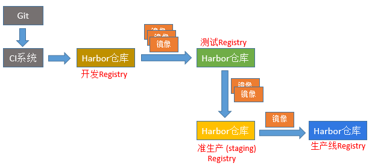
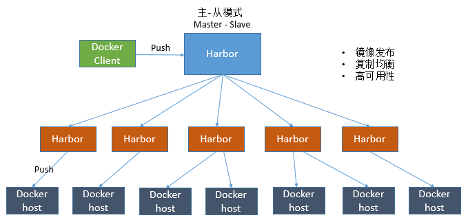
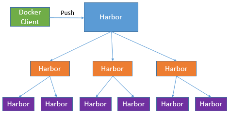
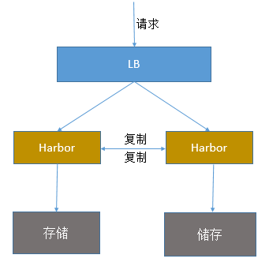
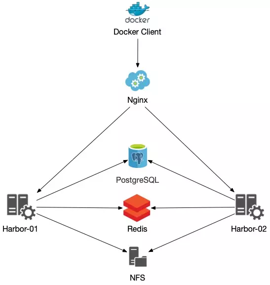
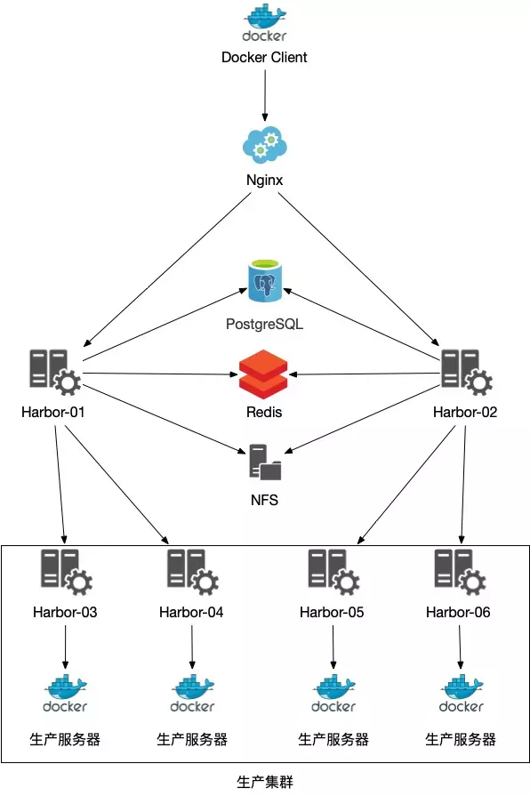

## Harbor 简介

`Harbor` 是一个用于存储和分发Docker镜像的企业级Registry服务器。

作为一个企业级私有 Registry 服务器，Harbor 提供了更好的性能和安全。提升用户使用 Registry 构建和运行环境传输镜像的效率。Harbor 支持安装在多个 Registry 节点的镜像资源复制，镜像全部保存在私有 Registry 中， 确保数据和知识产权在公司内部网络中管控。另外，Harbor 也提供了高级的`安全特性`，诸如`用户管理`，`访问控制`和`活动审计`等。

- `基于角色的访问控制`：用户与 Docker 镜像仓库通过“项目”进行组织管理，一个用户可以对多个镜像仓库在同一命名空间（project）里有不同的权限。
- `镜像复制`：镜像可以在多个 Registry 实例中复制（同步）。尤其适合于负载均衡，高可用，混合云和多云的场景。
- `图形化用户界面`：用户可以通过浏览器来浏览，检索当前 Docker 镜像仓库，管理项目和命名空间。
- `AD/LDAP 支持`：Harbor 可以集成企业内部已有的 AD/LDAP，用于鉴权认证管理。
- `审计管理`：所有针对镜像仓库的操作都可以被记录追溯，用于审计管理。
- `国际化`：已拥有英文、中文、德文、日文和俄文的本地化版本。更多的语言将会添加进来。
- `RESTful API`：RESTful API 提供给管理员对于 Harbor 更多的操控, 使得与其它管理软件集成变得更容易。
- `部署简单`：提供在线和离线两种安装工具， 也可以安装到 vSphere 平台(OVA 方式)虚拟设备。

## Harbor 架构

### 1、主从同步架构

Harbor 官方默认提供`主从复制`的方案来解决镜像同步问题，通过复制的方式，可以实时将测试环境harbor仓库的镜像同步到生产环境harbor，类似于如下流程：

在实际生产运维的中，往往需要把镜像发布到几十或上百台集群节点上。这时，单个Registry已经无法满足大量节点的下载需求，因此要配置多个Registry实例做负载均衡。手工维护多个Registry实例上的镜像，将是十分繁琐的事情。Harbor可以支持`一主多从的镜像发布模式`，可以解决大规模镜像发布的难题：

只要往一台Harbor上发布，镜像就会像`“仙女散花”`般地同步到多个Registry中，高效可靠。

如果是地域分布较广的集群，还可以采用层次型发布方式，比如从集团总部机房同步到分公司1机房，再从分公司1机房同步到分公司2机房：

然而单靠主从同步，仍然解决不了harbor主节点的单点问题。继续看下面Harbor架构。

### 2、双主复制说明

`双主复制`其实就是复用主从同步实现两个harbor节点之间的`双向同步`，来保证数据的一致性，然后在两台harbor前端顶一个负载均衡器将进来的请求分流到不同的实例中去，只要有一个实例中有了新的镜像，就是自动的同步复制到另外的的实例中去，这样实现了负载均衡，也避免了单点故障，在一定程度上实现了Harbor的高可用性：

这个方案有一个问题就是有可能两个Harbor实例中的数据不一致。假设如果一个实例A挂掉了，这个时候有新的镜像进来，那么新的镜像就会在另外一个实例B中，后面即使恢复了挂掉的A实例，Harbor实例B也不会自动去同步镜像，这样只能手动的先关掉Harbor实例B的复制策略，然后再开启复制策略，才能让实例B数据同步，让两个实例的数据一致。

另外，这里还需要多吐槽一句：`在实际生产使用中，主从复制十分的不靠谱！`所以这里推荐使用下面要说的这种架构方案。

### 3、多实例共享后端存储

`共享后端存储`算是一种`比较标准的方案`，就是多个Harbor实例共享同一个后端存储，任何一个实例持久化到存储的镜像，都可被其他实例中读取。通过前置LB进来的请求，可以分流到不同的实例中去处理，这样就实现了负载均衡，也避免了单点故障。

如果最终生产环境集群中服务器较多，依赖做完LB的Harbor也无法完全达到需求时，可以使用如下架构，部署下级Harbor节点从主节点同步镜像，然后再分发给生产服务器。

这个方案在实际生产环境中部署需要考虑三个问题：

- 1、共享存储的选取，Harbor的后端存储目前支持`AWS S3`、`Openstack Swift`, `Ceph`等，在下节文章在讲解如何部署这种高可用架构，后端存储使用`阿里云极速性NAS`。
- 2、Session在不同的实例上共享，这个现在其实已经不是问题了，在最新的harbor中，默认session会存放在redis中，只需要将redis独立出来即可。可以通过redis sentinel或者redis cluster等方式来保证redis的可用性。不过单台Redis也可以，只是Redis没有高可用。
- 3、Harbor多实例数据库问题，这个也只需要将harbor中的数据库拆出来独立部署即可。让多实例共用一个外部数据库，数据库的高可用也可以通过数据库的高可用方案保证。

## 小结

上文简单介绍 Harbor 不同的架构，下文再介绍 `多实例共享后端存储` 架构如何部署？使用`阿里云极速性NAS`作为后端存储。敬请期待。。。

## 参考链接

- http://www.yunweipai.com/39320.html